# Phase 11 Expanded: Distillery Equipment

This phase is a practical equipment guide for distilling teams, with special focus on single-operator or small-team craft distilleries.

It covers what equipment is actually needed, what can be deferred, what tends to fail first, and how choices differ when moving to larger-scale production.

You will also get a brand map of major manufacturers across stills, bottling, labeling, and printing systems.

---

## 1. Why Equipment Strategy Matters

Most equipment mistakes are not technical. They are planning mistakes.

Common pattern:

- Founders buy a still first, then realize utilities, packaging, compliance, and cleaning systems were under-scoped.
- Production starts, but packaging speed and quality control become bottlenecks.
- Capital gets trapped in machinery that is either too small to scale or too complex for current throughput.

A stronger sequence:

1. Define production and sales model.
2. Define annual litre targets by product type.
3. Map process bottlenecks.
4. Choose modular equipment that can scale in steps.

Treat equipment as an integrated system, not a shopping list.

---

## 2. Distillery Equipment by Process Stage

At a high level, most whisky distilleries use equipment in these groups:

- Raw material handling: grain intake, storage, milling.
- Mash and wort preparation: mashing, solids separation, transfer.
- Fermentation: washbacks, cooling/heating, instrumentation.
- Distillation: stills, condensers, spirit safe, receivers.
- Maturation and handling: casks, racking, movement equipment.
- Proofing and blending: dilution tanks, blend tanks, filtration.
- Packaging: bottle rinsing, filling, closure, labeling, coding, case packing.
- Quality and compliance: lab instrumentation, sampling, records.
- Utilities and hygiene: steam/hot water, glycol, air, CIP, wastewater.

In small plants, one machine may cover multiple roles.

In larger plants, each step is usually separated and optimized.

---

## 3. Small Distillery Equipment Stack (Single-Operator Friendly)

This section describes practical baseline gear for a small distillery producing gin/new make plus maturing whisky.

### 3.1 Grain, mash, and fermentation

Core equipment:

- Roller or hammer mill in the 100 to 500 kg/hour class.
- Mash tun in the 300 to 1500 litre class.
- Hot liquor tank and process-water tank.
- Two to six fermentation vessels (to stagger batches).
- Transfer pumps and sanitary hoses/fittings.

What matters most at this scale:

- Easy cleaning access.
- Reliable temperature control.
- Repeatable transfer and volume measurements.

### 3.2 Distillation

Typical craft setup:

- One pot still in the 300 to 1500 litre range.
- Optional second spirit still if running a traditional double-distillation flow.
- Condenser sized for peak throughput and seasonal cooling-water temperatures.
- Spirit safe and calibrated receivers.

Small-scale practical rule:

- A slightly smaller still with better controls usually beats a larger still with poor thermal and flow control.

### 3.3 Packaging

Realistic starter line:

- Semi-automatic rinser.
- 2 to 6 head semi-automatic filler.
- Bench corker or screw-capper.
- Semi-automatic labeler.
- Inkjet or laser coder for lot/date coding.

Many small distilleries underestimate packaging labor. Packaging can consume more hours than distillation.

---

## 4. Larger-Scale Machinery Examples

As throughput grows, equipment changes from manual or semi-automatic to integrated lines.

Typical expansion path:

- Craft scale: 500 to 5,000 LPA batches, manual handling, semi-automatic packaging.
- Growth scale: larger mash and fermentation vessels, hybrid still systems, automated transfer and CIP.
- Industrial scale: continuous or multi-column systems, inline QC, high-speed packaging lines, palletized logistics.

Examples of larger-scale machinery:

- Large mash conversion systems with automated recipe control.
- Multi-vessel fermentation cellars with central glycol control.
- Hybrid pot-column systems for flexible spirit styles.
- Fully automatic bottle filling lines with inline fill-level and closure inspection.
- Wrap-around labelers with vision verification.
- Laser coders with ERP-connected serialization.
- Robotic case packing and palletizing.

Scale changes the skill mix: less manual craft handling, more process control and maintenance engineering.

---

## 5. Stills: Types, Use Cases, and Manufacturer Examples

### 5.1 Pot stills

Best for:

- Batch production with strong house-style control.
- Distillate-forward craft profiles.

Common in:

- Single malt and pot-distilled whiskey operations.

### 5.2 Hybrid stills (pot plus rectification options)

Best for:

- Small distilleries producing multiple spirit categories.
- Operators needing flexibility from one still platform.

### 5.3 Column and continuous systems

Best for:

- Higher throughput and consistent repeated profiles.
- Grain-spirit-heavy operations and large blends.

### 5.4 Major still manufacturers (examples)

- Forsyths (Scotland): large heritage still-maker for major Scotch sites.
- Frilli (Italy): distillation systems used across craft and industrial projects.
- CARL GmbH (Germany): copper and hybrid systems for premium craft distilleries.
- Kothe (Germany): engineered pot and hybrid systems.
- Vendome Copper & Brass Works (USA): copper stills for US craft and larger plants.
- Louisville Distilling Company / Vendome ecosystem (USA): custom engineered stillhouse packages.
- Specific Mechanical Systems, SMS (Canada): modular still systems and turnkey support.
- Müller Brennereianlagen (Germany): broad distillation portfolio including whisky applications.
- Briggs of Burton (UK): process engineering and large-scale distillery systems.

Use manufacturer lists as starting points only. Final selection should be based on support access, commissioning quality, and utility fit.

---

## 6. Bottling, Labeling, and Printing Machinery

Packaging equipment determines release quality and commercial viability.

### 6.1 Bottling equipment categories

- Bottle unscrambler or manual infeed.
- Rinse or air-clean station.
- Filling machine (gravity, vacuum, or piston depending on product and speed).
- Closure application (cork, bar-top, screw cap, ROPP).
- Capsule shrink/sleeve (optional by brand style).

### 6.2 Labeling and verification

- Front/back pressure-sensitive labelers.
- Wrap-around labelers for round bottles.
- Vision systems for skew, missing label, and print quality checks.

### 6.3 Coding and printing

- Continuous Inkjet (CIJ): common for lot and date coding at speed.
- Thermal Inkjet (TIJ): sharp print quality for smaller operations.
- Laser coding: durable, low consumables once installed.
- Thermal Transfer Overprint (TTO): used for flexible packaging applications.

### 6.4 Major packaging and coding brands (examples)

Bottling and line integration:

- GAI (Italy)
- Cimec (Italy)
- Krones (Germany)
- KHS (Germany)
- Sidel (France)
- IC Filling Systems (UK)

Labeling:

- Krones labeling platforms
- HERMA (Germany)
- PE Labellers (Italy)
- CDA (France)
- Quadrel (USA)

Coding and printing:

- Videojet
- Domino
- Markem-Imaje
- Linx
- Hitachi Industrial Equipment Systems

Small-distillery practical point:

- A good semi-automatic labeler plus reliable coder can protect brand reputation better than an under-tuned full-speed line.

---

## 7. Quality Lab and Process-Control Equipment

Even tiny distilleries need a real lab routine.

Minimum practical lab set:

- Hydrometers and alcoholmeters.
- Density meter or digital density meter.
- pH meter with calibration standards.
- Temperature-calibrated sampling tools.
- Turbidity checks for chill haze risk.
- Basic microscope support for yeast checks (if fermentation managed in-house).

Advanced systems in larger operations:

- Anton Paar density/ABV systems.
- Near-infrared and inline sensors for process trends.
- Bench GC or outsourced GC-MS testing for congener profiling.
- LIMS integration for sample traceability.

Quality consistency is usually limited by sampling discipline more than instrument brand.

---

## 8. Utilities, CIP, and Safety Infrastructure

Utilities are often the hidden determinant of reliability.

Essential support systems:

- Steam boiler or equivalent thermal source.
- Glycol chiller for fermentation and process cooling.
- Compressed air for valves/automation.
- Water treatment where source chemistry is variable.
- CIP skid with validated cleaning cycles.
- Wastewater handling matched to local regulations.

Safety-critical equipment:

- Ventilation and vapor extraction in stillhouse.
- Explosion-risk aware electrical design where required.
- Fire suppression and emergency isolation points.
- Bunding and spill containment.
- Gas detection where fuels or CO2 accumulation are relevant.

A polished stillhouse with weak utilities will underperform. Utilities are production equipment.

---

## 9. Major Manufacturer Map by Category

The list below is intentionally broad and non-exhaustive.

### 9.1 Distillation and process systems

- Forsyths
- Vendome Copper & Brass Works
- Frilli
- Kothe
- CARL GmbH
- Specific Mechanical Systems (SMS)
- Müller Brennereianlagen
- Briggs of Burton

### 9.2 Packaging and bottling lines

- Krones
- KHS
- Sidel
- GAI
- Cimec
- IC Filling Systems

### 9.3 Labeling and print/coding

- HERMA
- PE Labellers
- CDA
- Quadrel
- Videojet
- Domino
- Markem-Imaje
- Linx

### 9.4 Lab instrumentation

- Anton Paar
- Mettler Toledo
- Hanna Instruments
- Metrohm
- Agilent (larger-lab environments)
- Shimadzu (larger-lab environments)

When comparing suppliers, include local service coverage, spare parts lead time, and commissioning references in your country.

---

## 10. How Small Distilleries Should Choose Equipment

A practical evaluation framework:

1. Define annual output goals in litres and bottles.
2. Estimate hours available for production vs packaging.
3. Identify bottleneck stage under current staffing.
4. Prefer machines with strong local support over maximum spec.
5. Verify cleaning and changeover time before purchase.
6. Request utility-load calculations before final quote.
7. Include validation and training in every contract.

Commercially, a slower line that runs reliably often wins over a faster line that is hard to maintain.

---

## 11. Commissioning and Validation Checklist

Before accepting equipment:

- FAT completed: Factory Acceptance Test witnessed or documented.
- SAT completed: Site Acceptance Test under real utility conditions.
- Calibration certificates supplied for critical instrumentation.
- SOPs written for operation, cleaning, maintenance, and safety.
- Spare-parts starter kit on site.
- Operators trained and signed off.
- Throughput and quality targets verified for at least three consecutive runs.

Without this step, many teams discover problems only after first commercial batches.

---

## 12. Common Failure Modes in Equipment Planning

- Buying distillation capacity without packaging capacity.
- Under-sizing glycol and cooling-water systems.
- Choosing automation beyond operator skill level.
- Ignoring serviceability and local technician availability.
- Selecting labels/closures before confirming machine compatibility.
- Missing traceability requirements in coder and lot-control setup.
- Treating CIP as optional rather than core quality control.

Most of these failures are preventable with stage-gated procurement.

---

## 13. Review List: Key Facts to Lock In

- Equipment planning should start from business model and throughput, not still size alone.
- Small distilleries need reliable utilities and packaging systems as much as distillation hardware.
- Semi-automatic lines can outperform poorly integrated automatic lines at low volume.
- Stills, bottling, labeling, and coding are separate specialties with different vendor ecosystems.
- Local support and spare parts access are strategic selection criteria.
- Lab discipline and sampling consistency are foundational for repeatable quality.
- Utilities and CIP systems are core production infrastructure, not optional extras.
- Commissioning quality (FAT/SAT/training) strongly predicts startup success.
- Larger-scale plants gain efficiency through integration, automation, and inline verification.
- The best equipment stack is modular, maintainable, and aligned with real staffing.

---

## 14. Quiz: Phase 11 Multiple Choice

Choose the best answer for each question.

1. What is the most common strategic mistake in early distillery equipment planning?
A) Spending too much time on utility design.
B) Buying a still before planning full process and packaging requirements.
C) Using calibrated measurement tools.
D) Running SAT before first release.

2. For a small distillery, which equipment area is most often underestimated?
A) Packaging labor and line reliability.
B) Cork color options.
C) Bottle shape variety.
D) Warehouse visitor signage.

3. Which still type is usually most associated with high-throughput continuous production?
A) Pot still only.
B) Alembic only.
C) Column or continuous system.
D) Bain-marie still only.

4. Why can a semi-automatic packaging line be the better choice at craft scale?
A) It is always cheaper to buy and run regardless of volume.
B) It can be easier to tune, maintain, and operate reliably with low staffing.
C) It eliminates all manual QC checks.
D) It makes coding and serialization unnecessary.

5. Which of the following is a coding/marking technology commonly used for lot and date coding?
A) CIJ.
B) CIP.
C) PLC.
D) LIMS.

6. What is the strongest reason to evaluate local service support when selecting machinery brands?
A) It improves label artwork quality.
B) It reduces downtime risk when failures or maintenance events occur.
C) It eliminates the need for SOPs.
D) It replaces SAT.

7. Which group best represents essential utility infrastructure?
A) Boiler/thermal source, glycol cooling, compressed air, and water treatment.
B) Label printer, barcode scanner, and pallet wrap.
C) Tasting glasses, shelving, and POS terminal.
D) Capsule colors, carton graphics, and social media tools.

8. What is the primary purpose of FAT and SAT in equipment projects?
A) To speed up excise filing.
B) To validate machine performance before and after installation under real conditions.
C) To replace all staff training.
D) To avoid preventive maintenance.

9. Which statement best describes lab instrumentation in small distilleries?
A) It is optional if the distiller has strong sensory skill.
B) Only large industrial plants need calibrated measurement tools.
C) A practical baseline lab setup is necessary for repeatable quality and compliance.
D) pH and density checks are irrelevant in spirit production.

10. Which approach best supports scalable equipment investment?
A) Buy the largest machinery possible at startup.
B) Use a modular, staged expansion plan aligned with real throughput and staffing.
C) Avoid commissioning tests to save time.
D) Prioritize visual design over maintainability.

### Quiz Answer Key

| Question | Correct answer |
|---|---|
| 1 | B |
| 2 | A |
| 3 | C |
| 4 | B |
| 5 | A |
| 6 | B |
| 7 | A |
| 8 | B |
| 9 | C |
| 10 | B |

### Quiz More Information

| Question | More information |
|---|---|
| 1 | Distillery success depends on end-to-end flow, and still-first purchasing often leaves hidden bottlenecks in utilities, packaging, and compliance systems. |
| 2 | Many teams discover packaging throughput is the true release constraint, especially when one operator must handle filling, closure, labeling, and coding. |
| 3 | Column and continuous systems are engineered for repeated throughput and consistent operation across higher volume production plans. |
| 4 | At craft scale, reliability and changeover simplicity usually matter more than nameplate speed, especially with small teams. |
| 5 | CIJ means continuous inkjet, a common industrial coding method for lot/date information on bottles, labels, or cartons. |
| 6 | Even high-quality machinery will eventually need support, and local service access is one of the biggest determinants of real uptime. |
| 7 | Thermal, cooling, air, and water systems are foundational because production equipment cannot perform consistently without utility stability. |
| 8 | FAT verifies build quality before shipment, while SAT confirms installed performance under site utilities and operating conditions. |
| 9 | Measurement discipline supports process control, release confidence, and traceability; sensory skill alone is not enough for consistent production. |
| 10 | Staged modular investment lowers execution risk and keeps capital aligned with demonstrated demand and operational capability. |

---

## 15. Distillery Equipment Image Gallery (Reference)

The images below are sourced from Wikimedia Commons and are arranged to follow the process stages covered in this document. Images are selected to illustrate both craft/small-scale equipment and larger reference examples where useful.

### 15.1 Grain Milling

1. **Grain mill at a distillery**
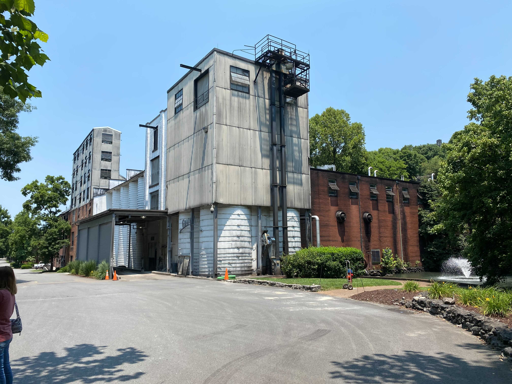
Source: [Wikimedia Commons file page](https://commons.wikimedia.org/wiki/File:Grain_mill_at_Jack_Daniel%27s_Distillery.jpg)  
License: CC-BY-SA 4.0  
*Grain mill machinery in a working distillery. Small distilleries use roller or hammer mills in the 100–500 kg/hour class performing the same function.*

### 15.2 Mash and Wort Preparation

2. **Traditional mash tun (circular drum format)**
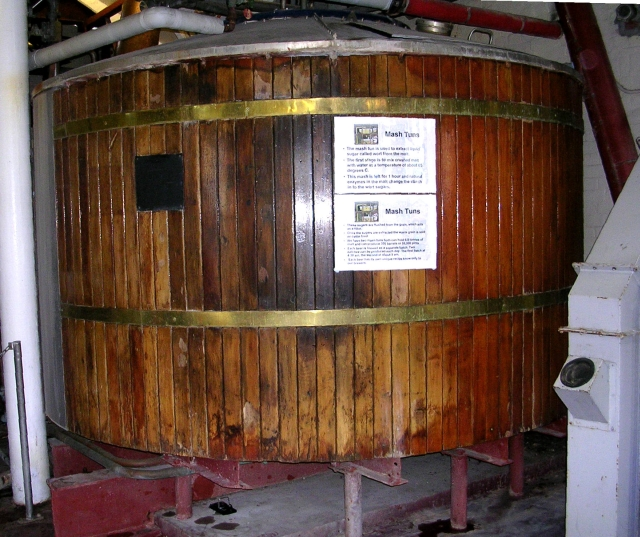
Source: [Wikimedia Commons file page](https://commons.wikimedia.org/wiki/File:Mash_Tun_-_Wadworth_Brewery_-_geograph.org.uk_-_945973.jpg)  
License: CC-BY-SA 2.0  
*Traditional circular drum mash tun — the same design used across craft distilleries and traditional Scottish whisky operations. Craft distilleries typically operate 300–1,500 litre vessels of this type.*

3. **Modern full-lauter mash tun (Hakushu Distillery)**

Source: [Wikimedia Commons file page](https://commons.wikimedia.org/wiki/File:Hakushu_distillery_Mash_tun.jpg)  
License: CC-BY-SA 4.0  
*Modern lauter-style mash tun at Suntory's Hakushu distillery. Shows the larger-scale enclosed stainless format used when moving beyond craft volumes.*

### 15.3 Fermentation

4. **Craft distillery fermenting vats (Kings County Distillery, Brooklyn)**

Source: [Wikimedia Commons file page](https://commons.wikimedia.org/wiki/File:Kings_County_Distillery_Fermenting_Vat.jpg)  
License: CC-BY-SA 4.0  
*Wooden fermenting vats at Kings County Distillery, one of New York's smallest whisky producers. Illustrates small-batch fermentation vessel layout at craft scale — comparable to the 2–6 vessel setups described in Section 3.1.*

5. **Active fermentation in a washback**
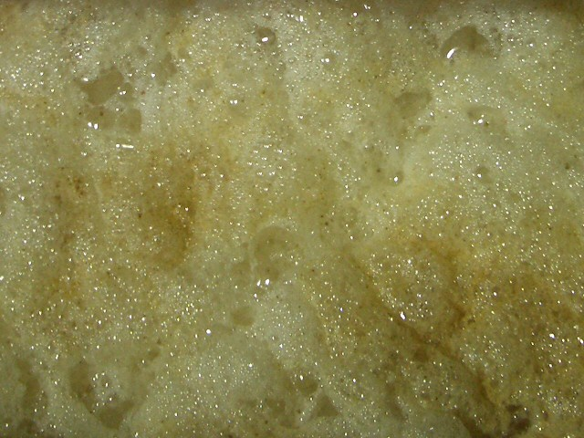
Source: [Wikimedia Commons file page](https://commons.wikimedia.org/wiki/File:Contents_of_washback_-_geograph.org.uk_-_477253.jpg)  
License: CC-BY-SA 2.0  
*Fermenting wash visible inside a traditional wooden washback — shows the active culture and foam head during peak fermentation.*

6. **Washback array at scale (Aberfeldy Distillery)**

Source: [Wikimedia Commons file page](https://commons.wikimedia.org/wiki/File:Washbacks_at_Aberfeldy_Distillery_-_geograph.org.uk_-_477249.jpg)  
License: CC-BY-SA 2.0  
*Traditional wooden washback array at Aberfeldy. Shows how multiple fermentation vessels are staged to stagger batches — the same batching logic applies from small to large distilleries.*

### 15.4 Small-Scale and Craft Stills

7. **Copper pot still at a craft whisky distillery (Bimber Distillery, London)**

Source: [Wikimedia Commons file page](https://commons.wikimedia.org/wiki/File:Pot_stil_bimber_distillery.jpg)  
License: CC-BY-SA 4.0  
*Copper pot still at Bimber Distillery, a small single-malt whisky producer in London. Illustrates the scale and copper construction typical of craft distillery stills in the 300–1,500 litre class described in Section 3.2.*

8. **Imported craft pot still (Koval Distillery, Chicago — Kothe, Germany)**
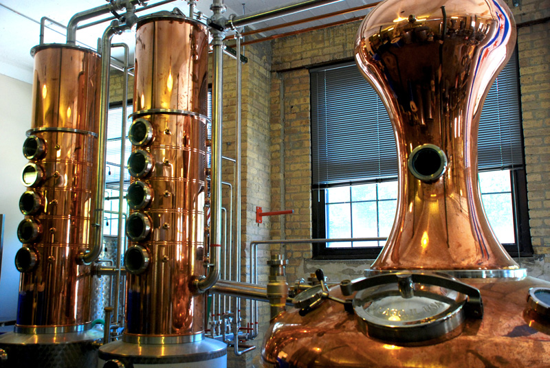
Source: [Wikimedia Commons file page](https://commons.wikimedia.org/wiki/File:Koval%27s_Potstill.jpg)  
License: CC-BY-SA 3.0  
*Custom copper pot still at Koval Distillery, Chicago, manufactured by Kothe (Germany). Koval imported this still specifically for whiskey and brandy production — a real-world example of the craft distillery manufacturer choices discussed in Section 5.4.*

9. **Craft copper still design (RAER Whisky, Jackton Distillery, East Kilbride)**
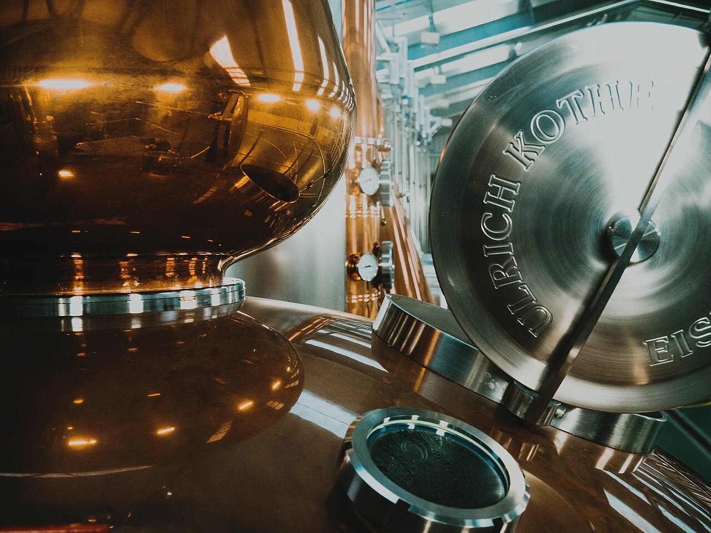
Source: [Wikimedia Commons file page](https://commons.wikimedia.org/wiki/File:RAER%27s_Unique_Copper_Stills_at_Jackton_Distillery,_East_Kilbride.jpg)  
License: CC-BY-SA 4.0  
*RAER Whisky's copper stills at Jackton Distillery, showing an unusual small-craft still design. Illustrates how craft producers sometimes commission distinctive still forms to create visual identity alongside distillate character.*

9a. **Double copper pot stills at craft scale (Kings County Distillery, Brooklyn)**

Source: [Wikimedia Commons file page](https://commons.wikimedia.org/wiki/File:Kings_County_Distillery-_Copper_Pot_Stills.jpg)  
License: CC-BY-SA 4.0  
*Copper pot stills at Kings County Distillery in Brooklyn, NY — one of New York City's craft bourbon producers. Shows the double-still configuration used in traditional bourbon whiskey production, where the first still (wash still) distills fermented mash, and the second still (spirit still) re-distills the low wines into whiskey.*

9b. **Traditional pot still head design (Jameson Distillery, Midleton, Ireland)**
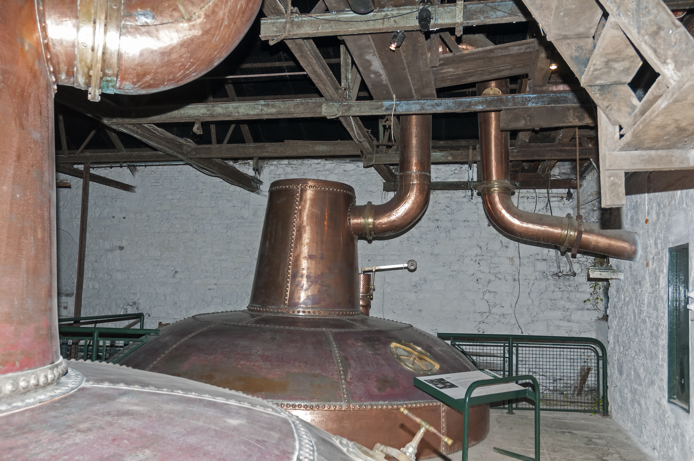
Source: [Wikimedia Commons file page](https://commons.wikimedia.org/wiki/File:Jameson_Whiskey_-_One_of_the_smaller_copper_pot_stills_-_geograph.org.uk_-_8220236.jpg)  
License: CC-BY-SA 2.0  
*One of Jameson's copper pot stills at Midleton Distillery. Shows traditional Irish pot still design with classic onion-shaped head. This is the workhorse still type for most Scotch and Irish whiskey distilleries.*

### 15.4.1 Alternative Still Designs: Alembic and Hybrid Stills

9c. **Historical alembic still (Mission Alembic, 160+ years old)**

Source: [Wikimedia Commons file page](https://commons.wikimedia.org/wiki/File:Mission_alembic_side_view.jpg)  
License: CC-BY-SA 4.0  
*Historic alembic still discovered at Mission San Luis Rey, California — dating from the 1800s. The distinctive dome-shaped head is characteristic of alembic design, traditionally used in brandy and cognac production. Alembics are increasingly popular in craft distilleries for their ability to produce lighter, more aromatic distillates compared to traditional pot stills.*

9d. **Modern craft alembic still (Panda Gin Distillery, France)**

Source: [Wikimedia Commons file page](https://commons.wikimedia.org/wiki/File:Alambic_Pot_Still_-_Panda_Gin.jpg)  
License: CC-BY-SA 4.0  
*A 1,200-litre alembic still used by Panda Gin in France. Shows contemporary alembic construction with copper body and dome head. The alembic style represents an alternative to traditional pot stills for producers seeking different spirit flavour profiles — lighter, more aromatic spirits can result from the higher surface-to-volume ratio of the dome head.*

9e. **Collection of historic alembic designs (National Museum of Scotland)**

Source: [Wikimedia Commons file page](https://commons.wikimedia.org/wiki/File:Alembics_owned_by_Joseph_Black,_National_Museum_of_Scotland.jpg)  
License: CC-BY-SA 4.0  
*Multiple alembic stills from the scientific collections of Joseph Black (18th century chemist), now at the National Museum of Scotland. Shows comparative still designs — different sizes and head shapes demonstrate how alembic engineering evolved. This illustrates Section 5.2's discussion of hybrid and flexible still platforms.*

### 15.5 Distillation: Manufacturer Reference and Scale

10. **Double copper pot stills by Vendome Copper & Brass Works (ASW Distillery, Atlanta)**
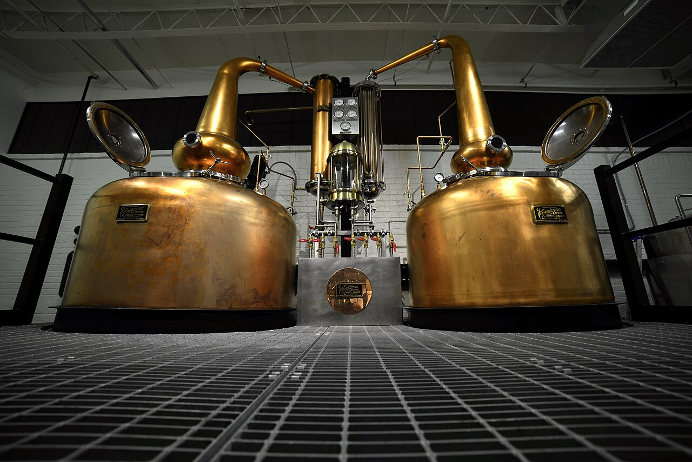
Source: [Wikimedia Commons file page](https://commons.wikimedia.org/wiki/File:ASW_Distillery_-_Atlanta%27s_hometown_whiskey_bourbon_craft_distillery_-_Chris_Avedissian_-_Stills_head_on.jpg)  
License: CC-BY-SA 4.0  
*ASW Distillery's double copper pot stills, manufactured by Vendome Copper & Brass Works (Louisville, Kentucky) — one of the major US still manufacturers listed in Section 5.4. ASW is an independent craft bourbon and whiskey producer.*

11. **Direct-fired pot still (Nikka Yoichi Distillery, Japan)**
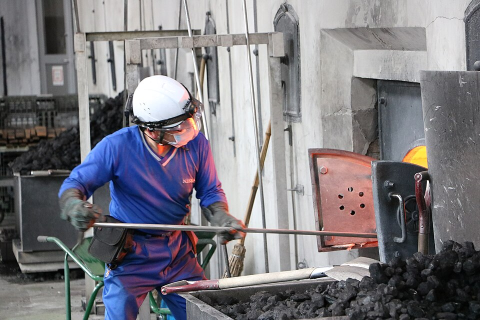
Source: [Wikimedia Commons file page](https://commons.wikimedia.org/wiki/File:Nikka_Whisky_Yoichi_Distillery._Still_House._Adding_coal_to_the_pot_still._A.jpg)  
License: CC-BY-SA 4.0  
*Coal is loaded into the firebox beneath a pot still at Nikka's Yoichi distillery — one of the few remaining direct-fired pot still operations in the world. Contrasts with the steam or indirect heating systems used at most distilleries.*

12. **Column still internals**
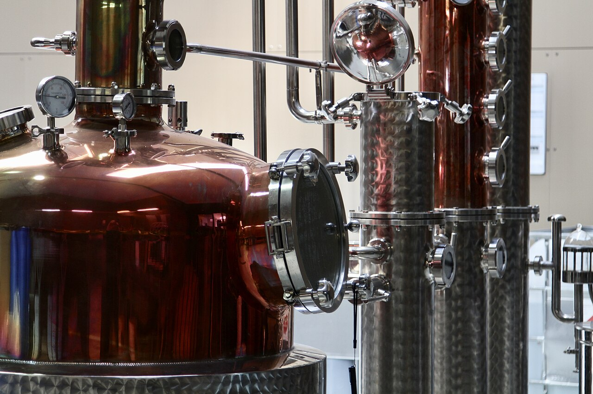
Source: [Wikimedia Commons file page](https://commons.wikimedia.org/wiki/File:Column_still_from_a_distillery.jpg)  
License: CC-BY-SA 4.0  
*Interior of a column still, showing the plate or tray structure used for continuous fractionation. Column systems are the dominant choice for higher-throughput grain spirit and continuous production described in Section 5.3.*

### 15.6 Spirit Safe and Cuts Control

13. **Classic spirit safe with excise padlock**

Source: [Wikimedia Commons file page](https://commons.wikimedia.org/wiki/File:Whisky_safe_DSC05276.JPG)  
License: CC-BY-SA 3.0  
*A padlocked whisky spirit safe at the end of a pot still — the distiller uses instruments inside to determine cut points between heads, hearts, and tails. The padlock is a historical excise control measure; in Scotland the safe was legally accessible only to Customs & Excise officers.*

14. **Modern spirit safe at a craft gravity distillery (Mackmyra, Sweden)**

Source: [Wikimedia Commons file page](https://commons.wikimedia.org/wiki/File:Spirit_Safe_at_Mackmyra_Whisky_Gravity_Distillery.jpg)  
License: CC-BY 2.0  
*Spirit safe at Mackmyra's gravity distillery (opened 2011), a Swedish craft whisky producer. Shows a contemporary spirit safe format where gravity flow replaces pumps — a small-distillery design principle discussed in Section 3.2.*

### 15.7 Casks, Maturation, and Cooperage

15. **Casks staged for filling**

Source: [Wikimedia Commons file page](https://commons.wikimedia.org/wiki/File:Casks_Ready_for_Filling_-_geograph.org.uk_-_819908.jpg)  
License: CC-BY-SA 2.0  
*New casks lined up ready for new-make spirit at Glenmorangie. Illustrates the cask-receiving and preparation stage before filling, which requires inspection, bung-cleaning, and provenance verification at any scale.*

16. **Barrel warehouse interior (Nikka Yoichi, Japan)**

Source: [Wikimedia Commons file page](https://commons.wikimedia.org/wiki/File:Nikka_Whisky_Yoichi_Distillery._Warehouse_No._1._Wooden_barrel._A.jpg)  
License: CC-BY-SA 4.0  
*Casks in warehouse No. 1 at Nikka's Yoichi distillery. Dunnage-style warehousing (low stacks on wooden rails) maintains natural temperature variation and is common at traditional and craft distilleries.*

17. **Cooperage workshop (Speyside Cooperage, Scotland)**

Source: [Wikimedia Commons file page](https://commons.wikimedia.org/wiki/File:Speyside_Cooperage_-_geograph.org.uk_-_97168.jpg)  
License: CC-BY-SA 2.0  
*Working cooperage at Speyside Cooperage (Craigellachie, Scotland), one of the largest active cooperages in Europe. Small distilleries typically do not operate their own cooperages — they source from specialist cooperages like this, or use brokers.*

### 15.8 Bottling and Packaging

18. **Small-scale craft distillery hand bottling (Lind & Lime Gin Distillery, Edinburgh)**
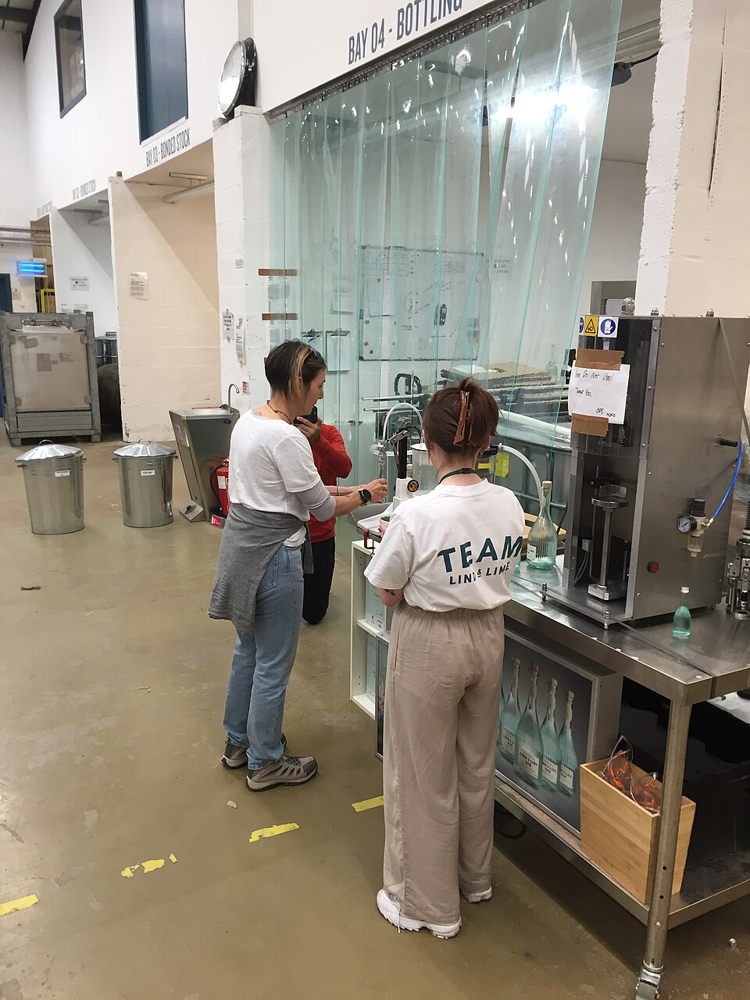
Source: [Wikimedia Commons file page](https://commons.wikimedia.org/wiki/File:The_Lind_%26_Lime_Gin_Distillery_bottling_experience.jpg)  
License: CC-BY 4.0  
*Hand-filling bottles at Lind & Lime Gin Distillery, Leith (Edinburgh). This is the fully manual end of the bottling spectrum — typical of very small producers or special-release bottling runs. Section 3.3 covers the semi-automatic rinser/filler/labeler/coder sequence that most growing craft distilleries use.*

19. **Semi-automated distillery bottling line (Alkon Distillery)**

Source: [Wikimedia Commons file page](https://commons.wikimedia.org/wiki/File:Bottling_line_of_Alkon_Distillery.JPG)  
License: CC-BY-SA 4.0  
*Bottling line at Alkon Distillery showing filling, closure, and conveying equipment. Represents the semi-automated line stage between manual hand-filling and fully integrated high-speed lines — a common investment point for distilleries moving beyond craft volumes.*

### 15.8.1 Labeling and Print Equipment

19a. **Semi-automatic wine/spirits labeler in operation**

Source: [Wikimedia Commons file page](https://commons.wikimedia.org/wiki/File:Machine_applying_wine_labels.jpg)  
License: CC-BY-SA 3.0  
*A semi-automatic pressure-sensitive labeling machine applying front and back labels to wine bottles in a production facility. This represents the type of equipment described in Section 6.2 — machines that apply labels while bottles move through on a conveyor. The same style of wrap-around labeler is used by spirits distilleries for whisky and other products.*

19b. **Wrap-around labeler applying labels to bottles (alternate angle)**
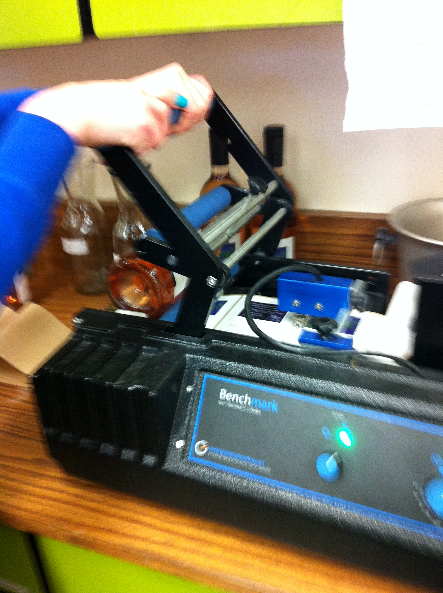
Source: [Wikimedia Commons file page](https://commons.wikimedia.org/wiki/File:Wine_label_machine_in_action.jpg)  
License: CC-BY-SA 3.0  
*Different angle of a labeling machine operation, showing how the label mechanism grips and applies labels to bottle sidewalls. The spacing and pressure-sensitive adhesive system is the backbone of the type of semi-automatic labeler discussed in Section 3.3 as suitable for craft distillery bottling lines.*

### 15.8.2 Filling Equipment

19c. **Industrial bottle filling machine (in-line production)**

Source: [Wikimedia Commons file page](https://commons.wikimedia.org/wiki/File:Bottle_Filling_Machine.jpg)  
License: CC-BY-SA 4.0  
*A multi-nozzle bottle filling machine in active production, showing the filling heads and bottle conveyor system. This illustrates the automated filling stage described in Section 6.1 — individual nozzles fill multiple bottles simultaneously as they move through the machine. Fill-level control and nozzle timing are critical for consistent product and minimal waste.*

### 15.9 Quality Lab

20. **Hydrometer in active use inside a still (Germany)**

Source: [Wikimedia Commons file page](https://commons.wikimedia.org/wiki/File:Hydrometer_in_a_still.jpg)  
License: CC-BY-SA 4.0  
*A hydrometer floating in new-make spirit inside a working still. The hydrometer reads alcohol density to determine ABV — the foundational measurement tool listed in the Section 7 minimum lab set. Even the smallest distillery requires calibrated measurement at this stage for both quality and compliance.*

### 15.10 Industrial-Scale Distillation for Reference

20a. **Large-scale continuous distillation columns (industrial spirit production)**

Source: [Wikimedia Commons file page](https://commons.wikimedia.org/wiki/File:Distillation_Columns_at_Saltend_-_geograph.org.uk_-_1384125.jpg)  
License: CC-BY-SA 2.0  
*Massive continuous distillation columns photographed at sunset. These industrial columns are used for large-scale spirit production and chemical separation. This image provides scale reference to show the dramatic difference between the craft pot stills in Section 15.4 (300–1,500 litres) and the industrial continuous systems described in Section 4. Industrial columns of this scale operate continuously, produce thousands of litres per day, and require sophisticated process control — in contrast to the batch-based, operator-controlled small stills used by craft distilleries.*
