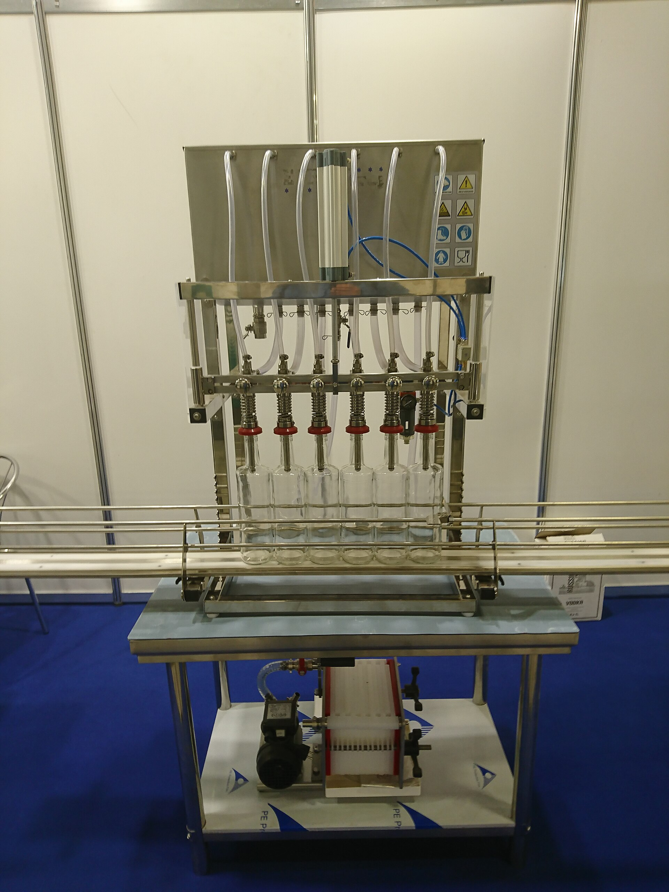
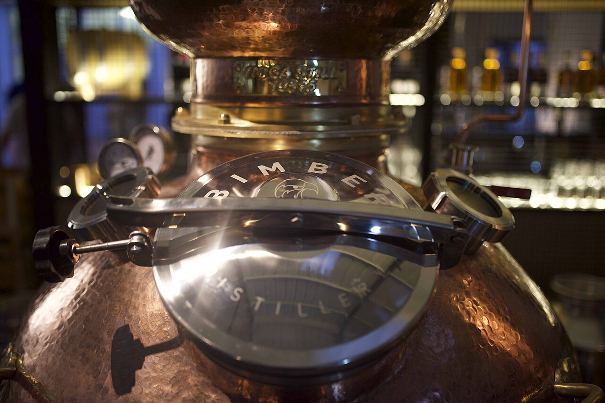
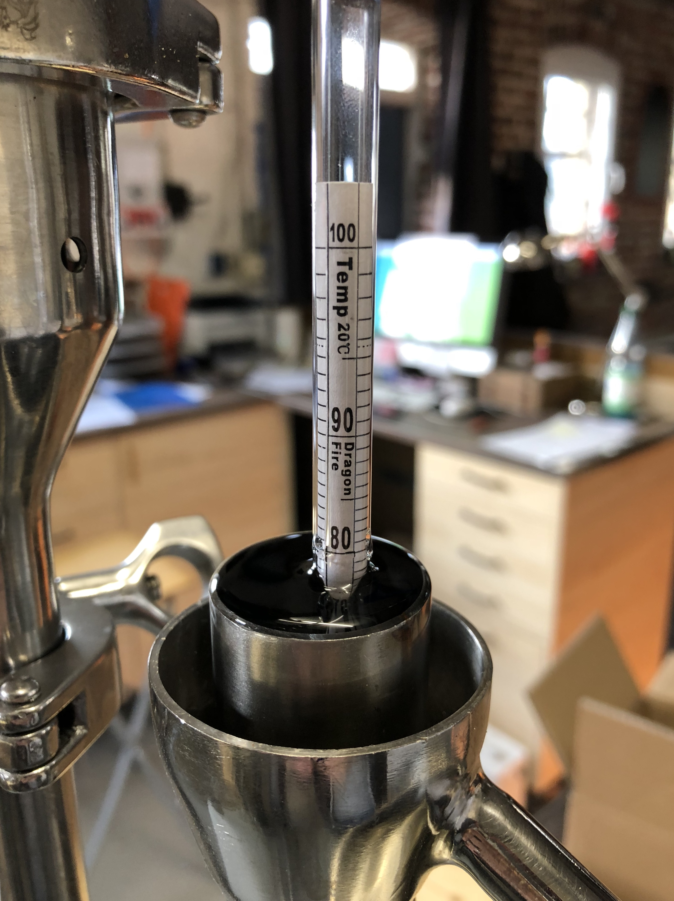
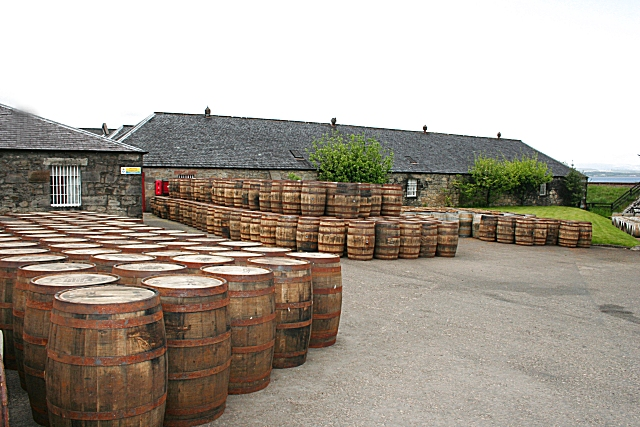

# Phase 11 Expanded: Distillery Equipment

This phase is a practical equipment guide for distilling teams, with special focus on single-operator or small-team craft distilleries.

It covers what equipment is actually needed, what can be deferred, what tends to fail first, and how choices differ when moving to larger-scale production.

You will also get a brand map of major manufacturers across stills, bottling, labeling, and printing systems.

---

## 1. Why Equipment Strategy Matters

Most equipment mistakes are not technical. They are planning mistakes.

Common pattern:

- Founders buy a still first, then realize utilities, packaging, compliance, and cleaning systems were under-scoped.
- Production starts, but packaging speed and quality control become bottlenecks.
- Capital gets trapped in machinery that is either too small to scale or too complex for current throughput.

A stronger sequence:

1. Define production and sales model.
2. Define annual litre targets by product type.
3. Map process bottlenecks.
4. Choose modular equipment that can scale in steps.

Treat equipment as an integrated system, not a shopping list.

---

## 2. Distillery Equipment by Process Stage

At a high level, most whisky distilleries use equipment in these groups:

- Raw material handling: grain intake, storage, milling.
- Mash and wort preparation: mashing, solids separation, transfer.
- Fermentation: washbacks, cooling/heating, instrumentation.
- Distillation: stills, condensers, spirit safe, receivers.
- Maturation and handling: casks, racking, movement equipment.
- Proofing and blending: dilution tanks, blend tanks, filtration.
- Packaging: bottle rinsing, filling, closure, labeling, coding, case packing.
- Quality and compliance: lab instrumentation, sampling, records.
- Utilities and hygiene: steam/hot water, glycol, air, CIP, wastewater.

In small plants, one machine may cover multiple roles.

In larger plants, each step is usually separated and optimized.

---

## 3. Small Distillery Equipment Stack (Single-Operator Friendly)

This section describes practical baseline gear for a small distillery producing gin/new make plus maturing whisky.

### 3.1 Grain, mash, and fermentation

Core equipment:

- Roller or hammer mill in the 100 to 500 kg/hour class.
- Mash tun in the 300 to 1500 litre class.
- Hot liquor tank and process-water tank.
- Two to six fermentation vessels (to stagger batches).
- Transfer pumps and sanitary hoses/fittings.

What matters most at this scale:

- Easy cleaning access.
- Reliable temperature control.
- Repeatable transfer and volume measurements.

### 3.2 Distillation

Typical craft setup:

- One pot still in the 300 to 1500 litre range.
- Optional second spirit still if running a traditional double-distillation flow.
- Condenser sized for peak throughput and seasonal cooling-water temperatures.
- Spirit safe and calibrated receivers.

Small-scale practical rule:

- A slightly smaller still with better controls usually beats a larger still with poor thermal and flow control.

### 3.3 Packaging

Realistic starter line:

- Semi-automatic rinser.
- 2 to 6 head semi-automatic filler.
- Bench corker or screw-capper.
- Semi-automatic labeler.
- Inkjet or laser coder for lot/date coding.

Many small distilleries underestimate packaging labor. Packaging can consume more hours than distillation.

---

## 4. Larger-Scale Machinery Examples

As throughput grows, equipment changes from manual or semi-automatic to integrated lines.

Typical expansion path:

- Craft scale: 500 to 5,000 LPA batches, manual handling, semi-automatic packaging.
- Growth scale: larger mash and fermentation vessels, hybrid still systems, automated transfer and CIP.
- Industrial scale: continuous or multi-column systems, inline QC, high-speed packaging lines, palletized logistics.

Examples of larger-scale machinery:

- Large mash conversion systems with automated recipe control.
- Multi-vessel fermentation cellars with central glycol control.
- Hybrid pot-column systems for flexible spirit styles.
- Fully automatic bottle filling lines with inline fill-level and closure inspection.
- Wrap-around labelers with vision verification.
- Laser coders with ERP-connected serialization.
- Robotic case packing and palletizing.

Scale changes the skill mix: less manual craft handling, more process control and maintenance engineering.

---

## 5. Stills: Types, Use Cases, and Manufacturer Examples

### 5.1 Pot stills

Best for:

- Batch production with strong house-style control.
- Distillate-forward craft profiles.

Common in:

- Single malt and pot-distilled whiskey operations.

### 5.2 Hybrid stills (pot plus rectification options)

Best for:

- Small distilleries producing multiple spirit categories.
- Operators needing flexibility from one still platform.

### 5.3 Column and continuous systems

Best for:

- Higher throughput and consistent repeated profiles.
- Grain-spirit-heavy operations and large blends.

### 5.4 Major still manufacturers (examples)

- Forsyths (Scotland): large heritage still-maker for major Scotch sites.
- Frilli (Italy): distillation systems used across craft and industrial projects.
- CARL GmbH (Germany): copper and hybrid systems for premium craft distilleries.
- Kothe (Germany): engineered pot and hybrid systems.
- Vendome Copper & Brass Works (USA): copper stills for US craft and larger plants.
- Louisville Distilling Company / Vendome ecosystem (USA): custom engineered stillhouse packages.
- Specific Mechanical Systems, SMS (Canada): modular still systems and turnkey support.
- Müller Brennereianlagen (Germany): broad distillation portfolio including whisky applications.
- Briggs of Burton (UK): process engineering and large-scale distillery systems.

Use manufacturer lists as starting points only. Final selection should be based on support access, commissioning quality, and utility fit.

---

## 6. Bottling, Labeling, and Printing Machinery

Packaging equipment determines release quality and commercial viability.

### 6.1 Bottling equipment categories

*Equipment-selection anchor: filler architecture and handling speed determine whether your line can meet planned release cadence without quality drift.*

- Bottle unscrambler or manual infeed.
- Rinse or air-clean station.
- Filling machine (gravity, vacuum, or piston depending on product and speed).
- Closure application (cork, bar-top, screw cap, ROPP).
- Capsule shrink/sleeve (optional by brand style).

### 6.2 Labeling and verification

- Front/back pressure-sensitive labelers.
- Wrap-around labelers for round bottles.
- Vision systems for skew, missing label, and print quality checks.

### 6.3 Coding and printing

- Continuous Inkjet (CIJ): common for lot and date coding at speed.
- Thermal Inkjet (TIJ): sharp print quality for smaller operations.
- Laser coding: durable, low consumables once installed.
- Thermal Transfer Overprint (TTO): used for flexible packaging applications.

### 6.4 Major packaging and coding brands (examples)

Bottling and line integration:

- GAI (Italy)
- Cimec (Italy)
- Krones (Germany)
- KHS (Germany)
- Sidel (France)
- IC Filling Systems (UK)

Labeling:

- Krones labeling platforms
- HERMA (Germany)
- PE Labellers (Italy)
- CDA (France)
- Quadrel (USA)

Coding and printing:

- Videojet
- Domino
- Markem-Imaje
- Linx
- Hitachi Industrial Equipment Systems

Small-distillery practical point:

- A good semi-automatic labeler plus reliable coder can protect brand reputation better than an under-tuned full-speed line.

---

## 7. Quality Lab and Process-Control Equipment

Even tiny distilleries need a real lab routine.

Minimum practical lab set:

- Hydrometers and alcoholmeters.
- Density meter or digital density meter.
- pH meter with calibration standards.
- Temperature-calibrated sampling tools.
- Turbidity checks for chill haze risk.
- Basic microscope support for yeast checks (if fermentation managed in-house).

Advanced systems in larger operations:

- Anton Paar density/ABV systems.
- Near-infrared and inline sensors for process trends.
- Bench GC or outsourced GC-MS testing for congener profiling.
- LIMS integration for sample traceability.

Quality consistency is usually limited by sampling discipline more than instrument brand.

---

## 8. Utilities, CIP, and Safety Infrastructure

Utilities are often the hidden determinant of reliability.

Essential support systems:

- Steam boiler or equivalent thermal source.
- Glycol chiller for fermentation and process cooling.
- Compressed air for valves/automation.
- Water treatment where source chemistry is variable.
- CIP skid with validated cleaning cycles.
- Wastewater handling matched to local regulations.

Safety-critical equipment:

- Ventilation and vapor extraction in stillhouse.
- Explosion-risk aware electrical design where required.
- Fire suppression and emergency isolation points.
- Bunding and spill containment.
- Gas detection where fuels or CO2 accumulation are relevant.

A polished stillhouse with weak utilities will underperform. Utilities are production equipment.

---

## 9. Major Manufacturer Map by Category

The list below is intentionally broad and non-exhaustive.

### 9.1 Distillation and process systems

- Forsyths
- Vendome Copper & Brass Works
- Frilli
- Kothe
- CARL GmbH
- Specific Mechanical Systems (SMS)
- Müller Brennereianlagen
- Briggs of Burton

### 9.2 Packaging and bottling lines

- Krones
- KHS
- Sidel
- GAI
- Cimec
- IC Filling Systems

### 9.3 Labeling and print/coding

- HERMA
- PE Labellers
- CDA
- Quadrel
- Videojet
- Domino
- Markem-Imaje
- Linx

### 9.4 Lab instrumentation

- Anton Paar
- Mettler Toledo
- Hanna Instruments
- Metrohm
- Agilent (larger-lab environments)
- Shimadzu (larger-lab environments)

When comparing suppliers, include local service coverage, spare parts lead time, and commissioning references in your country.

---

## 10. How Small Distilleries Should Choose Equipment

A practical evaluation framework:

1. Define annual output goals in litres and bottles.
2. Estimate hours available for production vs packaging.
3. Identify bottleneck stage under current staffing.
4. Prefer machines with strong local support over maximum spec.
5. Verify cleaning and changeover time before purchase.
6. Request utility-load calculations before final quote.
7. Include validation and training in every contract.

Commercially, a slower line that runs reliably often wins over a faster line that is hard to maintain.

---

## 11. Commissioning and Validation Checklist

Before accepting equipment:

- FAT completed: Factory Acceptance Test witnessed or documented.
- SAT completed: Site Acceptance Test under real utility conditions.
- Calibration certificates supplied for critical instrumentation.
- SOPs written for operation, cleaning, maintenance, and safety.
- Spare-parts starter kit on site.
- Operators trained and signed off.
- Throughput and quality targets verified for at least three consecutive runs.

Without this step, many teams discover problems only after first commercial batches.

---

## 12. Common Failure Modes in Equipment Planning

- Buying distillation capacity without packaging capacity.
- Under-sizing glycol and cooling-water systems.
- Choosing automation beyond operator skill level.
- Ignoring serviceability and local technician availability.
- Selecting labels/closures before confirming machine compatibility.
- Missing traceability requirements in coder and lot-control setup.
- Treating CIP as optional rather than core quality control.

Most of these failures are preventable with stage-gated procurement.

---

## 13. Review List: Key Facts to Lock In

- Equipment planning should start from business model and throughput, not still size alone.
- Small distilleries need reliable utilities and packaging systems as much as distillation hardware.
- Semi-automatic lines can outperform poorly integrated automatic lines at low volume.
- Stills, bottling, labeling, and coding are separate specialties with different vendor ecosystems.
- Local support and spare parts access are strategic selection criteria.
- Lab discipline and sampling consistency are foundational for repeatable quality.
- Utilities and CIP systems are core production infrastructure, not optional extras.
- Commissioning quality (FAT/SAT/training) strongly predicts startup success.
- Larger-scale plants gain efficiency through integration, automation, and inline verification.
- The best equipment stack is modular, maintainable, and aligned with real staffing.

---

## 14. Quiz: Phase 11 Multiple Choice

Choose the best answer for each question.

1. What is the most common strategic mistake in early distillery equipment planning?
A) Spending too much time on utility design.
B) Buying a still before planning full process and packaging requirements.
C) Using calibrated measurement tools.
D) Running SAT before first release.

2. For a small distillery, which equipment area is most often underestimated?
A) Packaging labor and line reliability.
B) Cork color options.
C) Bottle shape variety.
D) Warehouse visitor signage.

3. Which still type is usually most associated with high-throughput continuous production?
A) Pot still only.
B) Alembic only.
C) Column or continuous system.
D) Bain-marie still only.

4. Why can a semi-automatic packaging line be the better choice at craft scale?
A) It is always cheaper to buy and run regardless of volume.
B) It can be easier to tune, maintain, and operate reliably with low staffing.
C) It eliminates all manual QC checks.
D) It makes coding and serialization unnecessary.

5. Which of the following is a coding/marking technology commonly used for lot and date coding?
A) CIJ.
B) CIP.
C) PLC.
D) LIMS.

6. What is the strongest reason to evaluate local service support when selecting machinery brands?
A) It improves label artwork quality.
B) It reduces downtime risk when failures or maintenance events occur.
C) It eliminates the need for SOPs.
D) It replaces SAT.

7. Which group best represents essential utility infrastructure?
A) Boiler/thermal source, glycol cooling, compressed air, and water treatment.
B) Label printer, barcode scanner, and pallet wrap.
C) Tasting glasses, shelving, and POS terminal.
D) Capsule colors, carton graphics, and social media tools.

8. What is the primary purpose of FAT and SAT in equipment projects?
A) To speed up excise filing.
B) To validate machine performance before and after installation under real conditions.
C) To replace all staff training.
D) To avoid preventive maintenance.

9. Which statement best describes lab instrumentation in small distilleries?
A) It is optional if the distiller has strong sensory skill.
B) Only large industrial plants need calibrated measurement tools.
C) A practical baseline lab setup is necessary for repeatable quality and compliance.
D) pH and density checks are irrelevant in spirit production.

10. Which approach best supports scalable equipment investment?
A) Buy the largest machinery possible at startup.
B) Use a modular, staged expansion plan aligned with real throughput and staffing.
C) Avoid commissioning tests to save time.
D) Prioritize visual design over maintainability.

### Quiz Answer Key

| Question | Correct answer |
|---|---|
| 1 | B |
| 2 | A |
| 3 | C |
| 4 | B |
| 5 | A |
| 6 | B |
| 7 | A |
| 8 | B |
| 9 | C |
| 10 | B |

### Quiz More Information

| Question | More information |
|---|---|
| 1 | Distillery success depends on end-to-end flow, and still-first purchasing often leaves hidden bottlenecks in utilities, packaging, and compliance systems. |
| 2 | Many teams discover packaging throughput is the true release constraint, especially when one operator must handle filling, closure, labeling, and coding. |
| 3 | Column and continuous systems are engineered for repeated throughput and consistent operation across higher volume production plans. |
| 4 | At craft scale, reliability and changeover simplicity usually matter more than nameplate speed, especially with small teams. |
| 5 | CIJ means continuous inkjet, a common industrial coding method for lot/date information on bottles, labels, or cartons. |
| 6 | Even high-quality machinery will eventually need support, and local service access is one of the biggest determinants of real uptime. |
| 7 | Thermal, cooling, air, and water systems are foundational because production equipment cannot perform consistently without utility stability. |
| 8 | FAT verifies build quality before shipment, while SAT confirms installed performance under site utilities and operating conditions. |
| 9 | Measurement discipline supports process control, release confidence, and traceability; sensory skill alone is not enough for consistent production. |
| 10 | Staged modular investment lowers execution risk and keeps capital aligned with demonstrated demand and operational capability. |

---

## 15. Distillery Equipment Image Set (Curated)

This version uses a smaller, higher-impact set of reference visuals aligned to the operational decisions that most often drive quality, uptime, and cost.

### 15.1 Distillation Geometry and Style Control

*Geometry matters: shape and copper contact are process variables that influence reflux behavior and spirit character.*

### 15.2 Packaging Throughput and Commercial Reality

*Throughput reality: release cadence often breaks at packaging before it breaks at distillation.*

### 15.3 Measurement Discipline and Release Confidence

*Measurement backbone: consistent hydrometer and ABV checks support both legal compliance and batch consistency.*

### 15.4 Utilities as Hidden Production Equipment

*Utility truth: thermal, cooling, and service systems decide whether headline equipment performs reliably.*

### 15.5 Maturation Readiness and Cask Logistics

*Readiness checkpoint: fill-stage discipline prevents costly maturation drift and traceability failures later.*

### 15.6 Warehouse Behavior Over Time

*Warehouse effect: storage conditions shape evaporation, oxidation pace, and ultimately sensory profile.*
