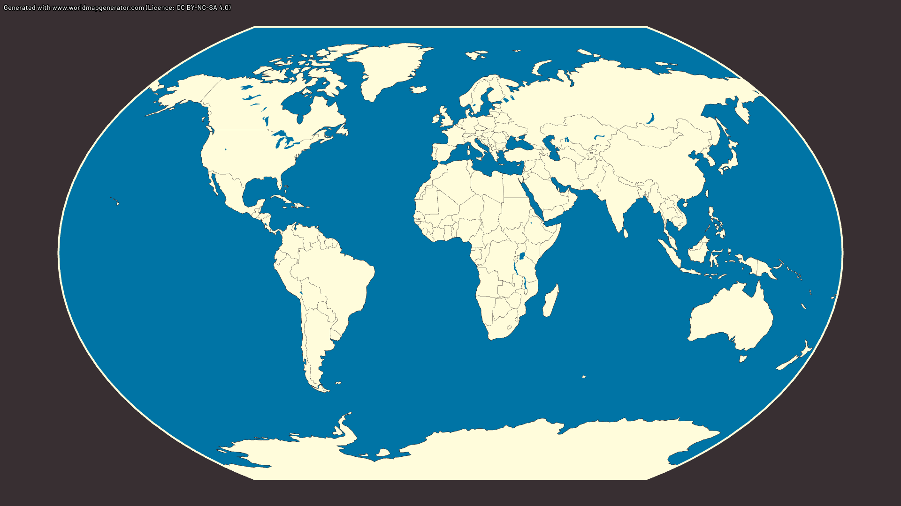
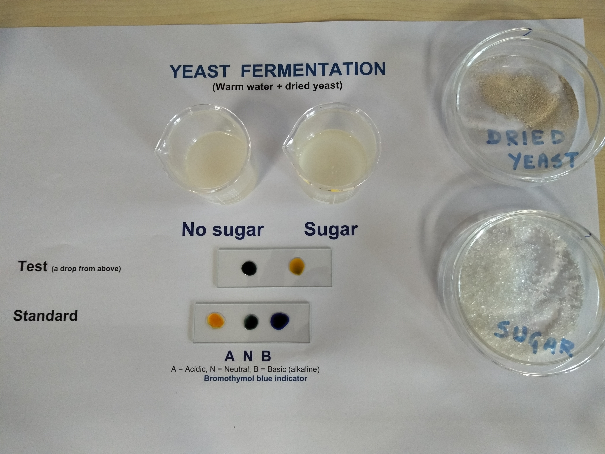
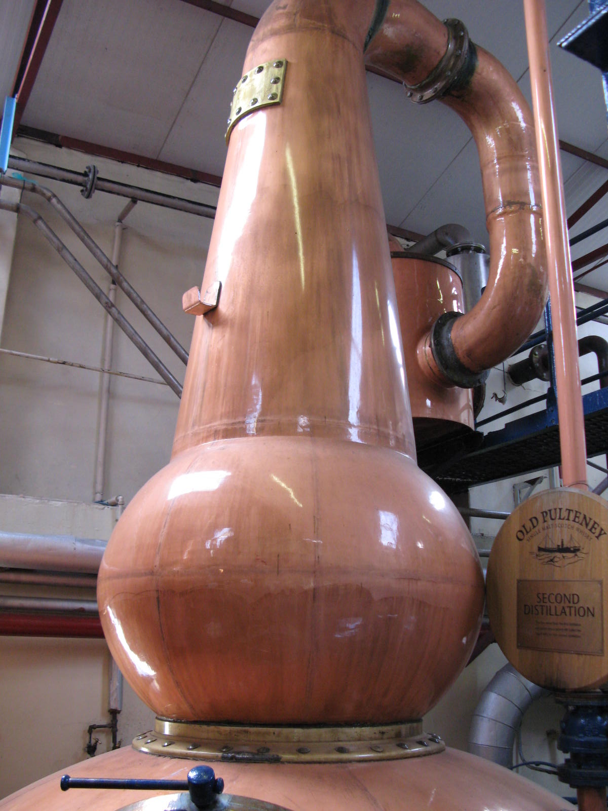
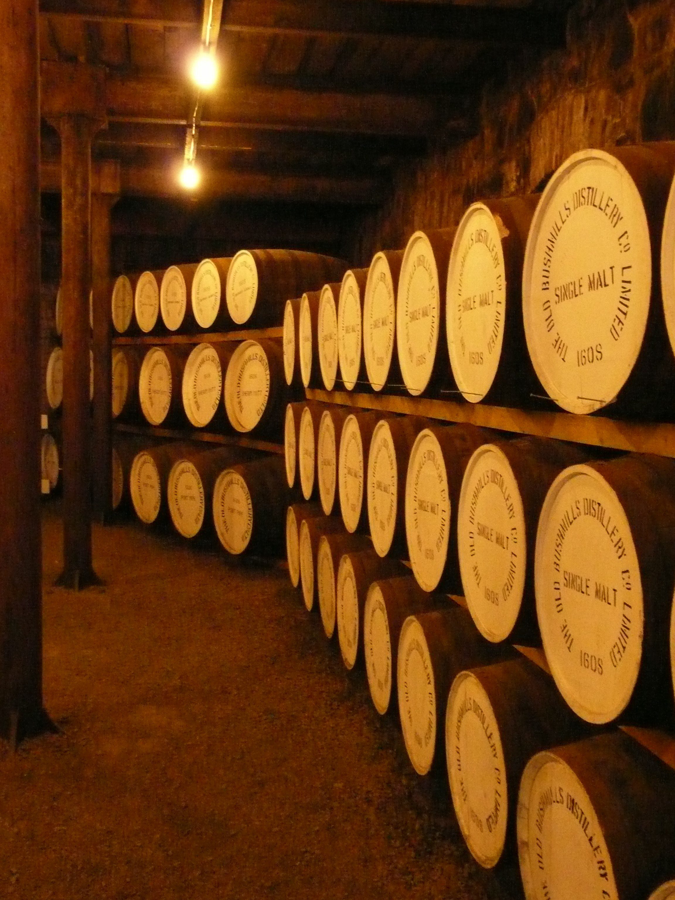
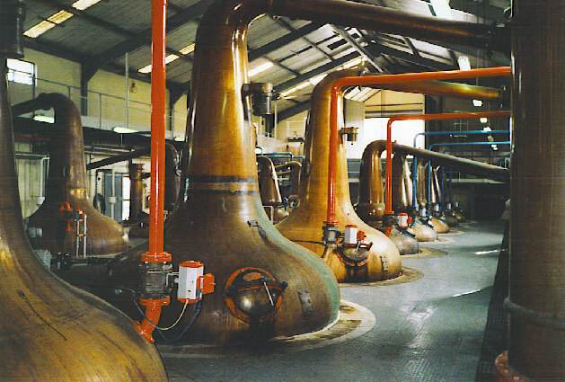
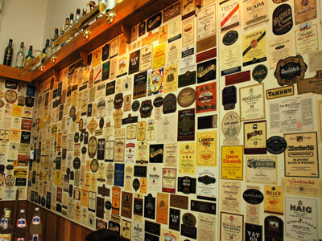

# Phase 1 Expanded: Orientation and Foundations

Suggested duration: Weeks 1 to 3

This companion guide expands Phase 1 from the main plan with more context, clearer examples, and a friendly pace. Think of this stage as building your whisky operating system: you are learning the language, the legal boundaries, and the production logic that make later study much easier.

If you complete this phase well, later topics like maturation strategy, regional style, and distillery character will feel connected instead of random.

---

## 1. What Counts as Whisky or Whiskey in Different Jurisdictions

Whisky is not just a flavor category. It is also a legal category.

That means each country (or bloc) sets production rules that determine what can legally be labeled as whisky/whiskey. Those rules shape everything from mash bill choices to cask policy and bottling language.

Core legal ideas you should know early:

- Distillation origin: where the spirit is made.
- Maturation location: where aging happens.
- Minimum maturation: how long spirit must stay in wood before legal release.
- Cask rules: whether wood must be new, used, charred, or size-limited.
- Grain definitions: what raw materials are allowed and in what proportions.
- Labeling claims: what terms are regulated (age statement, straight whiskey, single malt) and what terms are mostly marketing.

A practical mindset: always separate category law from brand story. If a claim sounds romantic, check whether it is legally binding or stylistic language.

Use the map as a study tool: mark Scotland, Ireland, United States, Canada, and Japan first, then add expanding producers like Australia, India, Taiwan, Sweden, France, and South Africa.

---

## 2. Why Spelling Differs: Whisky vs Whiskey

Both words refer to grain spirit matured in wood, but spelling follows historical and regional convention.

Typical pattern:

- Whisky: commonly used in Scotland, Canada, Japan, and many other markets.
- Whiskey: commonly used in Ireland and the United States.

Important nuance: spelling by itself does not guarantee quality, style, or legal category. It is a clue to tradition and labeling convention, not a technical tasting note.

When reading labels, treat spelling as orientation data, not proof.

---

## 3. Basic Ingredients: Grain, Water, Yeast

This topic is the foundation of process literacy.

### Grain

Grain provides starch, which is converted into fermentable sugar and then alcohol. Different grain choices influence yield, mouthfeel, and flavor pathways.

- Malted barley: central in malt whisky; contributes enzymes and robust cereal character.
- Corn: core of bourbon identity; often brings sweetness and body.
- Rye: often adds spice, herbal edges, and drier texture.
- Wheat: often softens profile and can round texture.

Glossary terms in action:

- Mash bill: the grain recipe.
- Malt: grain (usually barley) that was germinated and dried.
- Grist: milled malt prepared for mashing.

### Water

Water matters in mashing, cooling, dilution, and bottling reduction. Some water claims are over-romanticized, but water chemistry can affect process behavior and consistency.

### Yeast

Yeast does more than create ethanol. It also produces congeners, including esters and other compounds that shape fruitiness, floral notes, and fermentation complexity.

Glossary terms in action:

- Fermentation: sugar to alcohol conversion by yeast.
- Congeners: aroma/flavor compounds beyond ethanol.
- Ester: often linked to fruity aromas.
- Wash: fermented liquid ready for distillation.

---

## 4. Core Production Stages (High-Level)

At Phase 1, you do not need to master every technical parameter yet. You do need a clean mental flow of the process.

1. Malting and milling (where relevant)
2. Mashing
3. Fermentation (wash formation)
4. Distillation (collecting a spirit cut)
5. Maturation in cask
6. Vatting/blending (if applicable)
7. Reduction, filtration choices, and bottling

### Distillation Basics

Pot still and column still systems are not "better vs worse". They are tools optimized for different process goals.

- Pot still: batch method; often associated with heavier texture and strong distillery character.
- Column still: continuous method; efficient and often cleaner/lighter spirit profile.

Glossary terms in action:

- Foreshots/heads, heart, tails (feints): cut points in spirit run.
- Reflux: in-still condensation/re-vaporization affecting style.
- Copper contact: helps reduce sulfur-heavy notes and refine spirit profile.

### Maturation Basics

Wood maturation is transformative, not passive storage. Spirit extracts compounds from oak, interacts with oxygen over time, and loses volume through the angel's share.

Glossary terms in action:

- Maturation
- Angel's share
- First-fill and refill cask
- Cask finish
- Tannin and oak lactones

---

## 5. Major Families You Should Recognize Early

Treat these as legal-production families first, flavor families second.

- Scotch whisky
- Irish whiskey
- Bourbon (American whiskey)
- Rye whiskey (American and Canadian contexts differ)
- Canadian whisky
- Japanese whisky
- World whisky (broad umbrella for newer or non-traditional jurisdictions)

How to compare families in beginner mode:

- Grain rules
- Still strategy
- Maturation minimums
- Typical cask policy
- Typical sensory profile

This approach helps you avoid stereotype-only thinking.

---

## 6. Malt Whisky vs Grain Whisky

This distinction is essential and frequently misunderstood.

### Malt whisky

In Scotch context, malt whisky is made from malted barley and distilled in pot stills. The category often emphasizes distillery character and process identity.

### Grain whisky

Grain whisky typically includes grains beyond only malted barley and is commonly produced on column stills. It can be very high quality and is central to blending ecosystems.

Beginner correction to remember:

- Grain whisky is not a "low quality" category.
- It is a production category with different engineering priorities and sensory outcomes.

---

## 7. Single, Blended, Blended Malt, Blended Grain

These are structure terms, not quality rankings.

- Single malt: malt whisky from one distillery.
- Single grain: grain whisky from one distillery.
- Blended malt: blend of malt whiskies from multiple distilleries.
- Blended grain: blend of grain whiskies from multiple distilleries.
- Blended whisky: blend that may combine malt and grain components.

Why this matters:

- You can decode a label faster.
- You can compare like-with-like in tastings.
- You avoid paying premium prices for misunderstood terminology.

---

## 8. Basic Label Terms (Must-Know Before Deep Brand Study)

Read labels as technical documents first.

### Core legal/technical terms

- ABV: alcohol by volume.
- Age statement: youngest whisky age in bottle.
- NAS: non-age-statement.
- Cask strength: near-barrel proof, little or no dilution.
- Chill filtration: haze-control processing step.
- Natural color: no added caramel coloring claim (jurisdiction-specific relevance).
- Bottled-in-bond (US): legal category with strict conditions.
- Straight whiskey (US): legal designation with maturation requirements.

### Structure terms (what is in the bottle)

- Single malt, single grain, blended malt, blended grain, blended whisky.

### Cask and maturation terms

- Ex-bourbon cask
- Sherry cask
- First-fill / refill
- Finished in

### Reading labels critically

Ask three quick questions:

1. What is legally auditable here?
2. What is production data?
3. What is storytelling language?

If you practice this in Phase 1, you will avoid many common myths in Phase 2 and beyond.

---

## 9. Quick Comparison Chart: Major Categories

Simple reference chart for orientation. Rules can change, and some details vary by subcategory.

| Category | Legal minimum aging | Grain requirement (high-level) | Common still types |
|---|---|---|---|
| Scotch whisky | 3 years in oak casks (max 700L) | Cereals allowed; single malt uses 100% malted barley | Pot stills (malt), column stills (grain) |
| Irish whiskey | 3 years in wooden casks (max 700L) in Ireland | Cereals allowed; style depends on subcategory (single pot still uses malted + unmalted barley mix) | Pot stills and column stills |
| Bourbon (US) | No minimum for bourbon; 2 years for straight bourbon | At least 51% corn mash bill | Usually column still + doubler/thumper; some pot still use |
| Rye whiskey (US) | No minimum for rye; 2 years for straight rye | At least 51% rye mash bill | Usually column still + doubler/thumper; some pot still use |
| Canadian whisky | 3 years in small wood (max 700L) in Canada | Flexible grain use; often corn base plus rye flavoring component | Predominantly column stills; some pot still use |
| Japanese whisky (industry standards) | 3 years in wooden casks (max 700L) in Japan | Must use cereal grains and include some malted grain | Pot stills and column stills |
| World whisky (general) | Varies by jurisdiction | Varies by jurisdiction | Pot, column, or hybrid systems |

---

## 10. Review List: Key Facts to Lock In

- Whisky/whiskey is both a spirit and a legal category.
- Spelling reflects tradition and geography, not automatic quality.
- Grain, water, and yeast each affect output, but in different ways.
- Fermentation creates congeners that heavily influence aroma and flavor.
- Pot still and column still are different process tools, not quality rankings.
- Maturation in wood is central because extraction, oxidation, and evaporation reshape new make.
- Single and blended terms describe composition/source, not guaranteed quality tiers.
- Age statement refers to the youngest component in the bottle.
- NAS is a labeling format, not proof of quality in either direction.
- Strong whisky study always separates law, process, and marketing language.

---

## 11. Quiz: Phase 1 Multiple Choice

Choose the best answer for each question.

1. Which statement is most accurate about whisky category definitions?
A) They are mostly based on tasting panel opinion.
B) They are primarily legal and regulatory definitions.
C) They are determined by brand history only.
D) They are fixed globally with no regional differences.

2. In most contexts, what does an age statement represent?
A) Average age of all casks used.
B) Age of the oldest cask used.
C) Age of the youngest whisky in the bottle.
D) Number of years since the distillery opened.

3. Which mash bill threshold is required for bourbon in the US?
A) At least 51% rye.
B) At least 51% wheat.
C) At least 51% barley.
D) At least 51% corn.

4. What is the strongest beginner interpretation of pot still vs column still?
A) Pot still always means premium quality.
B) Column still always means neutral spirit only.
C) They are different production systems with different outcomes.
D) They are only cosmetic design differences.

5. Which term describes a blend of malt whiskies from multiple distilleries?
A) Single malt
B) Blended malt
C) Blended grain
D) Single grain

6. What does NAS stand for?
A) Natural Aging Standard
B) New American Spirit
C) Non-age-statement
D) Non-alcoholic spirit

7. Which option best describes why wood aging matters?
A) It only makes spirit darker.
B) It lowers ABV to legal minimum automatically.
C) It drives extraction, oxidation, and concentration changes over time.
D) It removes all congeners.

8. Which term is most directly tied to evaporation during maturation?
A) Spirit safe
B) Angel's share
C) Mash tun
D) Grist

9. Which statement about spelling is best?
A) Whiskey is always sweeter than whisky.
B) Whisky is always peated.
C) Spelling usually tracks regional convention.
D) Spelling determines legal maturation time.

10. Which three-part critical reading habit is recommended in Phase 1?
A) Price, age, and bottle color
B) Law, process, and marketing
C) Brand story, awards, and social media ratings
D) Label font, bottle shape, and cork style

### Quiz Answer Key

| Question | Correct answer |
|---|---|
| 1 | B |
| 2 | C |
| 3 | D |
| 4 | C |
| 5 | B |
| 6 | C |
| 7 | C |
| 8 | B |
| 9 | C |
| 10 | B |

### Quiz More Information

| Question | More information |
|---|---|
| 1 | Whisky categories such as Scotch, bourbon, and Irish whiskey are governed by legally binding regulations that determine ingredients, production methods, maturation requirements, geographic origin, and minimum age. These laws are enforced by government and trade bodies rather than being set by flavor panels or individual brand decisions. Understanding that definitions are legal rather than sensory prevents consumers from relying on aroma or taste alone to categorize a spirit, and helps interpret label claims that may use technical language in technically correct but commercially strategic ways. The flavor of any whisky is a secondary outcome of meeting legal production requirements, not the definition itself. |
| 2 | An age statement on a whisky label indicates the minimum age of the youngest component in the bottle, not the average or oldest. In blended expressions, dozens of casks of varying ages may combine, but the label must reflect the youngest contributor. Two bottles both stating twelve years could have vastly different actual average ages, with one potentially using largely older spirit than the other. The age statement is a legal minimum disclosure, not a complete picture of maturation history. Reading age in combination with distillery process context, cask type, and maturation climate is more informative than treating any age number as a standalone quality signal. |
| 3 | US law requires bourbon to be made from a grain mixture containing at least 51% corn, with the remainder typically being malted barley plus a flavor grain such as rye or wheat. The corn requirement directly shapes bourbon's characteristic sweetness and full body that differentiates it from rye whiskey (which requires at least 51% rye) or other American whiskey categories. Beyond grain composition, bourbon must be distilled to no more than 160 proof, placed into the barrel at no more than 125 proof, and aged in new charred oak containers. Understanding these cumulative legal requirements helps readers apply the law-process-marketing framework introduced in Phase 1. |
| 4 | Pot stills and column stills are fundamentally different engineering systems that produce distinct spirit profiles. Pot stills operate as batch systems: a fixed volume of wash is loaded, heated, and vapor collected before the cycle resets. This preserves a character-rich fraction of heavier compounds and congeners contributing to aromatic complexity. Column stills pass wash continuously past rising steam, allowing precise control over alcohol concentration and the stripping of heavier congeners, yielding a lighter, cleaner spirit suited to consistent large-scale production. Neither system is inherently premium; the distinction is a production design choice with flavor and efficiency tradeoffs, and many celebrated whiskies use column still grain spirit as components. |
| 5 | Blended malt (formerly called vatted malt or pure malt) is produced by combining single malt whiskies from more than one distillery. It should not be confused with blended Scotch, which combines malt whisky with grain whisky, or with single malt, which uses malt whisky from a single distillery. Single grain whisky uses grain other than malted barley in column stills. These four categories—single malt, blended malt, single grain, and blended Scotch—are each legally defined and represent distinct production strategies. Blended malts can showcase regional character combinations or achieve consistent flavor profiles year to year by drawing on multiple supply sources. |
| 6 | NAS (Non-Age-Statement) refers to a bottling that does not display a specific age on the label. Producers may use NAS because they include some younger spirit in a blend and do not want consumers to anchor on that number, because they wish to maintain consistent flavor across vintages without being constrained by age-specific inventory, or because they value the narrative freedom to discuss cask character rather than numbers. NAS does not indicate inferior quality—some highly regarded expressions carry no age statement. However, in the absence of an age number, consumers should seek other process disclosures such as cask type, distillation method, and ABV to understand what they are buying. NAS should be read critically as a labeling decision rather than a quality signal in either direction. |
| 7 | Wood aging is the most transformative stage in whisky production because it involves at least three distinct interactive processes. Extraction draws color, flavor compounds (vanillins, tannins, lactones), and sugar from the wood into the spirit. Oxidation occurs as oxygen permeates through the stave, softening harsh alcohols and converting some compounds into new aromatic molecules. Concentration through evaporation (the angel's share) raises the proportional weight of soluble compounds remaining in the cask. The duration, temperature, humidity, cask size, fill level, and warehouse positioning all influence how these processes interact, meaning maturation is an active, dynamic chemical cycle rather than passive storage. Stating that aging only makes spirit darker dramatically underestimates the complexity involved. |
| 8 | The angel's share refers to the volume of whisky lost to evaporation through the wood of the cask during maturation. In cooler Scottish climates, this typically amounts to roughly 2% per year, while in warmer climates like Kentucky or India, losses can exceed 10-15% annually. This evaporation is not simply water loss—it carries volatile compounds and concentrated aromatics, which partially explains why spirit character evolves over time. The angel's share becomes commercially significant over long maturation periods: a cask starting at 200 liters may contain significantly less than 100 liters after 25 years in Scotland, and the remaining spirit is proportionally richer in extracted wood compounds. The spirit safe (where distillate ABV and cut decisions are monitored) is operationally connected to this stage but is distinct from maturation losses. |
| 9 | The spelling whisky (no e) is used for Scotch, Canadian, and Japanese spirits, tracing to the original Gaelic etymological root. The spelling whiskey (with e) is used for Irish and American spirits, reflecting convention set by Irish distillers who emigrated to the US in the 19th century. The distinction is a regional and legal convention, not an indication of flavor, sweetness, peatiness, or quality. Both spellings refer to the same broad category of grain-distilled, wood-aged spirits. When encountering either spelling, the appropriate response is to identify which jurisdiction's regulations apply, because those define the production constraints—not the spelling. Some individual distilleries break from regional convention, which adds consumer confusion but does not change the analytical framework. |
| 10 | The Law-Process-Marketing framework is Phase 1's core analytical tool. It asks three separate questions: what does the law say about the specific category and how was production legally constrained; what was the actual production process—grain selection, fermentation approach, distillation type, and maturation choices—sourced from technical disclosures rather than brand storytelling; and what claims are marketing language rather than verifiable production facts. Separating these layers prevents the beginner error of treating compelling brand narrative as production evidence. A whisky described as crafted with ancient spring water in the shadow of mountains may be producing excellent spirit, but this language tells us nothing about mash bill, distillation proof, cask type, or age. Applying the L-P-M framework consistently is the foundation for all subsequent phases. |

---

## Image Notes

All images in this document were downloaded from Wikimedia Commons for educational use and remain subject to their original licenses and attribution terms.

- Jurisdictions map context: https://upload.wikimedia.org/wikipedia/commons/d/d1/A_blank_world_map.png
- Grain context image: https://upload.wikimedia.org/wikipedia/commons/6/65/Barley_Seeds.jpg
- Yeast and fermentation context image: https://upload.wikimedia.org/wikipedia/commons/d/d7/Yeast_fermentation.jpg
- Pot still context image: https://upload.wikimedia.org/wikipedia/commons/d/d0/Old_pulteney_pot_still.jpg
- Column still context image: https://upload.wikimedia.org/wikipedia/commons/0/05/Column_still_from_a_distillery.jpg
- Maturation warehouse context image: https://upload.wikimedia.org/wikipedia/commons/a/a1/Old_casks_in_Bushmill%27s_old_warehouse.jpg
- Distillery still house context image: https://upload.wikimedia.org/wikipedia/commons/d/d8/Glenfiddich_Distillery_stills.jpg
- Label terms context image: https://upload.wikimedia.org/wikipedia/commons/1/1c/Wall_of_Scotch_Whisky_Lables.jpg
