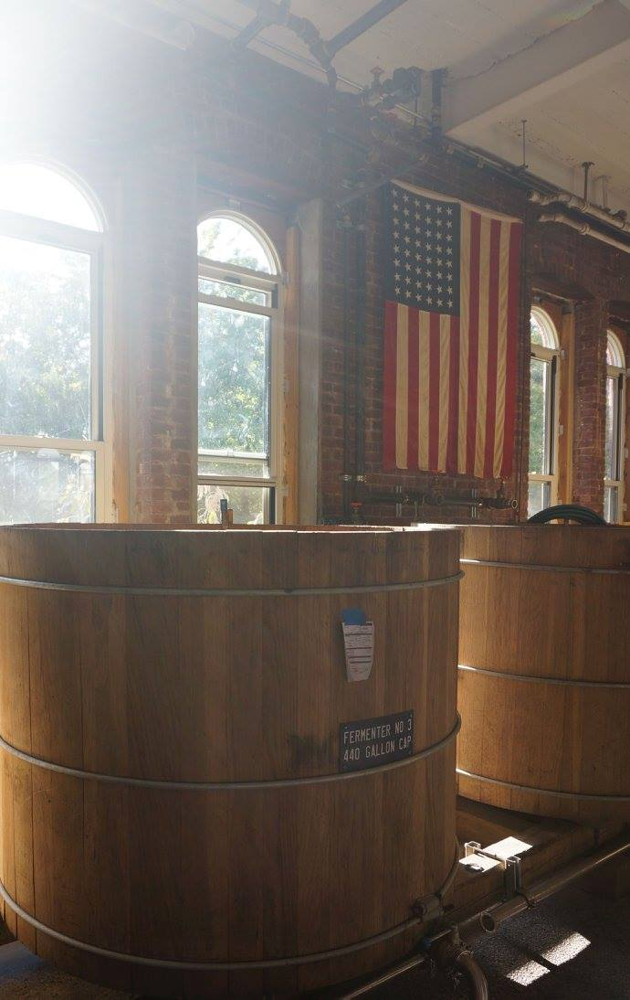
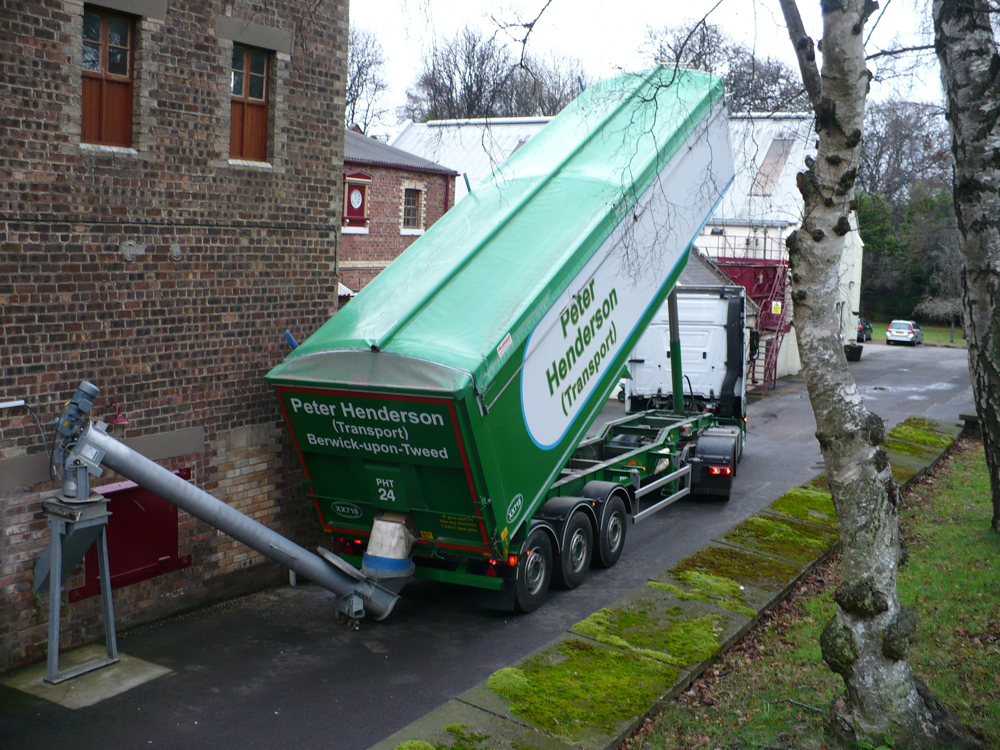
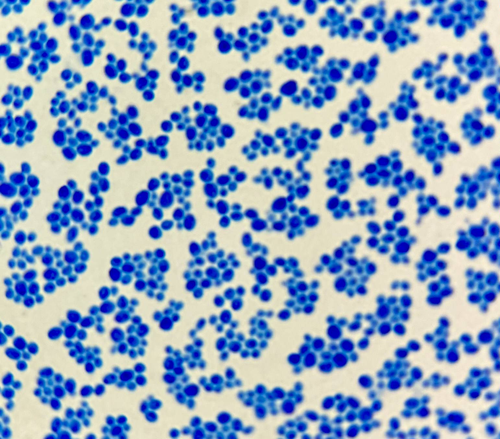
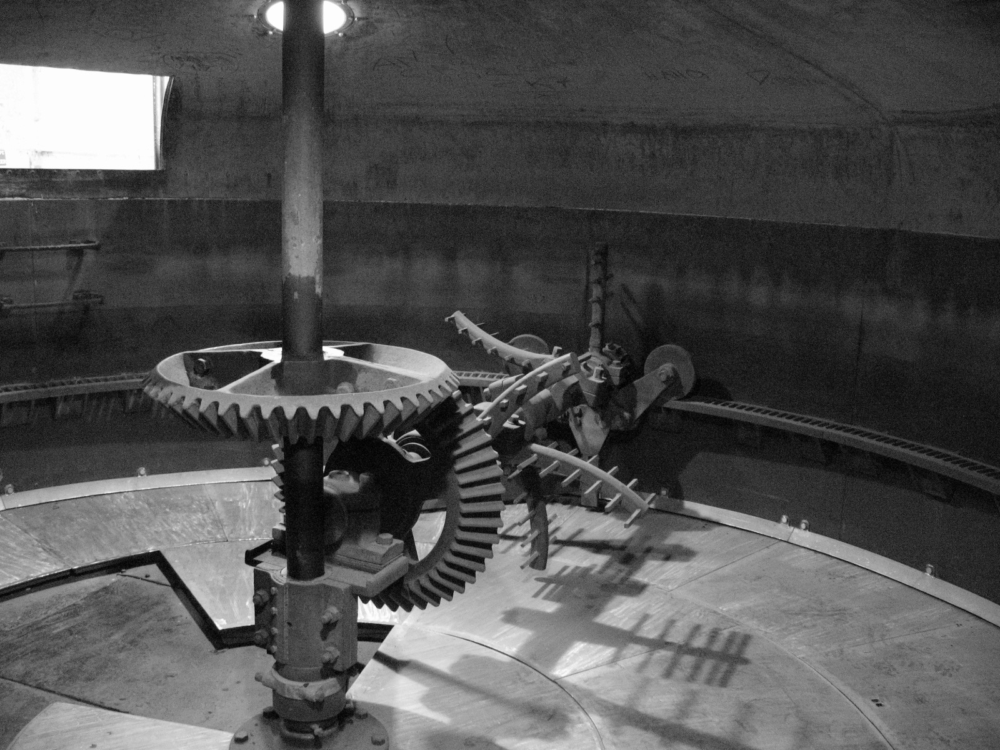
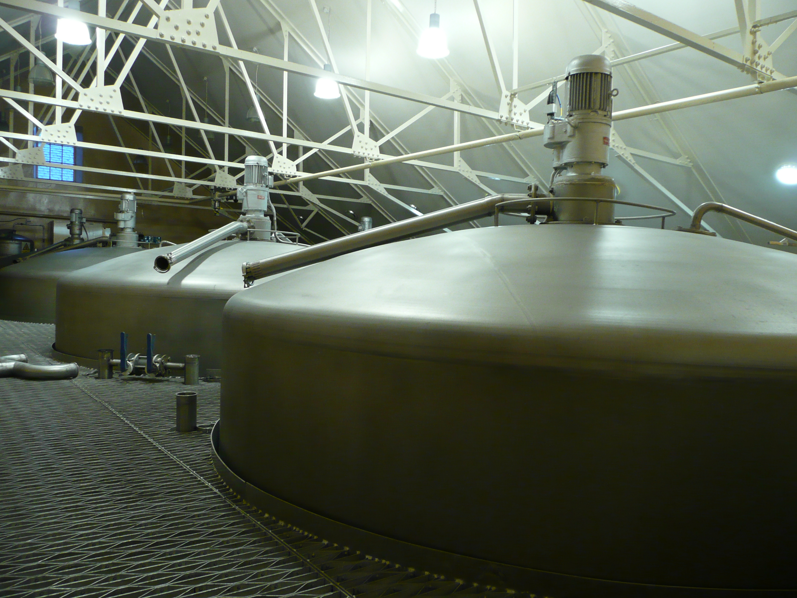
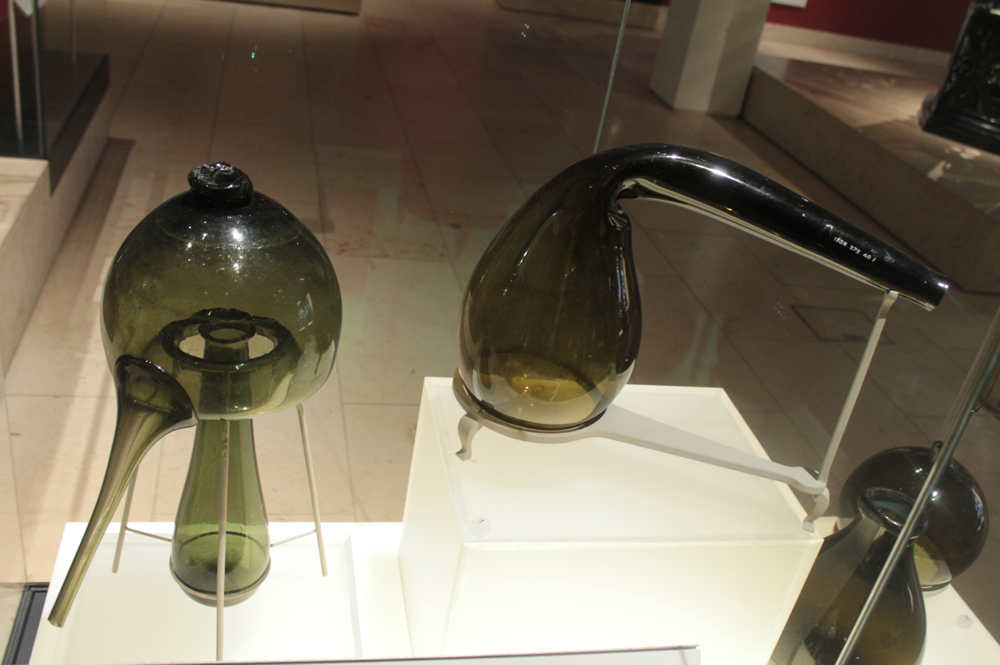
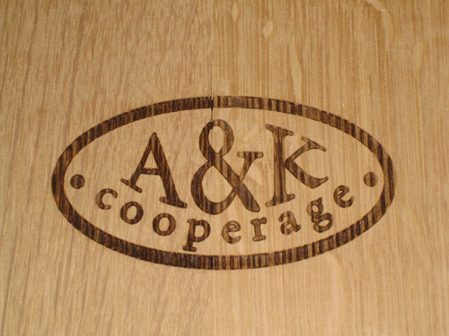
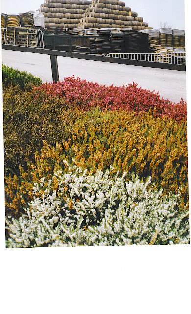

# Phase 3 Expanded: The Whisky-Making Process in Detail

Suggested duration: Weeks 8 to 12

This guide expands Phase 3 of the main study plan into a full process companion. If Phase 1 gave you a vocabulary and Phase 2 gave you a historical map, Phase 3 gives you the engine room. This is the part of whisky study where romance has to make room for thermodynamics, microbiology, plant design, and disciplined observation.

The good news is that the process is not mysterious once you learn how the stages connect. The challenge is that each stage leaves fingerprints on the next. Grain choice influences mash behavior. Mash composition affects fermentation. Fermentation determines the congeners available to distillation. Still shape and cut policy decide which of those congeners survive into new make. Cask policy decides which parts are amplified, softened, transformed, or buried.

That is why serious whisky study keeps returning to process. If you understand process deeply, you can stop treating flavor as magic.

*Process reminder: fermentation is where many high-impact flavor compounds are created before still selection starts.*

---

## 1. How to Think About Process

A beginner often imagines whisky production as a straight line: grain goes in, alcohol comes out, time in wood makes it better. A better model is a series of linked transformations.

- Grain provides starch, proteins, lipids, minerals, and eventually sugars.
- Malting unlocks enzymes and changes the physical grain.
- Mashing extracts fermentable material into wort.
- Fermentation turns wort into wash and creates congeners.
- Distillation concentrates alcohol and selects congeners.
- Maturation changes the spirit chemically and physically over time.
- Blending and bottling decide what final style reaches the drinker.

Every stage involves tradeoffs.

A distiller can chase alcohol yield, but yield is not the same thing as quality. A distiller can chase cleaner spirit, but overly clean spirit may mature into something bland. A distiller can chase heavy cask impact, but strong oak can flatten the character of the distillate underneath. A serious student learns to ask not only what a distillery does, but what it is optimizing for.

This phase is therefore about two habits:

1. Learn what each stage does technically.
2. Learn what each decision tends to cost or preserve.

---

## 2. Raw Materials: Grain Is the Start of Everything

### Why Grain and Not Fruit?

Whisky belongs to the family of distilled grain spirits. It is made from cereals because cereals contain starch, and starch can be turned into sugar and then alcohol. Fruit-based fermented liquids already contain sugar, which is why wine can be fermented directly from grapes. Grain cannot. Grain must first be processed to expose and convert starches before yeast can do its work.

That one fact explains a large part of why whisky production looks the way it does. It needs malting or some other enzymatic conversion step. It needs mashing. It needs process control long before alcohol appears.

### The Major Grains

#### Barley

Barley matters disproportionately in whisky because it malts well. Its husk survives milling, which helps with lautering. Its enzyme system is strong enough to convert its own starches and, in some mash bills, the starches of other grains too. It also carries a distinctive cereal and nutty character that can still be felt after distillation and maturation.

In malt whisky, barley is not just a raw material. It is the identity of the spirit.

#### Corn

Corn is central to bourbon because of law and because of flavor. As the dominant grain in the mash bill, it gives a sweeter, fuller, often rounder base spirit. Corn can also produce strong yield, which makes it attractive economically. Its combination of law, agriculture, and sensory payoff is why it became the defining grain of bourbon rather than merely an option.

#### Rye

Rye is the grain most likely to be described in flavor terms by drinkers: spicy, peppery, herbal, dry, even minty. Those terms simplify a more complex story, but they point in the right direction. Rye often creates a more assertive structure and a drier profile than corn-heavy spirit. It can also create mashing and fermentation challenges because rye behaves differently in the mash and can become gummy.

#### Wheat

Wheat is usually discussed as a softening grain. In wheated bourbons, or in wheat-heavy world whisky mash bills, the resulting spirit is often described as breadier, creamier, and gentler than rye-led alternatives. Those descriptors are not absolute truths, but they reflect a widely observed tendency.

#### Other Grains

Oats, triticale, heritage barley varieties, and other cereals appear in craft and experimental whisky. These can affect texture, fermentability, yield, and flavor in ways that are still being explored by smaller producers. For the student, these experiments are valuable because they reveal which assumptions in mainstream whisky are historical accidents and which are genuine technical necessities.

### Grain Character vs Process Character

A classic Phase 3 question is: how much of grain character survives into the glass?

The answer is: some, but not by itself.

Grain character can survive as an influence, particularly in mash bill-heavy categories like bourbon and rye. But it is not a simple straight line from raw grain aroma to finished whisky flavor. Distillation removes a great deal. Maturation overlays a great deal. What survives is a filtered, process-shaped version of the raw material. This is why distillers talk about grain as potential rather than destiny.

### Practical Questions for Study

- Why is barley enzymatically useful compared with some other cereals?
- How much of a mash bill difference survives long maturation?
- How do heritage or local grains matter in world whisky, where terroir claims are increasingly common?

---

## 3. Water: Operational Reality vs Romantic Storytelling

Water is one of the most mythologized ingredients in whisky. Distillery brochures love mountain springs, granite-filtered burns, and ancient aquifers. Some of that is true and some of it is presentation.

### Where Water Really Matters

Water matters in at least four clear ways:

- Mashing: mineral profile and pH can affect enzyme performance and extraction.
- Fermentation: water quality matters for yeast health and consistency.
- Cooling: distilleries need large volumes of water for condensers and heat exchange.
- Reduction: when spirit is diluted to bottling strength, water quality affects stability and haze behavior.

### Where Water Mostly Becomes Narrative

Many consumer-facing claims about water imply that the exact spring source is directly tasted in the final whisky. That is usually exaggerated. Distillation is a powerful selection process. By the time spirit has been distilled, matured in oak for years, and possibly filtered and diluted, the idea that the drinker is tasting a dramatic signature from a specific burn is usually more poetry than chemistry.

That does not make water unimportant. It makes its importance more operational than mystical.

### Water and House Style

Some distilleries genuinely do depend on a stable water source with known mineral behavior. If a distillery switched from soft to hard water without adjusting process, mash behavior could change. But for the student, the key is to ask a sober question: does this water source affect the plant, or is it mainly there to decorate the label story?

---

## 4. Yeast: The Quiet Author of Flavor

Casual whisky drinkers often underestimate yeast because yeast is invisible once distillation is complete. That is a mistake.

Yeast is one of the major creators of flavor potential. Ethanol is only part of fermentation's output. Yeast also generates esters, alcohols, acids, and many other congeners that will later influence how fruity, floral, creamy, spicy, or sulfur-marked a spirit feels.

### What Yeast Actually Does

In the simplest terms, yeast consumes fermentable sugar and produces alcohol, carbon dioxide, heat, and a complex mix of byproducts. Distillers care not only that fermentation happens, but how it happens.

A fast, efficient fermentation may maximize throughput. A slower, longer fermentation may allow more ester production or more bacterial complexity. One distillery may treat fermentation as a controlled industrial stage. Another may treat it as a source of style.

### Distiller's Yeast vs Brewer's Yeast

Many distilleries use specialized distiller's yeast selected for alcohol tolerance, speed, and reliability. Some use combinations of distiller's yeast and brewer's yeast to shape wash character. Some experimental producers use unusual strains or mixed cultures to chase distinctive fruit profiles.

### Fermentation Length Matters

Short fermentations can produce clean, efficient wash with less secondary complexity. Longer fermentations can introduce more esters, more lactic notes, and more bacterial action once primary yeast fermentation begins to taper.

That bacterial contribution is not automatically bad. In some distilleries it is central to the fruitiness and depth of the wash. A long fermentation can create notes that later survive into the new make as orchard fruit, tropical fruit, yogurt tang, or subtle savory complexity.

### Sulfur and Risk

Fermentation also creates the potential for sulfur compounds, which can be either a fault or a useful structural element depending on their level and how later distillation handles them. Some sulfur-heavy wash characters can be refined by copper contact in the still. Others linger unpleasantly.

For the student, this is a good reminder that process stages do not act alone. Fermentation problems can become distillation problems. Distillation choices can either correct or magnify fermentation character.

---

## 5. Malting: Unlocking the Grain

Malting is the step that makes barley workable for whisky production. It is a controlled germination process.

### The Three Core Stages

1. Steeping: barley is soaked to raise moisture.
2. Germination: the grain begins to sprout, activating enzymes.
3. Kilning: heat stops germination and preserves the grain in a usable state.

The goal is not to grow the barley into a plant. The goal is to activate the enzyme system that can later convert starch into sugar in the mash.

### Why Enzymes Matter

Two names matter early in whisky study: alpha-amylase and beta-amylase. You do not need advanced biochemistry to understand their role, but you should know the principle. These enzymes help break large starch molecules into smaller, fermentable sugars. Without them, yeast would have little to work with.

This is one reason malted barley became foundational to whisky. It carries its own conversion toolkit.

### Floor Malting vs Industrial Malting

Floor malting is the traditional method. Grain is spread across a floor and turned manually with shovels to control heat and germination. It is labor-intensive, atmospheric, and photogenic. It is also expensive and physically demanding.

Industrial malting uses large-scale facilities with controlled airflow, turning systems, and highly consistent processing. It is efficient, repeatable, and easier to scale.

For the student, floor malting is a useful example of how craft tradition and industrial logic sit side by side in whisky. A few distilleries maintain floor malting because it genuinely affects process and identity. Others do not, because buying malt from industrial maltsters is more practical.

### Kilning and Flavor

Kilning does more than stop germination. Its temperature profile influences flavor development. Gentle kilning preserves enzyme power and can create relatively clean cereal character. More aggressive kilning changes the aromatic profile and can diminish enzymatic strength.

In peated malt production, smoke from burning peat is drawn through the damp grain during kilning. This deposits phenols on the malt. Those phenols later create the smoky, medicinal, tarry, earthy notes associated with peated whisky.

### Peat Is Not Just Smoke

Students often reduce peat to smoke level. That misses the more interesting point. Peat is partly about fuel source, partly about regional history, and partly about chemistry.

Phenol levels in malt are commonly measured in parts per million, but ppm in the raw malt is not the same thing as smokiness in the finished whisky. Some phenols are lost during mashing and fermentation. Distillation style changes perception. Maturation can integrate, soften, or redirect smoke. A heavily peated malt does not always produce the most obviously smoky finished whisky.

This is why phrases like heavily peated and strongly smoky are related but not identical.

---

## 6. Milling: The Quietly Important Step

Milling is rarely glamorous in whisky storytelling, but it matters.

Malted barley is milled into grist, which ideally contains a useful balance of:

- Husk
- Grits
- Flour

Too much flour can clog the mash and lauter system. Too much intact husk or oversized particles can reduce extraction efficiency. The grist texture affects how water flows through the mash and how much fermentable material is recovered.

A distillery that gets milling wrong may lose efficiency, produce inconsistent wort, or create downstream process problems that later get blamed on other stages.

### Why the Husk Matters

In traditional mash systems, the barley husk helps create a natural filter bed during lautering. This is one reason barley is such a practical whisky grain. The physical structure of the grain helps the process work.

Corn and rye do not offer the same benefit, which is one reason bourbon and rye production often uses different cooking and separation approaches than malt whisky production.

---

## 7. Mashing: Turning Starch Potential Into Wort

Mashing is the stage where milled grain meets hot water and the distillery finally begins to create a fermentable liquid.

### The Mash Tun

In malt whisky, the mash tun is the vessel where grist and hot water are combined. Water is often added in multiple stages at rising temperatures. The aim is to extract sugars while balancing efficiency, clarity, and process practicality.

### Wort, Not Wash

One of the useful bits of glossary discipline in Phase 3 is keeping wort and wash separate.

- Wort is the sugary liquid collected after mashing, before fermentation.
- Wash is the fermented liquid after yeast has acted.

Mixing these up seems minor, but it confuses the logic of the whole process. Distilleries are full of terms that mark a change in state. Learn them carefully.

### Multiple Waters and Extraction Logic

A typical Scotch malt distillery mash may use several waters. The first water is often at the most conversion-friendly temperature. Later waters are hotter and pull out remaining extract. The strongest, cleanest wort usually goes to fermentation. Later weaker runnings may be recycled into future mashes.

This lets distillers balance yield with quality. The question is not simply how much sugar can be extracted, but what kind of wort should be sent forward.

### Oak Impact Preview: Why Cask Chemistry Starts in the Mash Room

Wood chemistry is shaped in cask, but cask outcomes are constrained by what arrives as new make. If wort and fermentation are managed for only short-term yield, the spirit can carry an imbalanced precursor set that oak later amplifies rather than corrects.

Practical implication for style planning:

- Treat mashing, fermentation, and cask policy as one system.
- Use early process decisions to support the oak profile you want years later.
- Do not assume active wood can rescue weak spirit architecture.

### Lautering and Clarity

Some distilleries prefer clearer wort. Others tolerate more solids. Clearer wort can produce lighter, fruitier spirit in some regimes. Cloudier wort may carry more lipids and solids into fermentation, potentially creating a heavier or more cereal-driven style.

This is an excellent example of a process decision that later becomes a house-style difference. Two distilleries may buy similar malt and use broadly similar stills, but if one chases clear wort and the other embraces cloudier wort, their spirit character can diverge.

### Bourbon and Rye Mashing Differently

American whiskey production often uses a cooker rather than a mash tun alone, especially when working with corn-heavy mash bills. Corn starch gelatinizes differently than barley. It needs cooking at higher temperatures before enzymes can work effectively. Malted barley may be added later in the process as an enzyme source.

The term mash bill belongs here. In American production, the exact ratio of corn, rye, wheat, and malted barley is a major part of brand identity.

### Conversion Efficiency vs Flavor Efficiency

One of the more important industrial realities in whisky is that maximum extraction is not always the same thing as best spirit quality.

From a purely economic standpoint, a distillery wants to pull as much fermentable extract as possible from its grain. Grain is a cost. Lost extract is lost potential alcohol yield. But distilleries also know that aggressively chasing extraction can create process side effects: more fines, more solids, harsher runnings, and sometimes a less elegant spirit.

This is why you should think in terms of two efficiencies:

- Conversion efficiency: how successfully starch becomes sugar.
- Flavor efficiency: how successfully the distillery keeps the kind of sugar-rich liquid that leads to the spirit style it actually wants.

These are related but not identical. A highly efficient plant can still make boring spirit if it optimizes for recovery more than character. A deliberately less aggressive plant may sacrifice some alcohol yield in exchange for cleaner wort or a more distinctive fermentation substrate.

### pH, Temperature Bands, and the Practical Mash

The mash is not just grain plus hot water. It is a biochemical environment. Temperature influences enzyme activity. pH influences enzyme behavior, extraction, and later fermentation health. If you overheat the mash too early, enzyme performance suffers. If the pH is mismanaged, conversion and clarity can drift out of the desirable range.

This is one reason experienced distillers are obsessive about apparently dull numbers. Good process is often built out of careful control of unglamorous variables.

For the student, this is worth noting because tasting notes never mention pH, but pH is one of the reasons the whisky exists in the form it does.

---

## 8. Fermentation: Where Spirit Personality Starts

Fermentation is the stage where the plant begins to smell alive.

### Washbacks and Materials

Fermentation often happens in washbacks, which may be made of wood or stainless steel.

- Wooden washbacks can harbor resident microflora and may contribute to longer-term house character.
- Stainless steel washbacks are easier to clean, more hygienic, and easier to standardize.

Neither automatically means better whisky. Each means a different balance between consistency, sanitation, and microbial complexity.

### Fermentation Length and Style

A short fermentation may be driven by efficiency and plant throughput. A longer fermentation can allow a more complex evolution.

During the early phase, yeast is doing most of the work. Later, if the process allows, bacteria may begin converting compounds into acids and esters that add fruity or lactic character. Distilleries known for tropical, waxy, or especially fruity new make often have fermentation regimes that encourage more than just quick alcohol production.

### Temperature Control

Fermentation generates heat. If temperature runs too high, yeast can become stressed or produce undesirable character. If it runs too low, fermentation may slow or stall. Distilleries therefore monitor temperature not just to avoid failure, but to shape style.

### The Wash as Distiller's Beer

The wash that emerges from fermentation is essentially a kind of un-hopped beer, commonly around 7% to 10% ABV, depending on process. It is not pleasant in every case, but it is often more informative than students expect. Smelling or tasting wash where legal and safe to do so can teach you a great deal about how fruitiness, cereal notes, acidity, and sulfur may appear before distillation changes the picture.

### Lactic and Fruity Pathways

Terms like lactic, estery, tropical, and creamy are not tasting-note fluff here. They are process descriptors. They point to real fermentation behavior. A distillery with long fermentations and active bacterial development may generate a wash that later leads to bright fruit notes even after distillation and years in cask.

This is one of the major corrections Phase 3 offers to beginner thinking: fruitiness in whisky is not always mainly a cask phenomenon. Some of it is born in fermentation.

### Yeast Physiology Levers That Actually Move Flavor

Beyond strain name, four yeast physiology levers repeatedly shape flavor outcomes:

- Attenuation behavior: incomplete attenuation can leave a heavier, less stable substrate and increase downstream variability.
- Flocculation timing: early flocculation can suppress full fermentation expression; controlled suspension can improve ester development windows.
- Sulfur metabolism stress: nutrient and temperature stress can elevate sulfur precursors that survive into distillation risk.
- Ester risk management: high-growth, high-stress ferment patterns may boost some esters but can also produce solvent-like imbalance if unmanaged.

This is why advanced plants monitor gravity, temperature, pH, and sensory profile together rather than treating them as separate dashboards.

### Fermentation Failure Modes

Fermentation is also one of the stages most likely to go quietly wrong.

Common failure modes include:

- Stuck fermentation: yeast stops before sugars are properly consumed.
- Overheated fermentation: yeast becomes stressed and creates unwanted byproducts.
- Contamination: wild organisms outcompete or distort the intended fermentation.
- Inconsistent attenuation: one batch reaches the expected endpoint while another falls short.

None of these failures necessarily produce catastrophe on sight. Sometimes the wash still looks active, but the aroma profile has shifted. Sometimes the alcohol yield is only slightly reduced, but sulfur or sour notes increase. Sometimes a spirit seems acceptable in new make but falls apart under cask because the base fermentation was unstable.

This is why production plants monitor gravity, temperature, pH, time, and sensory character together rather than separately. Numbers alone may miss a sensory fault. Sensory alone may miss a process drift. Good distilling uses both.

### Wooden vs Stainless Washbacks Revisited

The wooden versus stainless question is worth revisiting because it represents one of whisky's recurring themes: tradition and hygiene are not always natural allies.

Wooden washbacks may support a resident microbial ecology that subtly contributes to house character over time. They can also be more difficult to sanitize perfectly. Stainless washbacks provide cleaner repeatability and are easier to validate operationally, but some distillers believe they slightly reduce the living complexity of fermentation.

There is no universally correct answer here. The choice reflects what the distillery values most: predictable precision, or a controlled openness to small biological variation.

---

## 9. Distillation: Selection, Not Simple Purification

Distillation is often lazily described as purification. That description is too blunt to be useful.

A better description is selection and concentration. Distillation separates and concentrates alcohol, but it also chooses which congeners move forward, at what intensity, and in what balance.

### Boiling Points Are Not the Whole Story

Introductory explanations often lean on boiling points, as if the still simply boils off one pure compound after another. Real distillation is more complex. Ethanol and congeners interact in mixtures. Reflux happens. Copper contact matters. Vapor path matters. The still is a dynamic system, not a set of neat chemistry textbook boxes.

### Still Shape and Style

This is where famous house-style discussions become more concrete.

- Tall stills may encourage more reflux and a lighter spirit.
- Shorter, squat stills may let heavier compounds pass more readily.
- An upward lyne arm can promote reflux.
- A downward lyne arm can encourage heavier carryover.
- Shell-and-tube condensers may preserve different character than worm tubs.

### Batch vs Continuous: Small Distillery Decision Checklist

When choosing between batch-led and continuous-capable systems, evaluate:

- Throughput target: is annual volume achievable with realistic batch cycle time?
- Style intent: do you want maximal cut-shaping control or steadier high-volume spirit architecture?
- Staffing profile: can your team reliably run repeat batch operations and cut decisions?
- Utility load: can steam, cooling, and cleaning support the chosen configuration without chronic bottlenecks?
- Portfolio mix: single category focus or multi-category flexibility needs?
- Capex and maintenance: what can you support after commissioning, not just at purchase?

These are tendencies, not iron laws. Distillery character is the product of the whole system.

---

## 10. Pot Stills: Batch Spirit and Distillery Character

Pot stills are the image most people associate with whisky for good reason. They are iconic, but they are also technically expressive.

### How Pot Still Distillation Works

A batch of wash is heated in the wash still. The vapor rises, travels through the lyne arm, condenses, and produces low wines. Those low wines are then redistilled in the spirit still, where the distiller makes cuts between foreshots, heart, and feints.

In triple-distilled systems, an additional distillation stage is included.

### Copper Contact

Copper matters because it reacts with sulfur compounds and helps shape spirit cleanliness and character. This is why the internal condition of a still, how much copper is exposed, and how vapor moves through the system all matter.

A distillery does not simply own a still. It owns a copper surface and a vapor path.

### Reflux and Weight

Reflux is the condensation of vapor inside the still followed by re-vaporization. More reflux tends to favor lighter, cleaner spirit. Less reflux can allow heavier compounds through, which can produce a richer or oilier character.

This is why still height, neck shape, boil rate, and even ambient behavior inside the still house all matter. Distillation is not only about the final cut; it is also about how the vapor behaves before the cut happens.

### Pot Still Traditions Across Categories

Pot stills dominate Scotch single malt and Irish single pot still traditions, but they also appear in rum, Cognac, and some American craft whiskey. They are not owned by whisky culture alone. What makes whisky use distinctive is the combination of pot distillation with grain fermentation and long oak maturation.

### Triple Distillation and Its Limits

Triple distillation is often marketed as automatically smoother. There is some truth to the idea that extra distillation can create a lighter and more refined spirit, but smoother is too vague to be analytically helpful. Triple distillation changes the balance of congeners. Whether that is desirable depends on the style the distillery is trying to build.

A useful Phase 3 mindset is to translate vague sales language into process language. If someone says smoother, ask: lighter in congeners? less oily? fewer heavy tails? more refined by copper contact?

---

## 11. Column Stills: Continuous Production and Style Control

Column stills, also called continuous stills or patent stills, transformed whisky production because they made high-volume, efficient, repeatable spirit production possible.

### History-to-Design: How Column Architecture Shapes Style

The Coffey-era transition was not only a capacity upgrade. It changed flavor-shaping mechanics by giving distillers architectural control over reflux behavior and extraction intensity.

- Plate/tray design influences vapor-liquid interaction and separation sharpness.
- Reflux profile influences which congener families are carried into collected spirit.
- Draw-off strategy and proof target control whether output is blend-structural, character-forward, or near-neutral.

In other words, column design is a flavor design tool, not just an industrial productivity tool.

### The Basic Principle

Instead of processing one batch at a time, a column still continuously feeds wash into the system while steam rises through plates or trays. Alcohol and volatile compounds move upward, heavier liquid falls downward, and spirit is drawn off in a continuous stream.

The result is efficiency, consistency, and control.

### Column Still Does Not Mean Neutral

One of the most persistent beginner mistakes is assuming column still equals flavorless spirit. That is wrong.

Column still systems can be tuned to create a relatively light spirit, but they do not have to be neutral. Bourbon, rye, Canadian whisky, and grain whisky all demonstrate that column-distilled spirit can retain character, texture, grain expression, and even substantial complexity.

What matters is proof level, system design, cut logic, and what happens after the column, including doublers or thumpers in American whiskey systems.

### American Systems: Column Still Plus Doubler or Thumper

Many bourbon distilleries use a beer still or column still followed by a doubler or thumper. This setup gives them another point of refinement and style control. It is not identical to Scotch-style pot still double distillation, but it achieves a somewhat parallel function: another chance to shape the spirit.

### Grain Whisky and Blending

Scotch grain whisky is usually column-distilled and often matured more for structural role in blends than for intense individual character. But when bottled as single grain, it can be revealing. It shows how vanilla, oak sweetness, coconut, and soft cereal notes can emerge from a lighter spirit style.

For the student, grain whisky is useful because it strips away some of the romance that clings to pot still malt. It shows clearly how still type, proof, and cask policy combine to build style.

### Sour Mash, Backset, and House Continuity in American Whiskey

American whiskey adds another layer of process logic through the use of backset in sour mash production.

Backset is stillage from a previous distillation added to a new mash. Despite the name, sour mash whiskey is not sour in the sense many beginners imagine. The function of backset is mainly process control. It helps stabilize pH, suppress unwanted bacteria, and create continuity from batch to batch.

In practical terms, sour mash is one of the ways large American distilleries maintain consistency. It is an industrial memory system. Yesterday's run influences today's mash. The process becomes a chain rather than a set of disconnected starts.

This is especially useful for understanding bourbon's style stability. A brand with millions of bottles in market needs each batch to feel recognizably itself. Sour mash is one of the quiet process tools that helps make that possible.

### Entry Proof and Barrel Strategy

American whiskey students should also pay attention to barrel entry proof. The proof at which spirit enters the cask affects extraction, balance, and long-term maturation behavior.

Higher entry proof can pull certain compounds more aggressively and produce a different wood-to-spirit balance. Lower entry proof may preserve more grain expression and create a different texture. This is a reminder that cask policy begins before the barrel is filled. Dilution choices are already maturation choices.

---

## 12. Cuts: Foreshots, Heart, and Feints

The cut is one of the most important acts of judgment in a distillery.

### The Three-Part Simplification

- Foreshots or heads: the early part of the spirit run, containing more volatile compounds.
- Heart: the middle cut, collected for maturation.
- Feints or tails: the later part, containing heavier compounds.

In practice, the cut is not a cartoonishly neat boundary. It is a decision about where one kind of balance becomes another.

### Narrow vs Wide Cuts

A narrow cut may create cleaner, lighter spirit. A wider cut may bring in more weight, oiliness, fruit, or complexity, but also more risk of roughness or sulfur.

This is a classic tradeoff. The broader the cut, the more the distiller is accepting complexity and hazard together. The narrower the cut, the more the distiller is prioritizing elegance and precision over weight.

### Spirit Safe and Measurement

The spirit safe is the locked glass-fronted box through which the distiller observes spirit flow and makes cut decisions. Historically, it also served a tax function by preventing spirit theft before duty measurement.

Even in a modern regulated plant with automated measurements, the spirit safe remains symbolically important because it represents where sensory judgment and production discipline meet.

### Why Cuts Matter Years Later

A spirit that feels only slightly heavier or only slightly cleaner on the day of distillation may behave very differently after twelve years in oak. Distilleries therefore make cut decisions not for immediate aroma alone but for how the new make is expected to mature. This is why cask policy and distillation policy have to be studied together.

---

## 13. Condensers, Worm Tubs, and the Texture Question

Condenser design is a good example of a process variable that enthusiasts sometimes ignore because it is less visible than still shape.

### Shell-and-Tube Condensers

These are efficient, modern, and common. They offer large copper contact area and can encourage cleaner spirit character.

### Worm Tubs

A worm tub condenses vapor through a long coiled copper tube immersed in cooling water. Because copper contact and cooling behavior differ from shell-and-tube systems, worm tubs are often associated with heavier, meatier, or more sulfur-tolerant spirit styles.

This is not mythology. It is process logic.

If you compare distilleries known for robust, dense spirit, condenser type is one of the first pieces of equipment data worth checking.

### Texture Is a Process Outcome

Terms like oily, waxy, meaty, or weighty are often the result of multiple factors:

- cloudy wort
- long fermentation or its absence
- still shape
- cut width
- condenser type
- cask regime

One of the most useful upgrades in a student's thinking is learning not to credit any one stage alone for a finished whisky trait. Texture especially is usually multi-causal.

### Faults, Virtues, and Thresholds

One of the hardest things for a student to learn is that some compounds are only faults at certain levels. Sulfur is the classic example. At low levels, certain sulfur-linked notes may contribute depth or a savory edge that becomes attractive after maturation. At high levels, the whisky smells rubbery, vegetal, or dirty.

The same principle applies to feinty heaviness, oak tannin, lactic tang, or smoky phenols. Whisky quality is usually about balance and threshold, not about the absolute presence or absence of a compound family.

This matters when studying process because it explains why distillers can intentionally tolerate some things that a beginner assumes must be eliminated entirely.

---

## 14. New Make Spirit: The Cask's Starting Material

Before wood begins to work on spirit, there is new make.

### Why New Make Matters So Much

New make is the best place to understand what the distillery itself contributes before maturation dominates the conversation. If a distillery produces characterful new make, it usually has more options later. If the new make is dull or flawed, cask may cover some problems but rarely turns poor spirit into truly great whisky.

A strong new make can survive refill wood, long aging, or restrained cask policy and still remain distinctive. A weak new make often depends on active cask to supply most of the interest.

### Tasting New Make

Where legal, safe, and available, tasting new make is one of the highest-value educational experiences in whisky study. Students often find it shocking how fruity, floral, oily, grassy, or even smoky new make can be before any barrel influence arrives.

This is the stage that teaches the student an essential truth: whisky flavor is not simply wood flavor.

### Examples of Process Logic

- A fruity distillery with long fermentation and tall stills may produce delicate orchard-fruit new make that thrives in refill bourbon wood.
- A heavy distillery with wider cuts and worm tubs may produce muscular new make that needs long aging to integrate.
- A bourbon distillery with a high-rye mash bill and low barrel entry proof may produce a spicy new make that marries especially well with charred oak sweetness.

---

## 15. Cooperage and Cask Construction

Whisky maturation only exists because someone first made a cask.

### Cooperage as a Craft

The cooper is a craftsperson who makes and repairs casks. This matters more than students often realize. The cask is not a passive container. Its wood species, seasoning, toasting, charring, previous fill, size, and structural integrity all influence the whisky.

### Oak Dominance

Oak dominates whisky maturation for practical and chemical reasons.

- It is strong and workable.
- It holds liquid without excessive leakage.
- It contains compounds that contribute useful flavor and structure.
- Heat treatment of oak creates additional flavor-active compounds.

### American vs European Oak

American oak is often associated with vanilla, coconut, sweeter oak notes, and a more generous extraction profile.

European oak is often associated with spicier, drier, more tannic behavior, though this too is simplified. Much depends on seasoning, cask history, and treatment.

### Toast and Char

- Toasting gently heats the wood and develops compounds gradually.
- Charring burns the inside surface, creating a layer of carbon and changing extraction behavior.

American bourbon law requires new charred oak containers. This is one of the great legal decisions in whisky history because it shapes bourbon flavor directly and creates a vast supply of used ex-bourbon casks for the rest of the whisky world.

### Common Cask Types

- Barrel: American standard barrel, common in bourbon and ex-bourbon maturation.
- Hogshead: larger cask often reconstructed from bourbon staves, common in Scotch.
- Butt: large cask often associated with sherry seasoning.
- Puncheon: another large-format cask, variable in history and use.

The size matters because surface area relative to liquid volume matters. Smaller casks extract faster. Larger casks usually work more slowly.

---

## 16. Maturation: Extraction, Subtraction, and Transformation

Maturation is where spirit becomes whisky in the full legal and sensory sense, but it is not just aging. Aging sounds passive. Maturation is active.

### The Three-Part Model

A useful way to think about maturation is through three simultaneous processes:

- Extraction: spirit takes compounds from the wood.
- Subtraction: undesirable compounds are reduced, absorbed, or softened.
- Transformation: oxygen, time, and wood chemistry change compounds into new forms.

### Extraction

Spirit extracts compounds such as vanillin, oak lactones, spice compounds, tannins, sugars degraded by heat treatment, and many others. The speed and balance of extraction depend on cask size, fill strength, warehouse conditions, and the cask's previous life.

### Subtraction

Oak charcoal layers and time can reduce sulfur harshness, raw edges, and juvenile spirit notes. This is one reason a heavy new make can become beautiful after a decade while seeming aggressive at filling.

### Transformation

Oxidation and slow chemical evolution create integration. Fruit notes may deepen into dried fruit. Harsh edges may round off. Wood-derived compounds and distillate compounds begin to feel less separate.

This is why maturation is not simply adding vanilla and color. It is a long negotiation.

### Angel's Share

The angel's share is the portion of spirit lost to evaporation during maturation. It sounds romantic, and it is, but it is also a real cost center. In hot climates the angel's share may be enormous. In cool maritime Scotland it is relatively modest by comparison.

Evaporation changes more than volume. Depending on humidity, alcohol may evaporate faster than water or vice versa, shifting cask strength over time.

### Cask Management Is an Ongoing Decision Process

*Operational reminder: maturation quality depends on cask condition at filling, not just the years spent in storage.*

One of the misleading simplifications in whisky education is the idea that a cask is filled, forgotten, and rediscovered years later. Real maturation management is more active than that.

Distilleries monitor warehouses, sample casks, re-rack leaking barrels, decide whether particular parcels should continue aging, and determine whether some casks are better suited to blending stock than to premium single cask release. Mature stock management is therefore partly a sensory discipline and partly an inventory discipline.

This is one reason the role of the blender overlaps with the role of the warehouse team. Cask management is not simply storage logistics. It is a continuing set of decisions about style, timing, and risk.

### When a Cask Goes Wrong

Not every cask matures well.

A cask may become too tannic, too tired, too sulfur-marked, too wine-dominated, too woody, too thin, too leaky, or simply uninteresting. Some casks can be rescued in a blend. Some can be redirected into a finish. Some never become notable and are used structurally rather than as showpieces.

This is useful for the student because it breaks another common illusion: distilleries do not fill every cask expecting greatness. They fill a population of casks and then manage the outcomes.

---

## 17. Warehouse, Climate, and Time

A cask does not mature abstractly. It matures somewhere.

### Warehouse Types

- Dunnage warehouse: low, often earth-floored, with relatively stable conditions and casks stacked low.
- Racked warehouse: casks stacked in larger industrial systems.
- Palletized warehouse: modern logistics-driven storage.
- Climate-controlled warehouse: more unusual in traditional whisky, but increasingly relevant in some regions.

### Climate and Rate of Change

Hot climates accelerate extraction and evaporation. Cool climates generally slow the process. But faster is not always better. Rapid extraction can over-oak a spirit before integration catches up. Slow climates may preserve elegance but require patience and capital.

### Microclimate Matters Too

Even inside one site, casks mature differently depending on warehouse location, height, airflow, and temperature variation. This matters especially in rickhouses in the United States, where barrels on different floors may age very differently.

In some American distilleries, barrels from higher, hotter floors may show stronger extraction and more concentrated oak character. Lower or cooler floors may produce slower, gentler maturation. Distilleries can either bottle these differences as part of a story, such as floor-specific or warehouse-specific releases, or use blending to smooth them into a consistent house profile.

In Scotland, where warehouses are often cooler and less dramatic in temperature swing, microclimate still matters, but usually in subtler ways. Airflow, wall position, and moisture conditions can still shift a cask's development enough to matter in vatting decisions.

### Age Statements Need Context

Phase 1 taught that an age statement means the age of the youngest whisky in the bottle. Phase 3 adds the next layer: years are not the whole story.

A four-year-old whisky from Taiwan or India may show a degree of cask influence that a four-year-old Scotch would not. That does not automatically make it mature in the same sense. It means climate has accelerated some aspects of development.

Students should therefore treat age as one variable among several, not a universal proxy for quality.

---

## 18. Finishing, Refill Casks, and Active Wood

Not all maturation is the same kind of maturation.

### Full-Term Maturation vs Finish

A whisky may spend its whole life in one cask type, or it may spend most of its life in one cask and then be transferred to another for a finishing period.

A finish can add aroma, color, sweetness, spice, wine notes, or extra texture. It can also feel superficial if the cask influence sits on top of the spirit rather than integrating with it.

### First-Fill vs Refill

A first-fill cask is being used for whisky maturation for the first time after its previous contents. It is often more active and expressive.

A refill cask has already matured whisky at least once. It is often gentler, allowing more distillery character to remain visible.

This is a very important analytical distinction. Some distilleries make robust enough spirit to thrive in refill wood and still remain identifiable. Others lean on first-fill casks because they want more immediate impact.

### The Student's Question

Whenever you taste a whisky, ask: is the main story here the spirit, the cask, or the meeting of the two?

That question alone will improve your tasting more than almost any formal tasting wheel.

---

## 19. Blending and Batch Construction

Blending deserves more respect than it receives in enthusiast culture.

### What Blending Tries to Achieve

A blender may be trying to create:

- consistency across years
- balance across cask types
- a branded house style
- a price-appropriate flavor profile
- deliberate complexity from contrast

The blender is not simply mixing leftovers. The blender is curating a final sensory structure from multiple imperfect components.

### Single Malt Is Still Batched Most of the Time

Even many single malts are the product of vatting multiple casks together. Single malt means malt whisky from one distillery. It does not mean one cask, one recipe, one warehouse lane, or one fermentation style. The notion of single malt as pure and unblended is a category misunderstanding.

### Small Batch and Single Cask

Small batch is a loosely defined term and often more marketing than technical standard. Single cask or single barrel is more precise: it comes from one individual cask. That can provide individuality and transparency, but it can also produce imbalance. A single cask is honest in one sense and unreliable in another.

### Blended Malt and Blended Whisky

A blended malt combines malt whiskies from multiple distilleries. A blended whisky may combine malt and grain components. Neither category is inherently inferior. In fact, many of the most historically important and commercially successful Scotch whiskies are blended whiskies.

For the Phase 3 student, the important thing is to understand what the blender is solving. Usually the answer is consistency, harmony, and drinkability at scale.

---

## 20. Bottling Decisions: The Final Layer of Process

By the time spirit reaches bottling, the process story is not over.

### Bottling Strength

Bottling at 40% ABV, 43%, 46%, or cask strength changes texture, aroma release, balance, and how the whisky takes water. Higher strength often preserves more mouthfeel and aromatic intensity. Lower strength may make a whisky easier to approach but can flatten structure.

### Chill Filtration

Chill filtration removes compounds that may cause haze at low temperatures or when water is added. This improves cosmetic stability but may reduce some texture and aromatic weight.

The debate around chill filtration can become ideological. A better student question is practical: what was this bottling trying to preserve, and what was it willing to sacrifice?

### Natural Color and Caramel

Some producers add spirit caramel for color consistency. Others promote natural color as a quality sign. The truth is more nuanced. Caramel coloring can standardize appearance without dramatically changing flavor when used lightly. Natural color can mean more transparency, but it is not a guarantee of quality.

### Non-Age-Statement Releases

NAS whiskies are often misunderstood. They are neither automatically cynical marketing nor automatically liberated craft expressions. They are a format. Sometimes they let distillers build flavor-first products without age constraints. Sometimes they help companies manage stock shortages. Usually they are both things at once.

### Bottling Line Reality

Bottling is a manufacturing operation. It involves calibration, closures, label alignment, lot coding, fill precision, and packaging QA.

This matters for study because a fine whisky can still be badly presented. Oxidation risk, weak closures, poor filtration control, and labeling inconsistency are all part of the real industrial story.

### Presentation Choices and Sensory Consequences

Students often treat bottling presentation as secondary, but it is worth studying closely because it is the last moment at which the distillery can decide how much of the spirit's structure to preserve.

Consider a few common tradeoffs:

- Lower bottling strength may improve immediate approachability but reduce texture.
- Chill filtration may improve shelf stability but soften mouthfeel.
- Heavy cask influence may allow lower strength without collapse, while delicate spirit may feel hollow if reduced too far.
- Natural presentation choices, such as non-chill filtration and natural color, may increase enthusiast credibility but can also produce haze or batch-to-batch appearance shifts that mainstream brands prefer to avoid.

These are not trivial packaging choices. They are part of the style architecture.

### Closure, Oxygen, and Shelf Life

The closure system matters too. Natural cork, synthetic cork, screw caps, and technical closures behave differently over time. Poor closure integrity can lead to seepage, oxidation, or inconsistent consumer experience. That may sound like a packaging detail rather than a whisky issue, but if the product reaches the drinker in compromised condition, the distinction is academic.

This is another example of why serious whisky study eventually has to become serious manufacturing study.

---

## 21. Process Comparison Table: Major Styles at a Glance

This table simplifies reality, but it is useful as a map.

| Style | Dominant grains | Typical stills | Common cask approach | Process emphasis |
|---|---|---|---|---|
| Scotch single malt | 100% malted barley | Pot stills | Ex-bourbon, refill hogsheads, sherry casks | Distillery character plus cask balance |
| Irish single pot still | Malted and unmalted barley | Pot stills | Bourbon and sherry casks common | Textural richness, spicy creaminess, refined distillate |
| Bourbon | At least 51% corn | Column still plus doubler/thumper common | New charred oak required | Mash bill plus heavy oak impact |
| Rye whiskey (US) | At least 51% rye | Column still plus doubler/thumper common | New charred oak required | Spice, herbal notes, assertive grain-driven structure |
| Canadian whisky | Flexible, often corn base plus rye flavoring component | Predominantly column stills | Used and new oak, blended component strategy | Blend architecture and lighter style flexibility |
| Japanese whisky | Cereal grains with some malted grain required under standards | Pot and column stills | Bourbon, sherry, mizunara, diverse internal stocks | Precision blending and layered cask strategy |

---

## 22. A Good Process Question Changes How You Taste

If you want Phase 3 to change your whisky study permanently, start asking better tasting questions.

Instead of asking:

- Is this good?

Ask:

- Does this feel fermentation-driven or cask-driven?
- Is the texture suggesting cloudy wort, wider cuts, or active oak?
- Does the fruit feel estery and distillate-born, or wine-cask-born?
- Is the smoke integrated from malt and long maturation, or sitting sharply on top?
- Does this whisky seem to come from confident distillate or corrective cask policy?

These questions will not make tasting less enjoyable. They will make it more intelligent.

---

## 23. Common Myths That Phase 3 Should Break

### Myth 1: Older always means better

Older can mean more integration, but it can also mean tired oak, over-dilution of distillate character, and woody fatigue. Some spirits peak younger depending on style and cask.

### Myth 2: Pot still is always better than column still

Pot still and column still are different engineering systems serving different styles. Great whisky exists from both.

### Myth 3: Water source is the secret of a great whisky

Water matters operationally, but it is rarely the magical flavor key marketers imply.

### Myth 4: Smoke level equals peat ppm on the label or spec sheet

Peat measurement in malt is not the same thing as smoke perception in the final whisky.

### Myth 5: Cask strength automatically means better

Cask strength can preserve intensity and texture, but balance still matters. Some whiskies show better at modest reduction.

### Myth 6: Single malt means more natural or less manipulated

Single malt often involves extensive cask selection, vatting, dilution, and presentation choices. It is a category, not an innocence guarantee.

### Myth 7: Blending is a shortcut

Blending is one of the most demanding technical and sensory skills in the business.

---

## 24. Study Exercises for Process Mastery

1. Draw the whisky process from memory in ten steps, then redraw it with glossary terms like grist, wort, wash, low wines, heart cut, refill cask, and vatting.
2. Compare one pot still whisky and one column-distilled whisky, then list three sensory differences and three process reasons that might explain them.
3. Read the specs of one bourbon and one Scotch single malt, then separate which flavor expectations are mainly likely to come from grain, still type, or cask.
4. Choose one distillery and build a process dossier: barley source, fermentation time, still shape, condenser type, cask strategy, bottling strength.
5. If you can access tasting samples, compare one first-fill and one refill expression from similar spirit style and note what cask activity is doing.

### Fault Diagnosis Exercise

Take a tasting note or a whisky you know well and try to reverse-engineer possible process causes.

Examples:

- If a whisky feels waxy and dense, which combination of wort clarity, fermentation regime, condenser type, and cut width might explain it?
- If a whisky feels all cask and little spirit, which maturation and bottling choices may have dominated?
- If a whisky feels spirity or immature, is the likely issue youth itself, active oak imbalance, weak integration, or an aggressive cut structure?

This exercise is valuable because it forces you to treat process as a hypothesis generator rather than memorized trivia.

---

## 25. Review List: Key Process Facts to Lock In

- Grain contains starch, not ready-to-ferment sugar, so whisky production requires conversion before fermentation.
- Malted barley matters because it provides enzymes and useful physical structure for mashing and lautering.
- Mash bill is central to American whiskey identity, while malt type and cask policy often dominate Scotch discussion.
- Water matters operationally in mashing, cooling, fermentation, and reduction, but many consumer-facing water claims are romanticized.
- Yeast produces congeners, not just alcohol; fermentation is a major flavor-creation stage.
- Long fermentation can encourage ester formation and bacterial complexity that later shows up as fruit or lactic character.
- Wort is the sugary liquid before fermentation; wash is the fermented liquid before distillation.
- Grist balance matters because too much flour or too much coarse material changes extraction and lauter performance.
- Clear wort and cloudy wort can lead to different spirit profiles.
- Pot still distillation is batch-based and highly sensitive to still shape, reflux, boil rate, copper contact, and condenser design.
- Column still distillation is continuous and efficient, but not automatically neutral or flavorless.
- A doubler or thumper in American whiskey production adds another stage of style control after the column still.
- Foreshots, heart, and feints are cut zones, and the exact cut width changes spirit weight and maturity trajectory.
- Copper contact helps manage sulfur and influences spirit refinement.
- New make matters because it reveals distillery character before oak influence dominates.
- Oak is used because it is structurally reliable and chemically useful for maturation.
- First-fill casks are more active than refill casks; smaller casks generally extract faster than larger ones.
- Maturation involves extraction, subtraction, and transformation, not just passive aging.
- The angel's share is real evaporative loss and behaves differently across climates and warehouse conditions.
- Climate changes the pace and pattern of maturation, which is why age statements need context.
- Finishing is secondary maturation in a different cask, not the same thing as full-term maturation.
- Single malt does not mean single cask; most single malts are batched from multiple casks.
- Blending is a technical skill for building consistency, balance, and house style.
- Chill filtration improves cosmetic stability but may reduce some texture and aromatic weight.
- Cask strength is a presentation choice, not an automatic quality guarantee.
- NAS is a format, not a verdict.
- Good process study always asks what the distillery is optimizing for: yield, cleanliness, weight, fruit, oak integration, consistency, or some combination.

---

## 26. Quiz: Phase 3 Multiple Choice

Choose the best answer for each question.

1. Why is malted barley especially important in whisky production?
A) It is naturally sweeter than all other grains.
B) It provides enzymes that help convert starch into fermentable sugar.
C) It contains oak-derived compounds needed for maturation.
D) It prevents sulfur formation during distillation.

2. Which term correctly describes the sugary liquid collected after mashing but before fermentation?
A) Wash
B) Low wines
C) Wort
D) Feints

3. What is the most accurate statement about water in whisky production?
A) The spring source is usually the main direct flavor driver in the final whisky.
B) Water matters only at bottling.
C) Water matters operationally in mashing, cooling, fermentation, and reduction, though many flavor claims are exaggerated.
D) Hard water is legally required for Scotch malt whisky.

4. Which process stage is primarily responsible for creating esters and many other congeners?
A) Cooperage
B) Fermentation
C) Bottling
D) Warehouse ventilation

5. What is the purpose of kilning during malting?
A) To raise alcohol content before fermentation.
B) To stop germination and preserve the grain in a usable state.
C) To char the husk for smoky flavor.
D) To reduce the need for mashing.

6. What does cloudy wort generally suggest in process terms?
A) More solids and lipids carried forward, which may influence heavier spirit character.
B) Failed fermentation.
C) Over-aged casks.
D) Inadequate warehouse humidity.

7. Which statement best distinguishes pot stills from column stills?
A) Pot stills can only make peated spirit.
B) Column stills cannot make characterful whisky.
C) Pot stills are batch systems; column stills are continuous systems.
D) Pot stills are required by law for all premium whisky.

8. Why does copper matter in distillation?
A) It colors the spirit naturally.
B) It reacts with sulfur compounds and helps shape spirit style.
C) It increases cask strength automatically.
D) It prevents angel's share loss.

9. In a spirit run, what is the heart?
A) The late heavy fraction reserved for re-distillation.
B) The desired middle cut collected for maturation.
C) The first volatile fraction removed for safety.
D) The sugary liquid entering the wash still.

10. Which statement about column still spirit is most accurate?
A) It must be neutral by definition.
B) It can be tuned to produce relatively light or still-characterful spirit depending on setup and proof.
C) It cannot be used in bourbon production.
D) It is always inferior to pot still spirit.

11. What is the main value of tasting new make spirit in an educational context?
A) It reveals which label design best fits the mature whisky.
B) It shows distillery character before cask influence dominates.
C) It predicts exact bottle price after maturation.
D) It proves whether chill filtration will be used.

12. Which cask is generally more active in whisky maturation?
A) Refill cask
B) First-fill cask
C) Neutral stainless tank
D) Spirit safe

13. What is the angel's share?
A) The cask selection reserved for VIP visitors.
B) The first spirit collected in the heart cut.
C) The evaporative loss during maturation.
D) The water added before bottling.

14. What is a finish in whisky maturation?
A) The aftertaste after swallowing.
B) The final warehouse inventory check.
C) Secondary maturation in a different cask after initial aging.
D) The last stage of malting before milling.

15. What does single malt legally tell you?
A) The whisky came from one cask.
B) The whisky was never diluted.
C) The whisky is malt whisky from one distillery.
D) The whisky is older than twelve years.

16. Why is chill filtration used?
A) To remove compounds that may cause haze and improve cosmetic stability.
B) To raise ABV before bottling.
C) To add vanilla and coconut notes.
D) To replace maturation time.

17. Which of the following is the best summary of maturation?
A) Passive storage in oak until alcohol becomes smoother.
B) Extraction only.
C) A combination of extraction, subtraction, and transformation over time.
D) Repeated fermentation inside the cask.

18. Which statement about NAS whisky is best?
A) NAS always means low quality.
B) NAS means the whisky contains no ageable spirit.
C) NAS is a labeling format, not an automatic quality verdict.
D) NAS is illegal in Scotch whisky.

### Quiz Answer Key

| Question | Correct answer |
|---|---|
| 1 | B |
| 2 | C |
| 3 | C |
| 4 | B |
| 5 | B |
| 6 | A |
| 7 | C |
| 8 | B |
| 9 | B |
| 10 | B |
| 11 | B |
| 12 | B |
| 13 | C |
| 14 | C |
| 15 | C |
| 16 | A |
| 17 | C |
| 18 | C |

### Quiz More Information

| Question | More information |
|---|---|
| 1 | Malting activates enzymes, particularly amylases, which convert starch into fermentable sugars; without active enzymes the mash cannot produce sufficient yield for fermentation. |
| 2 | Wort is the sugary liquid drawn from the mash tun before fermentation; it becomes wash after yeast converts its sugars into alcohol and carbon dioxide. |
| 3 | Water plays practical roles at mashing, cooling, and dilution before bottling, though its direct contribution to final flavor is frequently overstated in distillery marketing. |
| 4 | Fermentation length significantly affects congener profile; longer fermentations can increase fruity ester formation, which survives distillation and contributes to spirit character. |
| 5 | Kilning stops germination and locks in enzyme potential; burning peat during kilning allows phenolic compounds to be absorbed by the grain, producing the smoky character measured in PPM. |
| 6 | Wort clarity affects what enters fermentation; clearer wort tends to produce lighter, more floral spirit, while cloudier wort carries more solids and lipids that may contribute heavier, oilier character. |
| 7 | Pot still shape also influences reflux and copper contact, with taller necks producing lighter spirit; column stills are continuous systems offering finer control of proof and output profile. |
| 8 | Copper contact throughout distillation—still walls, lyne arms, condensers—removes harsh sulfur compounds and contributes to the cleanliness and texture of the final spirit. |
| 9 | Cut points determine which compounds are collected; foreshots contain volatile undesirable compounds, the heart is the prized middle fraction, and tails are heavier and typically returned for redistillation. |
| 10 | Column stills can be adjusted to retain congeners at lower proof points; producing characterful spirit is a function of setup and operator choice, not an inherent limitation of continuous distillation. |
| 11 | New make enters maturation as the foundation that cask influence can modify but not completely replace; tasting it directly reveals the distillery's core production signature before wood transformation. |
| 12 | Refill casks contribute less intense wood extraction than first-fill casks, which means other maturation processes—oxidation, evaporation, slow chemical transformation—play a proportionally larger role. |
| 13 | Angel's share varies with climate, cask condition, and warehouse design; warmer climates accelerate evaporation, affecting both alcohol content and flavor concentration in the maturing spirit. |
| 14 | Finishing casks impart secondary flavor layers; the duration of finishing greatly affects how much influence the second wood contributes relative to the primary maturation character. |
| 15 | Single malt does not mean single cask or single batch; most distilleries blend hundreds of casks to achieve a consistent house style while remaining within the single malt definition. |
| 16 | Chill filtration removes fatty acid esters and other compounds that cause cloudiness when diluted or chilled; non-chill filtration is used as a quality signal in many premium releases. |
| 17 | Age statement communicates the age of the youngest spirit in a blend or vatting, not average cask age—maturation outcome also depends on cask type, fill history, and warehouse conditions. |
| 18 | NAS allows distillers to blend across age cohorts for style consistency or innovation; quality depends on cask management and blending goals rather than the absence of an age declaration. |

---

## Image Notes

All images in this document were downloaded from Wikimedia Commons for educational use and remain subject to their original licenses and attribution terms.

- Malted barley arrival: https://upload.wikimedia.org/wikipedia/commons/e/e6/Malted_barley_arrives_at_Glenkinchie_Distillery_-_geograph.org.uk_-_4807819.jpg
- Springbank malting floor: https://upload.wikimedia.org/wikipedia/commons/4/47/Springbank_distillery_-_the_malting_floor.jpg
- Dallas Dhu mash tun: https://upload.wikimedia.org/wikipedia/commons/f/f6/Dallas_Dhu_Distillery_Mash_tun_inside.jpeg
- Glenrothes washbacks: https://upload.wikimedia.org/wikipedia/commons/f/f7/Washbacks%2C_Glenrothes_distillery.jpg
- Copper pot stills: https://upload.wikimedia.org/wikipedia/commons/0/0e/Copper_Pot_Stills.jpg
- Column still: https://upload.wikimedia.org/wikipedia/commons/0/05/Column_still_from_a_distillery.jpg
- Glenkinchie spirit safe: https://upload.wikimedia.org/wikipedia/commons/6/6b/Spirit_Safe_in_Glenkinchie_Distillery_-_geograph.org.uk_-_4807840.jpg
- A&K Cooperage: https://upload.wikimedia.org/wikipedia/commons/7/7a/A%26K_Cooperage.jpg
- Old casks in Bushmills warehouse: https://upload.wikimedia.org/wikipedia/commons/a/a1/Old_casks_in_Bushmill%27s_old_warehouse.jpg
- Nelson's Green Brier bottling line: https://upload.wikimedia.org/wikipedia/commons/a/a4/Nelsons_Greenbrier_bottling_line.jpg
