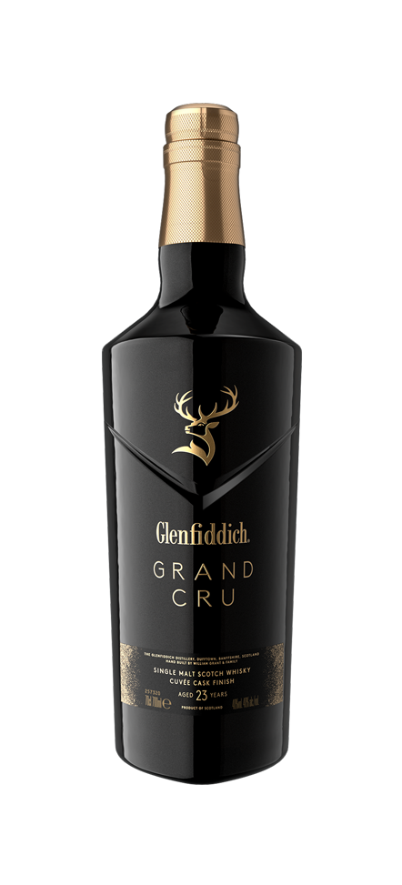
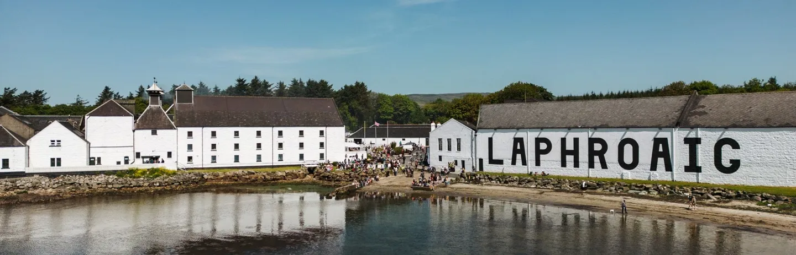
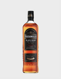

# Phase 4 Expanded: Regional Variations and Brand Identity

Suggested duration: Weeks 13 to 18

This guide is the expanded companion for Phase 4 of the main plan. If Phase 3 taught you how whisky is made, Phase 4 teaches you how whisky is framed, sold, remembered, and argued about through place.

Regional whisky study is useful, but it can become lazy very quickly. Students often memorize a stereotype map:

- Speyside = fruity and elegant
- Islay = smoky and medicinal
- Bourbon = sweet vanilla bomb
- Irish = smooth triple-distilled
- Japanese = precise and delicate

Those patterns can be helpful orientation, but they are not sufficient analysis. Real regional identity sits at the intersection of climate, legal framework, cask supply, agricultural history, equipment choices, corporate structure, and consumer expectation. Brand identity then selects a subset of that reality and tells a story.

This expanded Phase 4 is about learning that distinction: what is actually structural, and what is mostly narrative.

---

## 1. How to Study Region Without Falling for Stereotypes

A strong regional analysis uses the same three-part filter introduced earlier:

1. What does law require?
2. What does process actually do?
3. What does marketing emphasize?

When those three align, regional identity is often robust. When they diverge, you are usually looking at a story more than a structural truth.

### A Practical Regional Lens

For each region or country, map these seven dimensions:

- Legal category constraints
- Dominant grain systems
- Typical still systems
- Cask economics and availability
- Climate and warehouse behavior
- Historical trade pathways
- Signature brand narratives

This gives you an analytical skeleton. Flavor notes then sit on top of that skeleton rather than replacing it.

### Why Phase 4 Matters

Most arguments about whisky style are actually arguments about region and identity. Is a peated Highland less authentic than an Islay? Is Tennessee whiskey bourbon by another name? Is Japanese whisky style still distinct after global cask and stock sourcing shifts? Is climate-aged whisky from hot regions equivalent to much older spirit from Scotland?

You cannot answer those questions with tasting notes alone. You need this phase.

---

## 2. Scotland: Regional Myth, Real Process, and Global Prestige

Scotland is where regional language in whisky became globally standardized, especially through export marketing in the twentieth and twenty-first centuries. It is also where regional simplifications are most likely to break under scrutiny.

### 2.1 Speyside

Speyside is often presented as the heartland of single malt prestige. Historically and commercially, there is truth here. The region has a high concentration of distilleries and a long export tradition. But the stylistic range is broader than the "light-fruity" stereotype suggests.

Common tendencies:

- Frequent use of ex-bourbon and sherry cask programs
- Strong house-style differentiation among major producers
- Emphasis on polished presentation and age-led premium tiers

Database-linked distilleries:

- [Glenfiddich](https://www.glenfiddich.com/)
- [Glenfarclas](https://www.glenfarclas.com/)
- [The Macallan](https://www.themacallan.com/)

Analytical note:

Macallan's brand identity leans heavily on sherry cask prestige language. Glenfiddich leans more toward broad stylistic accessibility and high-volume consistency. Glenfarclas emphasizes family ownership and sherry-led continuity. Same region, very different identity architectures.

### 2.2 Islay

Islay is probably the strongest regional brand in whisky. Smoke, peat, medicinal notes, maritime imagery, and authenticity claims are deeply embedded in how consumers think about the region.

Common tendencies:

- Peat-forward production in several major houses
- Highly assertive house styles
- Strong use of place language (coast, sea air, iodine, storms)

Database-linked distilleries:

- [Laphroaig](https://www.laphroaig.com/)
- [Lagavulin](https://www.malts.com/en-row/products/single-malt-whisky/lagavulin)
- [Bruichladdich](https://www.bruichladdich.com/)

Analytical note:

Even inside Islay, profiles diverge strongly. Laphroaig's medicinal identity, Lagavulin's richer smoke structure, and Bruichladdich's multi-style portfolio (including heavily peated and unpeated lines) show that "Islay = one flavor" is incomplete.

### 2.3 Campbeltown

Campbeltown's history as a former whisky capital gives it one of the strongest survival narratives in Scotch. At its peak in the nineteenth century it had dozens of distilleries. Today, a small number of producers carry a category identity built around scarcity, old-school method, and textural distinctiveness.

Database-linked distilleries:

- [Springbank](https://www.springbank.scot/)
- [Glen Scotia](https://www.glenscotia.com/)

Analytical note:

Campbeltown's modern identity is not only about flavor. It is also about production philosophy: slower systems, labor-intensive traditions, and a cultivated resistance to over-industrialized style language.

### 2.4 Orkney and the Islands Question

The Islands are not an official Scotch Whisky Association region, but the term remains common in enthusiast and retail language. Your database currently includes Orkney and West Highlands entries under distinct labels.

Database-linked distilleries:

- [Highland Park](https://www.highlandparkwhisky.com/) (Orkney / Islands)
- [Oban](https://www.malts.com/en-row/products/single-malt-whisky/oban) (West Highlands)

Regional analysis note:

Orkney and West Highlands styles are often discussed as if they belong to one islands family. In practice, production choices and cask strategy explain more variation than map grouping alone.

### 2.5 Highlands and Lowlands in Your Current DB Context

Your README Phase 4 outline includes Highlands and Lowlands as major study tracks. The current database taxonomy includes West Highlands explicitly, but not a separate Lowlands bucket at this stage. Treat this as a versioning detail in the data model, not a reason to skip those conceptual regions in study.

A practical approach:

- Keep the conceptual region in your study plan.
- Use available distillery rows and official sites to anchor examples.
- Expand the DB taxonomy later if you want one-to-one mapping with textbook regional structures.

---

## 3. Ireland: Revival, Subcategory Identity, and Brand-Led Clarity

Irish whiskey's current global revival is one of the clearest cases where regional identity and brand identity reinforce each other.

Common tendencies in modern export-facing Irish whiskey:

- Emphasis on approachability and balance
- Frequent reference to triple distillation (though not universal)
- Strong single pot still storytelling in premium tiers
- Mix of legacy brands and newer urban distillery identity

Database-linked distilleries:

- [Bushmills](https://bushmills.com/)
- [Jameson](https://www.jamesonwhiskey.com/)
- [Redbreast](https://www.redbreastwhiskey.com/)
- [Teeling](https://www.teelingwhiskey.com/)

### 3.1 Category vs Brand Layer in Ireland

Jameson's scale and blend-led approach have made it one of the defining global whiskey brands for accessibility. Redbreast's single pot still identity positions it as a benchmark for depth and structure. Teeling emphasizes modern Dublin craft-urban positioning. Bushmills balances heritage age with broad market availability.

Same country, very different brand vectors.

### 3.2 Why Ireland Is a Good Phase 4 Classroom

Ireland is especially useful for regional analysis because it has:

- A clear historical narrative (rise, contraction, revival)
- A legally and stylistically distinctive flagship category (single pot still)
- Strong global brands with different identity strategies
- A manageable current producer set compared with Scotland's scale

This makes it easier to isolate which parts of identity are legal, process-driven, or storytelling.

---

## 4. United States: Law-Defined Categories and Strong Place Narratives

American whiskey is unusually explicit in legal category language. Bourbon, rye, and Tennessee whiskey are discussed in a framework where mash bill, charred oak requirements, and legal definitions are central.

Database-linked distilleries:

- [Buffalo Trace Distillery](https://www.buffalotracedistillery.com/) (Kentucky)
- [Maker's Mark](https://www.makersmark.com/) (Kentucky)
- [Wild Turkey](https://www.wildturkeybourbon.com/) (Kentucky)
- [Jack Daniel's](https://www.jackdaniels.com/) (Tennessee)
- [Uncle Nearest](https://unclenearest.com/) (Tennessee)

### 4.1 Kentucky and Bourbon Identity

Kentucky's climate and rickhouse dynamics are central to bourbon's profile. Seasonal temperature swings drive extraction and evaporation patterns that can intensify oak impact over relatively shorter legal ages compared with cooler-climate Scotch maturation.

But do not flatten Kentucky into one style. Mash bill architecture, barrel entry proof, warehouse strategy, and blending house decisions create major in-state diversity.

### 4.2 Tennessee: Process Identity and Cultural Positioning

Tennessee whiskey shares much production overlap with bourbon but often emphasizes charcoal mellowing narratives and state-level identity claims. Jack Daniel's and Uncle Nearest also demonstrate how brand history and cultural authorship now play a visible role in category perception.

### 4.3 The American Brand Voice

Compared with many Scotch houses, American brands often communicate more directly through mash bill, proof, and barrel terms rather than abstract heritage language alone. This is a useful contrast for students who want to compare how different markets teach consumers to read labels.

---

## 5. Canada: Blending Logic and Misread Identity

Canadian whisky is frequently misunderstood by students trained on Scotch single malt framing. The category's blending-first architecture and flexible style language can look vague until you understand its production intent.

Database-linked distilleries:

- [Crown Royal](https://www.crownroyal.com/)
- [Forty Creek](https://fortycreekwhisky.com/)

### 5.1 Structural Features of Canadian Identity

- Blend architecture is often central
- Lighter style references are common but not universal
- Rye language can be cultural shorthand, not always a strict mash-bill declaration

### 5.2 Why Canada Belongs in a Serious Comparative Study

Canadian whisky helps break rigid assumptions about what authenticity looks like. If your model of quality requires heavy pot-still signatures and overt terroir storytelling, you may miss categories built around balance, precision blending, and commercial consistency.

---

## 6. Japan: Precision Blending and Controlled Diversity

Japanese whisky grew through adaptation of Scottish methods and then differentiated through internal production strategy, blending philosophy, and presentation discipline.

Database-linked distilleries:

- [Yamazaki](https://house.suntory.com/yamazaki-whisky)
- [Hakushu](https://house.suntory.com/hakushu-whisky)
- [Yoichi](https://www.nikka.com/eng/brands/yoichi/)
- [Miyagikyo](https://www.nikka.com/eng/brands/miyagikyo/)

### 6.1 House-Internal Diversity as Strategy

Unlike traditional Scotch practices where trading and blending across firms historically played a major role, major Japanese groups often built diversity inside the house by creating multiple distillery styles they could blend internally.

That design choice has consequences:

- tighter style control
- stronger house signatures
- heightened importance of blending expertise

### 6.2 Identity Pressure After Global Demand Surges

As demand surged internationally, stock constraints and category-definition controversies forced clearer communication around what qualifies as Japanese whisky. For Phase 4 students, this is a useful case study in how law, inventory, and brand trust collide.

---

## 7. World Whisky (India and Taiwan): Climate and Legibility

Your DB currently includes two high-impact world-whisky anchors outside the legacy big five markets:

- [Amrut](https://amrutdistilleries.com/) (India)
- [Kavalan](https://www.kavalanwhisky.com/en/) (Taiwan)

### 7.1 Why These Two Matter in Phase 4

Amrut and Kavalan are among the clearest examples of producers that changed global assumptions by proving that premium whisky quality is not geographically limited to Scotland, Ireland, US, Canada, or Japan.

They also foreground climate as an identity variable. Maturation pace, evaporation intensity, and cask behavior in warmer conditions create profile structures that do not map neatly onto cool-climate age assumptions.

### 7.2 Interpreting Warm-Climate Maturity Claims

A useful analytical discipline here:

- Separate extraction speed from full integration.
- Compare profile maturity, not just numerical age.
- Track whether brand language overstates equivalence to older cool-climate whiskies.

Warm-climate whisky is not lesser or greater by default. It is differently paced.

---

## 8. Australia: The Deepest Regional Grid in Your Database

Australia is the largest country block in your current distillery database, making it ideal for a granular Phase 4 region-and-brand study.

Your DB includes concentrated coverage across:

- New South Wales
- Queensland
- South Australia
- Tasmania
- Victoria
- Western Australia

### 8.1 Tasmania: Density and Prestige Signal

Tasmania has the strongest concentration in your dataset and is often treated as Australia's premium whisky core.

Database-linked examples:

- [Lark Distillery](https://larkdistillery.com/)
- [Sullivans Cove](https://sullivanscove.com/)
- [Hellyers Road](https://hellyersroaddistillery.com.au/)
- [Spring Bay Distillery](https://springbaydistillery.com/)
- [Callington Mill Distillery](https://callingtonmilldistillery.com/)

### 8.2 Victoria: Urban-Craft and Grain Identity

Database-linked examples:

- [Starward](https://starward.com.au/)
- [The Gospel Whisky](https://thegospelwhisky.com/)
- [Bakery Hill](https://bakeryhill.com.au/)
- [Morris Whisky](https://morriswhisky.com.au/)

### 8.3 New South Wales: Broad Craft Spread

Database-linked examples:

- [Amber Lane Distillery](https://amberlanedistillery.com/)
- [Archie Rose Distilling Co.](https://archierose.com.au/)
- [Black Gate Distillery](https://www.blackgatedistillery.com.au/)
- [Corowa Distilling Co.](https://corowadistilling.com/)
- [Joadja Distillery](https://joadja.com.au/)
- [Reedy Swamp Distillery](https://www.reedyswampdistillery.com.au/)

### 8.4 Queensland: Smaller Set, Clear Anchors

Database-linked examples:

- [2020 Distillery](https://2020distillery.com.au/)
- [Noosa Heads Distillery](https://noosaheadsdistillery.com/)
- [Mt Uncle Distillery](https://mtuncle.com/)
- [Cauldron Distillery](https://www.cauldrondistillery.com.au/)

### 8.5 South Australia: Distilling Network and Brand Diversity

Database-linked examples:

- [23rd Street Distillery](https://www.23rdstreetdistillery.com.au/)
- [Adelaide Distillery](https://adelaidedistillery.com.au/)
- [Adelaide Hills Distillery](https://adelaidehillsdistillery.com.au/)
- [5Nines Distilling](https://5ninesdistilling.com.au/)
- [Fleurieu Distillery](https://fleurieudistillery.com.au/)

### 8.6 Western Australia: Distinct Cluster

Database-linked examples:

- [Limeburners / Great Southern Distilling Company](https://www.limeburners.com/)
- [Whipper Snapper Distillery](https://whippersnapper.com.au/)
- [The Grove Distillery](https://www.grovedistillery.com.au/)
- [Nullaki Distillery](https://www.nullakidistillery.com/)

### 8.7 Why Australia Is a Strong Phase 4 Lab

Australia's multi-state structure in your DB makes it easy to study how regional identity is built from small-to-medium producer ecosystems rather than from a single legacy category architecture. This is especially useful for building modern comparative frameworks that go beyond the old five-country model.

---

## 9. Regional Style vs Brand Identity: A Practical Matrix

When a bottle makes a place claim, use this matrix.

| Question | Regional signal | Brand signal |
|---|---|---|
| Is there a legal rule behind this claim? | Strong if codified by category law | Weak if only slogan-level |
| Does local climate plausibly shape maturation? | Strong when warehouse behavior is documented | Can be exaggerated in marketing |
| Does production method match the claimed style? | Strong when still/cask choices align | Weak when process details are opaque |
| Is the flavor claim true across multiple producers in region? | Strong if repeated across independent houses | Weak if only one brand pushes it |
| Could this same style be made elsewhere with same process? | If yes, place claim may be partial | Brand differentiation may still be valid |

This matrix does not eliminate subjectivity, but it prevents uncritical acceptance of regional shorthand.

---

## 10. Distillery Dossier Method (Database-Integrated)

Use this repeatable template for any distillery in your DB.

1. Distillery name and region label from DB.
2. Official site link from `official_site`.
3. Category and subcategory positioning.
4. Process details publicly disclosed: mash bill, still type, fermentation, cask policy.
5. Core brand narrative language.
6. Evidence check: what is technical fact versus promotional framing?
7. Comparative neighbor: one distillery from same region, one from another region.
8. Working hypothesis: what most likely drives this distillery's identity?

### Example Mini-Dossiers

#### Example A: Speyside vs Islay (Scotland)

- [Glenfiddich](https://www.glenfiddich.com/) (Speyside)
- [Laphroaig](https://www.laphroaig.com/) (Islay)

Hypothesis prompt:

How much of the contrast in sensory identity is region and how much is deliberate process/cask policy?

#### Example B: Ireland Heritage vs Urban Revival

- [Bushmills](https://bushmills.com/)
- [Teeling](https://www.teelingwhiskey.com/)

Hypothesis prompt:

How does each brand balance heritage language with contemporary positioning?

#### Example C: Tennessee Identity Construction

- [Jack Daniel's](https://www.jackdaniels.com/)
- [Uncle Nearest](https://unclenearest.com/)

Hypothesis prompt:

How do process similarities and historical storytelling differences create distinct premium narratives?

#### Example D: Japan House Contrast

- [Yamazaki](https://house.suntory.com/yamazaki-whisky)
- [Yoichi](https://www.nikka.com/eng/brands/yoichi/)

Hypothesis prompt:

How do house-internal blending strategies shape perceived regional precision?

#### Example E: Australia Multi-State Comparison

- [Starward](https://starward.com.au/) (Victoria)
- [Lark Distillery](https://larkdistillery.com/) (Tasmania)
- [23rd Street Distillery](https://www.23rdstreetdistillery.com.au/) (South Australia)

Hypothesis prompt:

How much of the style and story differences are climatic, and how much are portfolio strategy?

---

## 11. Tasting Flights That Teach Regional Literacy

Design flights that isolate one variable and challenge one stereotype.

### Flight 1: Speyside Range, Same Region, Different Identity

Use three Speyside anchors from your DB:

- [Glenfiddich](https://www.glenfiddich.com/)
- [Glenfarclas](https://www.glenfarclas.com/)
- [The Macallan](https://www.themacallan.com/)

Learning target:

Understand why one-region assumptions are often weaker than cask and house policy analysis.

### Flight 2: Islay Internal Diversity

- [Bruichladdich](https://www.bruichladdich.com/)
- [Lagavulin](https://www.malts.com/en-row/products/single-malt-whisky/lagavulin)
- [Laphroaig](https://www.laphroaig.com/)

Learning target:

Map peat style variation without collapsing all Islay into one smoke profile.

### Flight 3: Ireland vs Scotland Process Accent

- [Redbreast](https://www.redbreastwhiskey.com/)
- [Springbank](https://www.springbank.scot/)

Learning target:

Compare textural signatures and cask articulation across category traditions.

### Flight 4: US Category-Law Framing

- [Maker's Mark](https://www.makersmark.com/)
- [Wild Turkey](https://www.wildturkeybourbon.com/)
- [Jack Daniel's](https://www.jackdaniels.com/)

Learning target:

See how legal and process framing supports distinct brand narratives in one national ecosystem.

### Flight 5: Japan and World Whisky Disruption

- [Yamazaki](https://house.suntory.com/yamazaki-whisky)
- [Amrut](https://amrutdistilleries.com/)
- [Kavalan](https://www.kavalanwhisky.com/en/)

Learning target:

Test your assumptions about place, climate, and prestige hierarchy.

---

## 12. Common Regional Errors to Avoid

### Error 1: Treating region as flavor destiny

Region sets context, not certainty.

### Error 2: Confusing protected legal names with sensory guarantees

A legal label tells you minimum structure, not final flavor quality.

### Error 3: Assuming older regions are automatically better regions

Maturity of category history does not replace process excellence.

### Error 4: Treating small producers as more authentic by default

Craft scale and quality are related only when process discipline is present.

### Error 5: Ignoring cask supply economics

Cask availability can strongly shape regional style expression and premium positioning.

### Error 6: Underestimating corporate portfolio design

Many "regional" impressions are produced by intentional brand architecture as much as by local conditions.

---

## 13. Deep Comparative Cases (Region vs Brand)

These cases are designed to push you past broad descriptions and into evidence-based interpretation.

### Case 1: Speyside Prestige vs Islay Intensity (Scotland)

Compare:

- [The Macallan](https://www.themacallan.com/)
- [Glenfiddich](https://www.glenfiddich.com/)
- [Laphroaig](https://www.laphroaig.com/)

Questions:

- Which positioning cues are sensory (cask, smoke, texture) and which are symbolic (luxury, heritage, collectability)?
- How does each brand use age statements or NAS tiers differently?
- How much of the consumer's expectation is region-driven before the bottle is opened?

Analytical takeaway:

Speyside prestige and Islay intensity are both partly real and partly pre-conditioned by brand communication systems. Region gives each producer a starting script, but the script is rewritten by cask policy and portfolio architecture.

### Case 2: Campbeltown Scarcity and Authenticity Signaling

Compare:

- [Springbank](https://www.springbank.scot/)
- [Glen Scotia](https://www.glenscotia.com/)

Questions:

- How does each house communicate production method and labor intensity?
- Which expressions lean into local identity and which are portfolio-expansion plays?
- Is scarcity in these brands mostly genuine stock constraint or narrative strategy, or both?

Analytical takeaway:

Campbeltown identity is unusually sensitive to supply levels. Scarcity in this region can be simultaneously a real inventory condition and a brand-value amplifier.

### Case 3: Irish Accessibility vs Irish Specialization

Compare:

- [Jameson](https://www.jamesonwhiskey.com/)
- [Redbreast](https://www.redbreastwhiskey.com/)
- [Teeling](https://www.teelingwhiskey.com/)

Questions:

- What role does single pot still language play in premium differentiation?
- How does each brand balance education with broad-market simplicity?
- Which terms are legal category markers versus house-style descriptors?

Analytical takeaway:

Ireland's modern global identity is multi-layered: a large accessible blend-led gateway and a high-credibility specialist lane built on pot still and cask detail.

### Case 4: Kentucky Heritage vs Tennessee Framing

Compare:

- [Maker's Mark](https://www.makersmark.com/)
- [Wild Turkey](https://www.wildturkeybourbon.com/)
- [Jack Daniel's](https://www.jackdaniels.com/)
- [Uncle Nearest](https://unclenearest.com/)

Questions:

- Which identity claims are backed by legal category structure and which by process variation?
- How do packaging and proof strategy signal either premium seriousness or broad accessibility?
- How is historical authorship used differently between legacy and modern Tennessee narratives?

Analytical takeaway:

US identity frameworks are law-heavy, but final brand differentiation still depends on storytelling choices around history, place, and process emphasis.

### Case 5: Japan Precision vs World Whisky Acceleration

Compare:

- [Yamazaki](https://house.suntory.com/yamazaki-whisky)
- [Yoichi](https://www.nikka.com/eng/brands/yoichi/)
- [Amrut](https://amrutdistilleries.com/)
- [Kavalan](https://www.kavalanwhisky.com/en/)

Questions:

- How do warm-climate producers communicate maturity without relying on high age numbers?
- How do Japanese producers communicate refinement and blending discipline under stock pressure?
- Which identities appear built on process disclosure and which on inherited prestige assumptions?

Analytical takeaway:

Global premium whisky is now built on competing models of legitimacy: heritage continuity, process precision, and climate-driven performance.

---

## 14. Legal and Category Mapping by Region

Regional identity becomes clearer when you map legal category structure beside brand language.

### Scotland

- Strong category protection and naming controls.
- Distillery region language remains commercially important but is not always tightly predictive of flavor.

### Ireland

- Irish whiskey definitions provide a robust category frame.
- Single pot still is a strategic legal-cultural identity anchor.

### United States

- Bourbon and rye laws are highly explicit on mash bill and cask requirement.
- Tennessee identity overlays category law with process and geographic framing.

### Canada

- Category allows more blending flexibility.
- Consumer-facing style language can be culturally consistent even when technical composition varies.

### Japan

- Category standards and producer communication evolved significantly under global demand pressure.
- House-level style integrity is heavily tied to internal production planning.

### World Whisky (India/Taiwan in your DB)

- Category perception is still catching up to quality reality.
- Climate and maturation dynamics force reinterpretation of age-centric assumptions.

Practical use:

When evaluating a bottle claim, first locate it on this legal map. If a claim has no legal grounding, treat it as a brand hypothesis requiring process evidence.

---

## 15. Climate, Warehouse Behavior, and Regional Style Drift

Students frequently learn regional flavor as static. In reality, climate and warehouse strategy can shift profile over time, especially as global temperatures and cask supply patterns change.

### Climate Variables That Matter

- Annual temperature swing
- Humidity patterns
- Warehouse construction and airflow
- Cask fill strength
- Cask size and refill cycle

### Stylized Regional Maturation Patterns

| Region model | Typical climate behavior | Common maturation consequences |
|---|---|---|
| Cool maritime (many Scotch sites) | Modest annual swings, relatively slower extraction | Longer integration windows, gradual oak development |
| Continental/seasonal rickhouse (many US sites) | Strong summer/winter swings | Faster extraction cycles, stronger oak concentration gradients |
| Warm/hot humid (many India/Taiwan contexts) | High temperatures and elevated evaporation | Rapid extraction, strong angel's share pressure, earlier cask impact |
| Temperate maritime (many Tasmanian/Australian coastal sites) | Moderate swings with strong microclimate effects | Highly site-dependent outcomes; both elegant and active profiles possible |

### Why This Matters for Phase 4

Regional style can drift as production systems adapt to climate and stock economics. A region's historical profile is not guaranteed to remain stable over decades if warehouse strategy, cask sourcing, or climate behavior shifts materially.

For your database-backed study workflow, this suggests adding a climate and warehouse observation field to future distillery notes so you can track style drift longitudinally.

---

## 16. Database-Integrated Research Workflow for Phase 4

You already have a practical advantage: a structured distillery database with country, region, and official links. Use it as an analysis engine, not just a directory.

### Workflow A: Region Consistency Audit

Goal:

Test whether distilleries in one region are communicating similar process drivers.

Method:

1. Pull distilleries by region.
2. Review official-site process pages for disclosed points: mash bill/grain, still type, cask policy.
3. Classify each claim as legal, process, sensory, or narrative.
4. Compare overlap.

Expected output:

A region profile showing which claims are structurally shared versus brand-specific.

### Workflow B: Cross-Region Identity Collision

Goal:

Find distilleries in different regions making similar style claims.

Method:

1. Select one style claim (for example, sherry-forward, smoky-maritime, fruity-light).
2. Identify distilleries across countries making that claim.
3. Compare disclosed process pathways that support it.
4. Note where regional identity overstates uniqueness.

Expected output:

An evidence-based map of convergent style pathways across geographies.

### Workflow C: Brand Narrative Density Scoring

Goal:

Measure how much a brand relies on heritage/place language versus process disclosure.

Method:

1. Sample official-site copy for each distillery.
2. Count references to history/place symbols versus process details.
3. Score each brand on narrative density.
4. Compare narrative density with category and price positioning.

Expected output:

A practical framework for separating educational transparency from symbolic branding.

### Database-Linked Distillery Sets for Immediate Use

Scotland set:

- [Glenfiddich](https://www.glenfiddich.com/)
- [The Macallan](https://www.themacallan.com/)
- [Laphroaig](https://www.laphroaig.com/)
- [Springbank](https://www.springbank.scot/)

Ireland set:

- [Bushmills](https://bushmills.com/)
- [Jameson](https://www.jamesonwhiskey.com/)
- [Redbreast](https://www.redbreastwhiskey.com/)
- [Teeling](https://www.teelingwhiskey.com/)

United States set:

- [Buffalo Trace Distillery](https://www.buffalotracedistillery.com/)
- [Maker's Mark](https://www.makersmark.com/)
- [Wild Turkey](https://www.wildturkeybourbon.com/)
- [Jack Daniel's](https://www.jackdaniels.com/)

Japan/world set:

- [Yamazaki](https://house.suntory.com/yamazaki-whisky)
- [Yoichi](https://www.nikka.com/eng/brands/yoichi/)
- [Amrut](https://amrutdistilleries.com/)
- [Kavalan](https://www.kavalanwhisky.com/en/)

Australia set:

- [Lark Distillery](https://larkdistillery.com/)
- [Starward](https://starward.com.au/)
- [23rd Street Distillery](https://www.23rdstreetdistillery.com.au/)
- [Limeburners](https://www.limeburners.com/)

### Phase 4 Capstone Ideas (DB-Native)

1. Build a region-signal index for each country in the DB.
2. Build a claim taxonomy: legal, process, sensory, narrative.
3. Rank distilleries by process transparency score.
4. Produce one comparative report per month using only DB-linked producers.

---

## 17. Review List: Key Facts to Lock In

- Regional whisky identity is strongest when law, process, and climate align.
- Brand identity often simplifies or dramatizes regional truth.
- Speyside is diverse; it is not one profile.
- Islay is highly peated in reputation, but internal stylistic variation remains substantial.
- Campbeltown identity is partly a survival narrative and partly a real process/style cluster.
- Ireland's modern profile blends heritage brands with revival-era distilleries.
- US whiskey categories are unusually law-explicit and process-labeled.
- Canadian whisky quality is often underread because many students apply Scotch-first frameworks.
- Japanese whisky identity is strongly linked to blending architecture and house precision narratives.
- India and Taiwan challenge old prestige geographies and force climate-aware interpretation of age.
- Australia's multi-state development is a strong live case for contemporary world-whisky regional analysis.
- In your current DB taxonomy, Scotland includes Speyside, Islay, Campbeltown, Orkney/Islands, and West Highlands labels.
- The DB provides official links for all core Phase 4 anchor countries plus India and Taiwan under World Whisky.
- Good Phase 4 study compares distilleries within region and across region, not just between countries.
- Regional shorthand is a starting point; process evidence is the finish line.

---

## 18. Quiz: Phase 4 Multiple Choice

1. Which approach best supports accurate regional whisky analysis?
A) Memorize tasting-note stereotypes for each region.
B) Evaluate law, process, and marketing claims separately.
C) Prioritize bottle age above all other factors.
D) Focus only on distillery founding date.

2. In your current database, which Scotland region labels are represented?
A) Speyside, Islay, Campbeltown, Orkney / Islands, West Highlands
B) Speyside, Islay, Lowlands, Highlands, Islands
C) Speyside, Highlands, Lowlands, Campbeltown only
D) Islay only

3. Which of the following distilleries in your DB is in Campbeltown?
A) Laphroaig
B) Oban
C) Springbank
D) Glenfiddich

4. Which statement about Islay is most accurate for Phase 4 study?
A) Every Islay whisky has the same smoke profile.
B) Islay is useful only for peat analysis, not brand strategy.
C) Islay has strong peat identity but meaningful internal house variation.
D) Islay identity is mostly unrelated to place language.

5. Which trio is the Speyside-linked set in your DB?
A) Glenfiddich, Glenfarclas, The Macallan
B) Oban, Highland Park, Springbank
C) Bushmills, Teeling, Redbreast
D) Yamazaki, Hakushu, Yoichi

6. Which Irish distillery in your DB is based in Dublin?
A) Bushmills
B) Teeling
C) Jameson
D) Redbreast

7. What is the strongest analytical reason to compare Maker's Mark and Wild Turkey in Phase 4?
A) They are both Japanese whiskies.
B) They show how one legal category can still hold different brand/process identities.
C) They are both single malts from Islay.
D) They are both Canadian blended whiskies.

8. Which DB-linked pair represents Tennessee whiskey producers?
A) Buffalo Trace and Wild Turkey
B) Jack Daniel's and Uncle Nearest
C) Bushmills and Teeling
D) Yamazaki and Hakushu

9. Which statement best explains why Canadian whisky is often misread by enthusiasts?
A) It lacks legal standards.
B) It is always flavored with additives.
C) Scotch single-malt assumptions are applied to a blend-centered category.
D) It is never aged in wood.

10. Which set represents Japan in your DB?
A) Glen Scotia, Springbank, Oban, Highland Park
B) Amrut, Kavalan, Starward, Lark
C) Yamazaki, Hakushu, Yoichi, Miyagikyo
D) Bushmills, Jameson, Redbreast, Teeling

11. Why are Amrut and Kavalan important in a Phase 4 framework?
A) They are Lowlands Scotch producers.
B) They reinforce old geography-only prestige assumptions.
C) They help test climate-driven and world-whisky identity models.
D) They are Canadian rye benchmarks.

12. Which statement about Australian coverage in your DB is true?
A) Only Tasmania is represented.
B) Multiple state clusters are represented, making Australia a strong regional-analysis lab.
C) Australia is represented by one distillery only.
D) No official-site links are available for Australia.

13. What does the distillery dossier method primarily do?
A) Replace tasting entirely with marketing copy review.
B) Standardize comparisons between legal structure, process facts, and brand narrative.
C) Rank whiskies by auction value only.
D) Avoid cross-region comparisons.

14. Which is the best interpretation of regional shorthand (for example, Speyside = fruity)?
A) It is always wrong.
B) It is always sufficient for deep analysis.
C) It can be useful orientation but must be tested against process and brand evidence.
D) It is legally binding.

15. In Phase 4, what is the strongest reason to compare distilleries inside the same region?
A) To prove all regional claims are false.
B) To reveal how house style and cask policy can diverge despite shared geography.
C) To avoid reading labels.
D) To estimate stock market value.

16. Which pairing is best for a Scotland internal contrast in your DB?
A) Glenfiddich and Laphroaig
B) Crown Royal and Forty Creek
C) Teeling and Redbreast
D) Jack Daniel's and Uncle Nearest

17. Which of these is a core error in regional whisky analysis?
A) Comparing legal requirements across countries
B) Assuming region alone determines final flavor
C) Studying cask economics
D) Comparing distillery narratives with process disclosures

18. Why is Phase 4 especially relevant after Phase 3?
A) It replaces process analysis.
B) It teaches that process does not matter.
C) It helps interpret how process outcomes are grouped and marketed through place.
D) It focuses only on distillery architecture.

### Quiz Answer Key

| Question | Correct answer |
|---|---|
| 1 | B |
| 2 | A |
| 3 | C |
| 4 | C |
| 5 | A |
| 6 | B |
| 7 | B |
| 8 | B |
| 9 | C |
| 10 | C |
| 11 | C |
| 12 | B |
| 13 | B |
| 14 | C |
| 15 | B |
| 16 | A |
| 17 | B |
| 18 | C |

### Quiz More Information

| Question | More information |
|---|---|
| 1 | Evaluating regional whisky accurately requires separating three distinct layers that are often merged in casual discussion: legal definitions that determine what must be produced and where, process characteristics that actually shape the spirit's sensory profile, and marketing narratives that frame those characteristics for consumer audiences. Legal definitions are verifiable through regulation. Process characteristics can be discovered through producer technical disclosures. Marketing narratives should be read with the same critical framework applied to any brand claim—some are accurate and some are embellishments. A consumer who can separate these three layers approaches regional identity analysis with a much more reliable toolkit than one who treats regional reputation as factual sensory prediction. |
| 2 | Geography in whisky influences production in several genuine ways: altitude and climate affect maturation rates, local grain varieties (where they exist) can shape mash character, water source chemistry affects mashing efficiency, and traditional production practices develop regionally and persist as house style conventions. However, the relationship between geography and flavor is mediated by human production decisions at every stage—what grain to use, how to ferment, where to cut during distillation, which casks to employ. Two distilleries in adjacent valleys can produce radically different spirits despite sharing geology, water source, and climate. Geography sets context and constraints; it does not determine outcome mechanistically. Treating regional origin as a flavor guarantee misunderstands how production works. |
| 3 | Scotch whisky regions—Speyside, Highlands, Lowlands, Campbeltown, Islay, and Islands—are not legally binding production rules. They are administrative and traditional groupings that have developed to help categorize a large and diverse industry for marketing and trade purposes. Profile generalizations (Speyside equals fruity, Islay equals peated, Lowlands equals light) are useful as first-approximation orientation but are repeatedly confounded by real production diversity. Bruichladdich produces heavily unpeated Islay whisky. Some Speyside distilleries produce heavily sherried, dense expressions with little fruity lightness. Highland Park is an Orkney distillery categorized as Islands or sometimes grouped loosely with Highland. Treating regional labels as predictive flavor specifications rather than geographic convenience categories consistently leads to analytical errors. |
| 4 | Islay has a genuine and historically grounded connection to peated whisky production: the island's peat bogs provided traditional fuel for kilning, and heavy peating became a component of house styles for several major distilleries including Lagavulin, Laphroaig, and Ardbeg. However, Islay also hosts Bruichladdich, which produces a wide range of mostly unpeated expressions, and Bunnahabhain, which uses minimal peat. These unpeated Islay whiskies demonstrate that the island provides geographic context for distillation but does not mandate a specific smoke level. Additionally, even among the peated Islay distilleries, phenol ppm targets, cut points, and cask programs produce meaningfully different results that make comparisons between Laphroaig and Ardbeg educational beyond simply measuring peat intensity. |
| 5 | Speyside is home to the highest concentration of Scotch whisky distilleries in Scotland, with over 50 operating sites within the region. The Speyside grouping includes Glenfiddich—the world's best-selling single malt—alongside The Macallan and Glenfarclas, each of which takes a significantly different approach to production. Glenfiddich emphasizes fresh, fruity character through its distillation approach and flexible cask strategy. The Macallan is closely associated with sherry cask maturation, which dominates its flavor profile with dried fruit, spice, and richness. Glenfarclas takes a different sherry orientation with family ownership and traditional practices. The fact that these three distilleries share a geographic region but produce quite distinct whisky demonstrates why Speyside as a flavor category requires nuanced reading rather than a single profile assumption. |
| 6 | Campbeltown's status as a recognized Scotch whisky region is unusual given that only three distilleries—Springbank, Glen Scotia, and Glengyle (Kilkerran)—actively produce there. Historically, Campbeltown was one of Scotland's most prolific whisky production areas, with over 30 distilleries operating in the 19th century, but the industry collapsed due to overproduction, quality problems, and changing export markets. The modern Campbeltown designation reflects a combination of historical importance and the distinctive character of Springbank in particular, which produces several distinct expressions (including Longrow and Hazelburn as separate style lines) from a single distillery using different production approaches. Springbank's position as a family-owned, traditional producer exercising full production control from malting to bottling on-site gives it a particularly distinctive provenance in the modern market. |
| 7 | Irish whiskey spans a wider stylistic range than its popular reputation suggests. The traditional Irish pot still style—using a mash of both malted and unmalted barley in pot stills—produces a distinctive spicy, creamy, full-bodied whiskey that is unique to Ireland and distinct from both Scotch malt and bourbon. Redbreast and Powers Gold Label represent this style. Irish single malt (for example Teeling Single Malt) uses only malted barley, similar to Scotch single malt. Irish blended whiskey (for example Jameson) combines grain and pot still or malt components. This stylistic diversity means that reading Irish whiskey through a single lens (smooth and light, for example) reflects the marketing positioning of certain brands rather than the production breadth of the category. |
| 8 | US bourbon has a set of legally specific requirements that apply uniformly to all producers, but these legal parameters still leave considerable space for stylistic differentiation through mash bill composition, yeast strain, entry proof at barrel, warehouse position, char level, and maturation duration choices. Maker's Mark is a wheated bourbon—replacing the more common rye in its flavor grain—producing a softer, sweeter profile compared to high-rye bourbons like Old Grand-Dad. Wild Turkey uses a high-rye mash bill and is bottled at higher proof than many competitors. These differences in brand philosophy and production parameters exist entirely within the common legal framework of bourbon definition and illustrate why legal category membership does not reduce to sensory homogeneity. |
| 9 | Canadian whisky's legal framework differs from most other major categories in that it permits the addition of up to 9.09% of other spirits or flavoring agents to the base whisky. The category also allows grain components produced separately at different proofs and blended after maturation—a practice that allows considerable stylistic flexibility. Canadian whisky often tastes smoother and lighter than Scotch or bourbon because its production design targets that profile, not because it lacks technical sophistication. The enthusiast tendency to dismiss Canadian whisky as lacking character reflects applying single-malt prestige frameworks (complex, individualistic, terroir-driven) to a category whose technical identity is built around consistency, approachability, and blend craftsmanship. Crown Royal and Forty Creek are examples of Canadian producers that reward close production attention rather than category dismissal. |
| 10 | Japanese whisky production has developed a distinctive character through several decades of disciplined technical refinement. Suntory established Yamazaki in 1923 and Hakushu in 1973, both of which use a range of different still types and configurations within a single distillery to produce diverse spirit styles for blending. Nikka operates Yoichi, which uses coal-heated pot stills and produces a heavier, more traditional style, and Miyagikyo, which uses indirect steam heating for a lighter, more delicate character. The internal variety within the Japanese system allows producers to blend complex expressions without acquiring spirit from other distilleries—a significant difference from the Scotch model where most blenders source widely. Japanese whisky's global prestige reflects both genuine production quality and effective cultural and aesthetic brand positioning in international markets. |
| 11 | Amrut Distilleries in Bangalore, India, began releasing single malt whisky internationally in 2004, followed by Kavalan from Taiwan's Yilan in 2005. Both producers demonstrated that world-class whisky could be produced outside the traditional Scottish, Irish, Japanese, and American categories. Climate has been one of the most analytically interesting variables in evaluating these whiskies: intense subcontinental heat at Amrut and subtropical conditions at Kavalan dramatically accelerate maturation, with some expressions achieving equivalent wood integration to 12-year Scotch in as little as 3-4 years. These accelerated maturation dynamics challenge assumptions about age and quality built around cool-climate whisky economies. Amrut and Kavalan also raise important questions about whether European oak maturation compounds behave identically under tropical conditions, making them useful laboratory examples for world-whisky identity analysis. |
| 12 | Australia's whisky production has developed rapidly since the 1990s, with significant geographic spread across Tasmania, Victoria, New South Wales, Queensland, South Australia, and Western Australia. Tasmania, home to Lark Distillery (founded 1992, a pioneer of the revival) and Sullivans Cove, is often credited with establishing the Australian craft whisky template. Victoria hosts Starward, which has pioneered maturation using Australian red wine barrels (previously used for Apera/Shiraz/Cabernet) in Melbourne's variable climate. New South Wales, Queensland, and South Australia each have emerging producers with distinct regional flavor approaches. The geographic breadth of Australian production makes it a particularly rich case study for regional identity analysis because the internal variation within a single country spans multiple production philosophies, climates, and maturation approaches. |
| 13 | The distillery dossier method is a structured analytical exercise in which the student or analyst compiles production facts, legal category documentation, geographic context, and brand narrative for a specific distillery, then evaluates each element separately before synthesizing observations. The purpose is to make visible the gaps between what the producer discloses technically, what the legal framework requires, and what brand storytelling adds. When these three align (for example, a legal category requiring pot still distillation, confirmed pot still use, and brand narrative centered on pot still craft), the claim is well-supported. When gaps appear—for example, claims about ancient spring water that cannot be traced to any production relevance—the method helps the analyst recognize where narrative is substituting for production evidence. |
| 14 | Regional shorthand functions as useful cognitive scaffolding during early learning: knowing that Islay has historically produced heavily peated whisky, or that Speyside shelters many fruity, lighter malts, provides an initial orientation framework that is not completely wrong. The problem arises when these generalizations are mistaken for hard rules that apply to all distilleries within a region and persist regardless of production changes. Regions evolve: Campbeltown's 19th-century profile was very different from its contemporary one; Islay now produces a spectrum of smoke levels rather than a uniform style. Using regional labels as starting hypotheses to be tested against production evidence—rather than as final conclusions—is the analytical improvement Phase 4 is designed to produce. |
| 15 | Comparing distilleries within the same region is analytically productive precisely because it controls for the regional variables that influence spirit character (climate, water, local grain supply) while allowing investigation of the producer decisions that drive differentiation within those shared constraints. Glenfiddich and The Macallan are both Speyside; their very different flavor profiles (fresh fruit and malt versus rich sherry and dried fruit) cannot be explained by geography alone, requiring investigation of cask policy, fermentation approach, and house style philosophy. Similarly, Laphroaig versus Bruichladdich on Islay isolates the impact of malting phenol choices against shared island geography. These same-region comparisons develop the analytical muscle that single-region or single-distillery focus cannot provide. |
| 16 | Glenfiddich and Laphroaig represent one of the most analytically illuminating contrasts in the Scotch whisky world precisely because they sit in different regions and take almost diametrically opposed production positions. Glenfiddich is Speyside, fresh, light, unpeated, using a large variety of cask types in a flexible blending strategy. Laphroaig is Islay, heavily peated, coastal, using predominantly ex-bourbon barrels and producing a medicinal, smoky, saline profile that is among the most distinctive in Scotch. Comparing these two side by side makes regional identity, production choice, and cask policy visible as distinct causal variables. They share a legal category (single malt Scotch whisky) while producing radically different spirits—demonstrating that legal category membership is not a reliable sensory predictor without production specificity. |
| 17 | The single most common analytical error in regional whisky analysis is treating regional origin as the complete explanation of sensory character—assuming that because a whisky comes from Islay it will be smoky, or from Speyside it will be fruity, without checking whether the specific producer's process, yeast choice, cask program, or house style actually supports those inferences. This error is reinforced by marketing that leans heavily on regional identity because it provides simple, memorable positioning. Advanced analysis requires treating regional affiliation as the starting point for investigation rather than the conclusion. Tracking exceptions to regional generalizations—the unpeated Islay malt, the heavily sherried Speyside, the light Highland—develops the habit of prioritizing evidence over assumption. |
| 18 | Process analysis (Phase 3) and regional analysis (Phase 4) are most powerful when combined rather than applied separately. Process establishes the mechanism: why does this spirit have this character based on grain preparation, fermentation behavior, distillation design, cut points, and cask program? Regional analysis establishes the context: how does geography, local tradition, and market positioning frame and communicate those process outcomes? Understanding that a specific Speyside distillery uses long fermentation, light-bodied pot still character, and first-fill ex-bourbon casks explains why its spirit is fruit-forward, fresh, and softly sweet; understanding that this sits in Speyside context explains how those process choices align with or depart from regional expectation. Together the frameworks are more explanatory than either alone. |

---

## Image Notes

Images in this document come from the local project image archive in this workspace.

- Speyside (Glenfiddich): data/images/scotland-speyside-glenfiddich/74932d0a43c482f45b.png
- Islay (Laphroaig): data/images/scotland-islay-laphroaig/83c887d23ff5f491a6.webp
- Campbeltown (Springbank): data/images/scotland-campbeltown-springbank/040c2e5cd4cf32ae05.png
- Ireland (Bushmills): data/images/ireland-county-antrim-bushmills/7f10c12eb129624fc3.png
- United States (Maker's Mark): data/images/united-states-kentucky-bourbon-kentucky-maker-s-mark/ae0f9b02839c28ea46.webp
- Canada (Crown Royal): data/images/canada-manitoba-brand-history-canadian-category-benchmark-crown-royal/b2ac5dd423eb69ad03.jpg
- Japan (Yamazaki): data/images/japan-osaka-prefecture-yamazaki/b33f04d2c107c0cd04.webp
- Australia (Starward): data/images/australia-victoria-victoria-starward/8dc9a2de537110bb18.jpg
