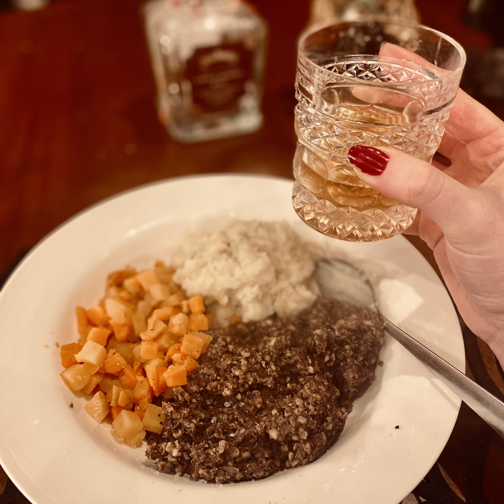
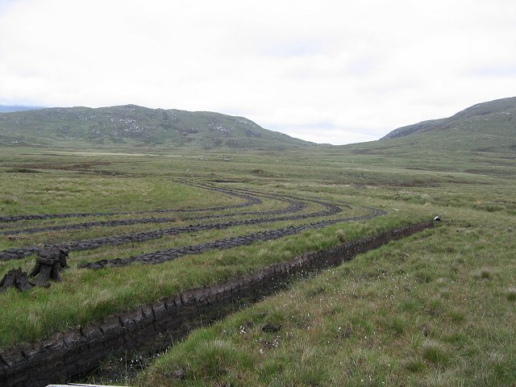
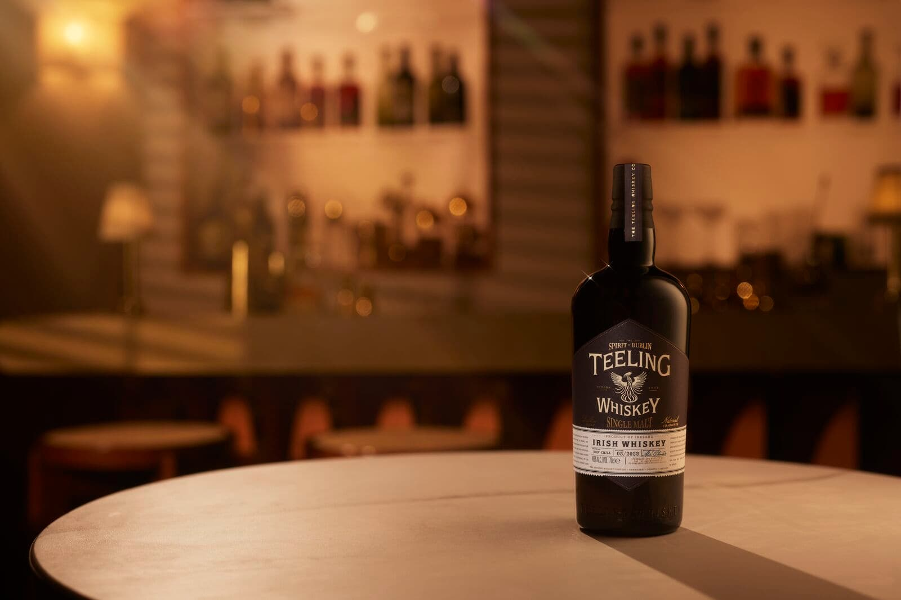
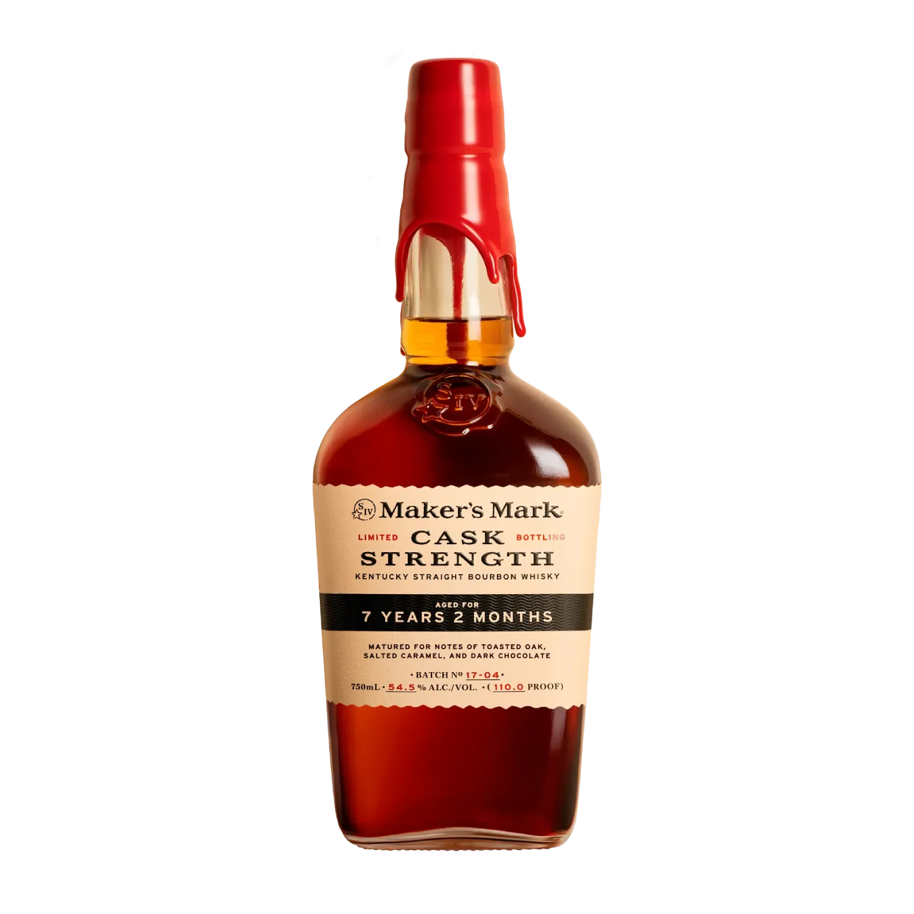
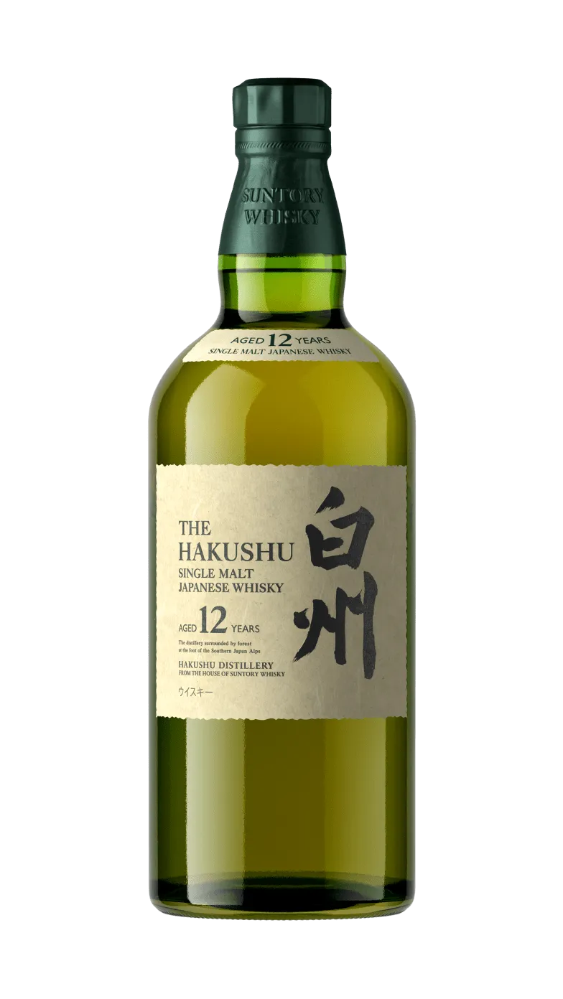
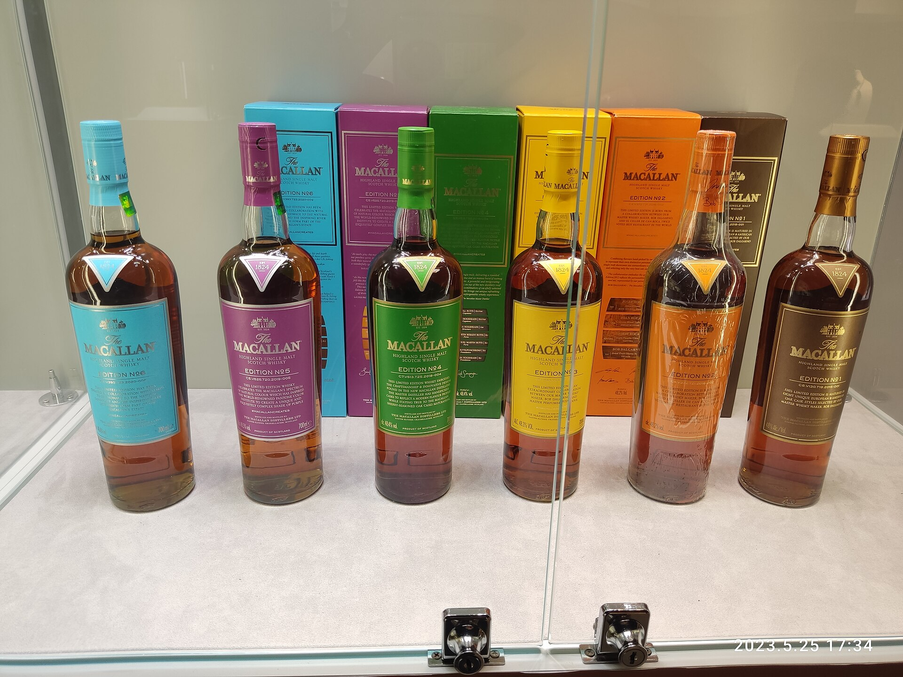
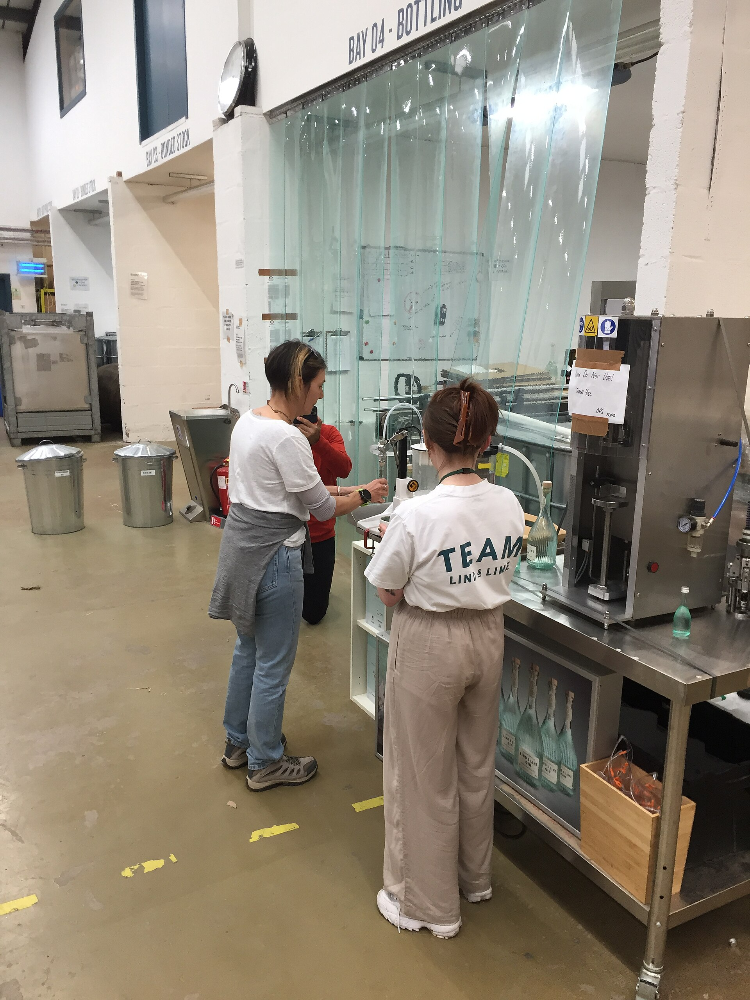

# Phase 5 Expanded: Cultural Backgrounds and Social Importance

Suggested duration: Weeks 19 to 21

This guide expands Phase 5 from the main learning plan. At this stage, you already understand legal categories, production systems, and regional structures. Now the focus shifts to meaning: why whisky matters to people beyond flavor.

Whisky is never only a liquid in a glass. It is also:

- an identity signal
- a social ritual
- a class marker
- a memory object
- a tourism product
- an investment asset
- a political symbol

If you skip this phase, you can still describe fermentation and still shape. But you will miss how whisky is actually used in the world.

---

## 1. How Culture Changes What a Whisky Is

The same bottle can function very differently depending on context.

- In one setting, it is a working-class pub staple.
- In another, it is a luxury gifting token.
- In another, it is a heritage symbol at national ceremonies.
- In another, it is a collectible traded like an asset.

A useful Phase 5 habit is to ask four questions whenever you encounter a whisky product:

1. Who is this for?
2. In what setting is it consumed?
3. What identity does it signal?
4. What social story is it borrowing?

These questions help you separate sensory reality from social framing without dismissing either.

---

## 2. Scotland: Nation, Landscape, and Export Identity

In Scotland, whisky is both an industry and a symbolic national language.

### 2.1 Rural Labor and Heritage Narratives

Scotch branding frequently references landscape, weather, stone buildings, peat, and long continuity. Some of that is historically grounded. Some is curated nostalgia.

Common symbolic themes:

- Highland ruggedness
- island endurance
- craft continuity
- family lineage
- local water and place purity

These themes are powerful because they connect drink to place memory, even when the modern production system is highly industrial.

### 2.2 Burns, Ceremony, and National Ritual

Burns Night remains one of the clearest examples of whisky as cultural ritual. A dram in this context is not just a beverage choice; it is participation in a narrative of national memory.

A similar pattern appears in Hogmanay traditions and civic ceremonies where whisky functions as a shared social script. In these settings, technical details are secondary to symbolic belonging.

### 2.3 Prestige and Diplomacy

Scotch also functions in soft-power and diplomatic contexts. State dinners, gifting rituals, and formal international events often use premium Scotch as a symbol of national quality and historical depth.

This is a key Phase 5 insight: some whiskies are built as cultural ambassadors first and consumer products second.

### 2.4 Distillery Tourism as Cultural Packaging

Visitor centers in Scotland increasingly package whisky as total experience:

- architecture
- landscape staging
- guided sensory narratives
- retail exclusives
- historical storytelling

Tourism in this form converts regional identity into a designed journey. This is neither fake nor purely organic. It is curated culture.

---

## 3. Ireland: Recovery Narrative and Shared Sociability

Irish whiskey's modern cultural force is strongly tied to revival.

### 3.1 From Collapse to Renaissance

Ireland's historical collapse and later rebound created one of the strongest recovery stories in global spirits. Brands and national tourism bodies both use this narrative:

- historical excellence
- twentieth-century contraction
- twenty-first-century return

This story has economic value because it gives consumers a meaningful arc to buy into.

### 3.2 Pub Culture and Session Identity

Irish whiskey culture is deeply linked to pub sociability. The pub is not only a sales channel; it is a social institution where music, conversation, memory, and community interact.

The session tradition reinforces whiskey as a connector rather than only a connoisseur object. This can contrast with high-ritual tasting culture in some Scotch contexts.

### 3.3 Brand Layers in Modern Ireland

- Large houses often signal familiarity and social ease.
- Premium specialist labels emphasize structure and craft depth.
- New urban distilleries often foreground innovation and contemporary Irish identity.

These layers coexist. Phase 5 students should resist treating Irish whiskey as one cultural voice.

---

## 4. United States: Myth, Law, and Performance

American whiskey culture combines legal precision with strong storytelling energy.

### 4.1 Frontier Mythology

Bourbon and rye are often narrated through frontier independence, agricultural self-reliance, and handcraft resilience. These motifs remain commercially powerful even when production scale is very large.

### 4.2 Bourbon as Regional Pride

In Kentucky, bourbon functions as economic engine and identity marker. Festivals, trails, local civic branding, and media representation all reinforce this relationship.

### 4.3 Tennessee and Story Ownership

Tennessee whiskey highlights how identity can be shaped by process language, place language, and historical narrative together. Modern recognition of previously marginalized contributors shows that whiskey culture is not static; it can revise itself.

### 4.4 Country Music, Bar Culture, and Whiskey Language

In US popular music, whiskey vocabulary is unusually visible. Songs use whiskey to signal:

- heartbreak
- rebellion
- working-class exhaustion
- celebration
- masculine performance

This matters because music feeds brand meaning. Consumers often approach bottles through emotional scripts learned from culture, not from production study.

---

## 5. Canada: Quiet Identity and Export Function

Canadian whisky often carries a lower-drama identity compared with Scotch and bourbon, but that does not mean it lacks cultural significance.

### 5.1 Blend Culture and Practical Prestige

Canadian style has long been associated with blended flexibility and approachable structure. This helped it function well across broad market segments and export channels.

### 5.2 Cross-Border Historical Influence

Prohibition-era dynamics linked Canadian producers to US demand patterns in ways that still influence perception. Canadian whisky's role is often discussed less theatrically, but historically it has been economically central.

### 5.3 Why Students Undervalue It

Many enthusiasts trained on single malt prestige frameworks undervalue blend-driven categories. Phase 5 asks you to assess social function and market role, not only enthusiast status hierarchy.

---

## 6. Japan: Craft Prestige, Bar Culture, and Aesthetic Discipline

Japanese whisky culture combines process precision with distinctive aesthetic framing.

### 6.1 Postwar Urban Culture and Bars

Japanese whisky identity grew in parallel with modern bar culture, including highball service and jazz-associated spaces. This made whisky part of urban lifestyle rather than only ceremonial tradition.

### 6.2 Precision as Cultural Value

In global discourse, Japanese whisky often symbolizes meticulous control and refinement. Whether or not every bottle matches the stereotype, the identity is durable because it aligns with broader global perceptions of Japanese craft disciplines.

### 6.3 Scarcity and Prestige Effects

International demand shocks created scarcity narratives that amplified luxury positioning. This can produce tension between everyday drinking culture at home and prestige allocation culture abroad.

---

## 7. Global Modern Culture: From Dram to Asset

Whisky has become increasingly financialized in some market segments.

### 7.1 Collecting and Speculation

Collectors, investors, and flippers now influence release dynamics:

- rapid sell-outs
- secondary market premiums
- artificial scarcity effects
- allocation politics

This changes how brands design releases and how enthusiasts experience access.

### 7.2 Influence Media and Credential Signaling

Review channels, ranking systems, influencers, and social platforms now shape demand at speed. Taste authority has partly decentralized from traditional critics toward networked micro-audiences.

### 7.3 Luxury Packaging and Symbolic Value

Limited editions increasingly use design language borrowed from luxury sectors:

- heavy presentation boxes
- serialized bottlings
- artist collaborations
- archive narratives

Sometimes this aligns with liquid quality. Sometimes packaging carries more value than spirit. Phase 5 students should learn to detect that difference.

---

## 8. Gender, Class, and Inclusion in Whisky Culture

Cultural analysis is incomplete without social structure.

### 8.1 Gendered Marketing Histories

Whisky advertising has historically leaned masculine in many markets, often associating the category with ruggedness, authority, and connoisseur seriousness. That framing is changing but remains influential.

### 8.2 Class Signaling

Whisky can function as class language:

- budget blends as everyday social drink
- premium malts as educated taste signal
- rare releases as wealth display

The same category can therefore host radically different social meanings depending on price tier and context.

### 8.3 Inclusion and Narrative Revision

Modern whisky culture is increasingly revisiting who gets recognized as a maker, authority, and consumer. This includes renewed attention to overlooked labor histories and broader participation across gender and background.

For the student, this is not peripheral politics. It is core cultural literacy.

---

## 9. Place-Making and Distillery Tourism

Distillery tourism deserves explicit Phase 5 treatment because it is where culture, commerce, and education converge.

*Cultural-commercial bridge: guided bottling and tasting experiences convert process knowledge into tourism value and brand memory.*

### 9.1 Experience Design

A modern distillery visit is a staged narrative:

- origin story
- process walkthrough
- sensory training
- curated tasting arc
- retail conversion moment

Every step can teach, but every step also sells.

### 9.2 Regional Economy Effects

Distillery tourism can support hotels, restaurants, transport providers, local employment, and associated producer ecosystems. In some regions, whisky tourism now operates as a meaningful development strategy.

### 9.3 Risk of Heritage Flattening

When tourism scales, complex histories may be compressed into cleaner, market-friendly narratives. Students should appreciate experience design while maintaining critical distance.

---

## 10. Cultural Analysis Matrix for Any Bottle

Use this when reviewing one expression.

| Lens | Question | Evidence to collect |
|---|---|---|
| Identity | What social identity does this bottle signal? | packaging, copy, placement, price tier |
| Ritual | In what settings is it consumed? | on-trade use, gifting patterns, media depiction |
| History | Which historical arc is referenced? | timeline claims, archival support |
| Class | What status level is implied? | pricing, limited release logic, secondary market behavior |
| Region | Is place doing real explanatory work? | disclosed process + climate + legal category |
| Authenticity | What is verified vs implied? | legal terms, production specifics, vague descriptors |

This matrix helps convert cultural impressions into analyzable data.

---

## 11. Study Tasks (Expanded)

1. Write a 1,000-word essay comparing two countries where whisky is culturally central but symbolically different.
2. Audit five brand websites and classify their core narrative as heritage-led, process-led, lifestyle-led, or scarcity-led.
3. Pick one festival, one bar culture context, and one tourism route; compare how each teaches consumers to value whisky.
4. Build a timeline of cultural turning points: Prohibition, postwar bar culture, single-malt boom, collector era, influencer era.
5. Conduct a label-plus-context review of one bottle at three price tiers from the same brand family.

---

## 12. Review List: Key Facts to Lock In

- Whisky culture cannot be reduced to tasting descriptors.
- Scotland's whisky identity is both historical and carefully staged for modern tourism and export prestige.
- Irish whiskey's modern meaning is strongly tied to recovery narrative and social pub culture.
- US whiskey identity combines legal category precision with powerful myth storytelling.
- Canadian whisky's quieter cultural profile still reflects significant historical and commercial impact.
- Japanese whisky blends process prestige with urban bar and aesthetic culture.
- Secondary market speculation now affects access and brand strategy in many premium segments.
- Packaging and scarcity can generate symbolic value independent of liquid quality.
- Gender and class dynamics shape how whisky is marketed and interpreted.
- Distillery tourism is an educational medium and a commercial conversion system at the same time.
- Cultural literacy in whisky means separating social meaning, historical truth, and commercial framing.

---

## 13. Quiz: Phase 5 Multiple Choice

1. What is the main objective of Phase 5?
A) Memorize mash temperatures by region.
B) Understand whisky as social and symbolic culture, not only liquid profile.
C) Classify cask sizes by liter capacity.
D) Compare yeast strains only.

2. Which statement best describes Scotch cultural identity in modern markets?
A) It is purely technical and avoids heritage framing.
B) It combines real history with curated landscape and prestige narratives.
C) It is unrelated to tourism.
D) It is dominated only by budget blends.

3. Irish pub session culture is most relevant to Phase 5 because it shows:
A) legal minimum aging requirements.
B) yeast optimization protocols.
C) whiskey as a social connector in living communal settings.
D) cask-char calibration.

4. In US whiskey culture, frontier myth language usually functions as:
A) mandatory legal wording.
B) symbolic storytelling that shapes brand perception.
C) proof of mash bill composition.
D) warehouse safety documentation.

5. Why is Canadian whisky often undervalued in enthusiast discourse?
A) It is not legally whisky.
B) It has no historical role.
C) Blend-centered identity is misread through single-malt prestige frameworks.
D) It is never exported.

6. Japanese whisky's global cultural framing is often tied to:
A) anti-aging and zero-cask policy.
B) precision, refinement, and disciplined presentation.
C) prohibition mythology.
D) no-bar service culture.

7. What is one major effect of the modern secondary market?
A) It eliminates scarcity.
B) It has no impact on producers.
C) It can alter allocation strategy and consumer access.
D) It standardizes pricing downward.

8. Which is the best interpretation of luxury packaging in whisky?
A) Packaging guarantees liquid quality.
B) Packaging can carry symbolic value that may or may not reflect liquid quality.
C) Packaging is legally irrelevant and culturally irrelevant.
D) Packaging only matters for shipping efficiency.

9. Why are gender and class relevant in whisky cultural study?
A) They are outside the whisky category.
B) They influence marketing language, access, and status signaling.
C) They only affect cask procurement.
D) They replace process analysis entirely.

10. Distillery tourism in Phase 5 should be understood as:
A) pure education with no commercial intent.
B) pure commerce with no educational value.
C) a combined education-commerce narrative system.
D) unrelated to regional identity.

11. Which matrix lens asks whether place claims are genuinely explanatory?
A) Identity
B) Region
C) Ritual
D) Class

12. Which Phase 5 habit is most consistent with the overall program?
A) Accept regional stories at face value.
B) Treat social meaning as irrelevant noise.
C) Separate social meaning, historical evidence, and commercial framing.
D) Focus only on auction prices.

### Quiz Answer Key

| Question | Correct answer |
|---|---|
| 1 | B |
| 2 | B |
| 3 | C |
| 4 | B |
| 5 | C |
| 6 | B |
| 7 | C |
| 8 | B |
| 9 | B |
| 10 | C |
| 11 | B |
| 12 | C |

### Quiz More Information

| Question | More information |
|---|---|
| 1 | Phase 5 shifts from the technical and historical frameworks of earlier phases toward cultural and symbolic analysis. While Phases 1-4 develop tools for reading legal definitions, production methods, regional identity, and historical context, Phase 5 asks how whisky functions as a meaning-maker in communities, identities, and social rituals beyond its role as a drink. The same bottle of whisky carries different cultural weight in a Scots pub, a Tokyo bar, a Kentucky distillery tour, and a London auction house—and those differences shape marketing, access, pricing, and status in ways that purely technical analysis cannot capture. Cultural literacy about whisky is not separate from analytical rigor; it is an additional analytical layer that explains market behaviors and consumer motivations. |
| 2 | Scotch whisky marketing frequently deploys a specific visual and narrative vocabulary: Highland landscapes, tartans, ancient stone buildings, family heritage, and craft continuity. Some of these associations reflect genuine historical reality—the landscape connection is real, many distilleries are genuinely old, and family ownership does exist within the industry. But the cultural packaging presented to consumers is a curated and often compressed version of a much more complex and commercially driven industrial history. The key Phase 5 analytical skill is distinguishing genuine historical culture from commercially reconstructed heritage, appreciating the real cultural roots while recognizing where narrative has been selectively shaped for market positioning purposes. |
| 3 | The seisiún in Irish pub culture demonstrates how whiskey's significance extends far beyond its beverage properties. In a traditional Irish session environment, whiskey and other drinks are part of the shared ritual infrastructure of the gathering—marking participation, hospitality, and social belonging. Whiskey is not incidental to the session but is intertwined with the social function of the space. This contrasts with the Western wine connoisseur tradition where the beverage is often the primary analytical focus. Understanding whiskey-in-culture means recognizing that the liquid is frequently a vehicle for social meaning rather than simply a product consumed for its own sensory qualities. This framework carries through all major whisky cultures and is relevant when evaluating distillery tourism, brand event strategy, and community association claims. |
| 4 | American whiskey brands, particularly bourbon, employ frontier mythology: references to pioneer settlers, self-reliance, craftsmanship passed through generations, and the rugged independence of distillers working against restrictive authority. This narrative framework is partly rooted in real history—the Appalachian farming tradition, the Whiskey Rebellion, and the role of frontier grain production in American economic development are genuine historical facts. But the marketing application is predominantly a 20th-century commercial construction designed to communicate authenticity, tradition, and American identity to contemporary consumers. Recognizing this as symbolic storytelling neither invalidates a whiskey's quality nor dismisses the underlying history; it allows the analyst to clearly separate what the production evidence shows from what the brand narrative communicates about values. |
| 5 | Canadian whisky is a legally defined category with a distinctive production approach—typically blending multiple grain whisky streams with small amounts of flavoring whisky—that results in an accessible, often lighter style. The enthusiast community has historically undervalued Canadian whisky by comparing it against Scotch single malt benchmarks where density, unique cask influence, and unmistakable regional character are prized virtues. Within the standards its production design intends—consistency, approachability, mixing performance, value for everyday consumption—many Canadian expressions are technically accomplished. The issue is not the whisky but the analytical framework applied to it. Applying single-malt prestige assumptions to a blend-centered, different-purpose category produces an unfair comparison equivalent to criticizing a well-made lager for not tasting like a craft stout. |
| 6 | Japanese whisky's international reputation is inseparable from broader cultural perceptions of Japanese craftsmanship, precision, and the concept of monozukuri (the art of making things). This cultural framing—positioning Japanese whisky as a product of exceptional attention to detail, aesthetic refinement, and disciplined process—has been highly effective in premium global markets, particularly after international whisky competition awards began recognizing Japanese expressions in the early 2000s. Importantly, this framing reflects genuine production commitments: Japanese distillers have maintained rigorous quality standards and invested significantly in both technical excellence and aesthetic presentation. However, the cultural narrative simultaneously operates as a commercial advantage commanding significant price premiums. Understanding both dimensions—genuine quality and powerful cultural branding—is necessary for accurate assessment of Japanese whisky's market position. |
| 7 | The whisky secondary market—auction houses, specialist retailers buying and reselling, online platforms—has evolved from a niche collector activity into a substantial economic force influencing producer, retailer, and consumer behavior. When limited releases or age-stated expressions achieve significant auction premiums, producers gain incentive to create more scarcity-based limited release strategies; retailers alter allocation policies to favor relationships over regular retail access; and ordinary consumers may find products inaccessible at official prices despite their being theoretically available at retail. The secondary market also creates perverse incentives for speculation over consumption, and can permanently distort the relationship between a whisky's liquid quality and its market price, making value analysis much more complex than comparing retail price to sensory result. |
| 8 | Packaging in the premium whisky segment communicates status, exclusivity, and perceived quality independently of what is inside the bottle. Crystal decanters, wooden presentation boxes, bespoke metal closures, and elaborate label printing add cost and signal luxury positioning that appeals to gift buyers and status-seeking consumers. This signaling can be commercially rational—consumers purchasing gifts or seeking status expressions are partly buying the symbolic communication packaging provides. However, packaging investment does not correlate directly with liquid quality, and some of the most technically accomplished whiskies appear in standard bottles while average liquid is presented in elaborate packaging. The Phase 5 analytical habit is to consciously separate packaging signal quality from process and technical evidence when assessing the actual value of what is being purchased. |
| 9 | Whisky marketing has historically been written toward masculine audiences—imagery of rugged outdoors, traditional craft, and independence has shaped who the category is presumed to be for, which in turn affects who enters the community, whose expertise is recognized, and what language is normalized in trade and consumer communications. Class markers are similarly pervasive: ultra-premium expressions signal social status, and significant price stratification creates access barriers that are not purely quality-based. Recognizing these dynamics does not require dismissing the technical qualities of individual whiskies but helps explain patterns in who consumes which expressions, how media coverage is shaped, and why some brands invest heavily in inclusive marketing campaigns. These social forces are as real as grain selection in determining market outcomes. |
| 10 | Modern distillery visitor experiences are simultaneously educational and commercial, and the value of understanding their dual nature is that it allows a visitor to engage honestly with both dimensions. The tour provides genuine production insight, historical context, and tangible material understanding of process steps that can be very difficult to grasp from written description alone. At the same time, the experience is designed by the commercial organization to build emotional connection, brand loyalty, direct sales of visitor-only bottlings, and organic marketing through memorable moments. Neither function excludes the other, and recognizing the commercial design of the experience does not diminish its personal educational value. What Phase 5 warns against is treating the managed visitor experience as unmediated access to production reality rather than as a curated narrative. |
| 11 | The Region lens in Phase 5's analytical matrix asks specifically whether place-based identity claims are genuinely explanatory—meaning they point to something about geography that produces a demonstrably distinct outcome in the whisky—or are primarily decorative, invoking geographic prestige association without a traceable mechanism. A claim is genuinely explanatory when it references a specific, verifiable geographic factor: water chemistry that affects mineral balance, a microclimate that influences maturation rate, or a legal GI requirement that mandates a specific production practice within that geography. A claim is decorative when the place name simply invokes heritage, landscape, or prestige without any mechanism connecting geography to the liquid in the bottle. The lens is not hostile to place identity—it demands evidence rather than assertion. |
| 12 | The three-layer separation habit that Phase 5 makes central is an extension of Phase 1's Law-Process-Marketing framework into cultural analysis. Social meaning is real, matters to consumers and communities, and can be analytically studied—but it is not contingent on historical accuracy (traditions invented relatively recently can still have genuine communal value and emotional significance). Historical evidence answers what actually happened and when, and should be assessed using documentary sources rather than brand storytelling. Commercial framing describes the story told to consumers to build brand equity and justify pricing, which selects, compresses, and sometimes invents elements of the other two layers. A strong Phase 5 analyst can appreciate cultural meaning, acknowledge historical reality, and identify commercial construction simultaneously without collapsing all three into a single verdict about authenticity. |

---

## Image Notes

Images in this document come from the local project image archive. Where an image was originally downloaded from Wikimedia Commons, the original source URL is included below.

- Robert Burns portrait: data/images/phase-2-history/robert-burns-portrait.jpg
	Source: https://upload.wikimedia.org/wikipedia/commons/3/36/Portrait_of_Robert_Burns_%284673661%29.jpg
- Peat cutting: data/images/phase-2-history/peat-cutting.jpg
	Source: https://upload.wikimedia.org/wikipedia/commons/7/76/Peat_cutting._-_geograph.org.uk_-_15973.jpg
- Irish folk session: data/images/phase-2-history/irish-folk-session.jpg
	Source: https://upload.wikimedia.org/wikipedia/commons/1/1a/Irish_Folk_Session-The_Old_Dubliner_Hamburg_208-0075-f-hinnerk-ruemenapf-prev.jpg
- Woodford Reserve Distillery: data/images/phase-2-history/woodford-reserve-distillery.jpg
	Source: https://upload.wikimedia.org/wikipedia/commons/0/02/Woodford_Reserve_Distillery-27527-4.jpg
- Suntory Yamazaki Distillery: data/images/phase-2-history/yamazaki-distillery.jpg
	Source: https://upload.wikimedia.org/wikipedia/commons/4/41/Suntory_Yamazaki_Distillery.JPG
