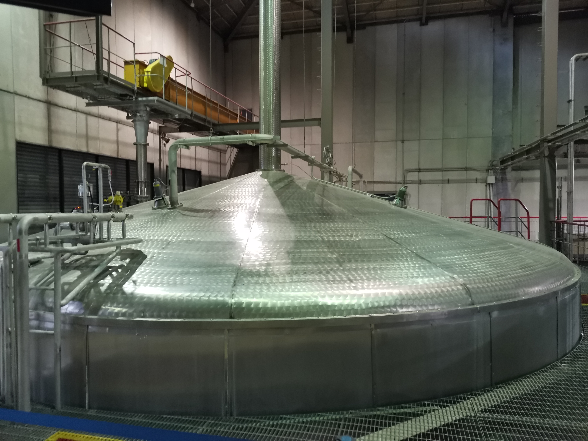
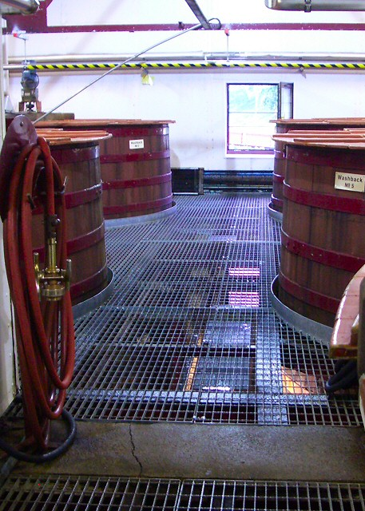
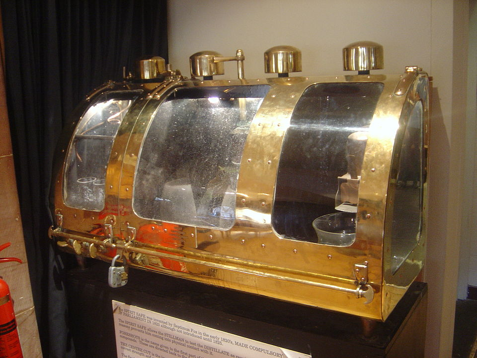
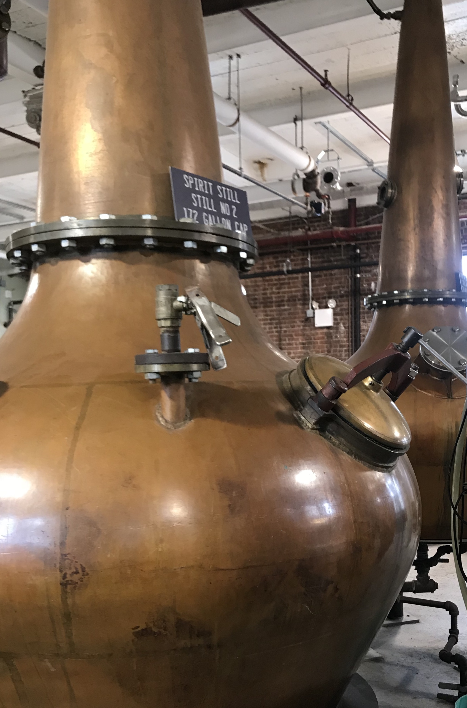
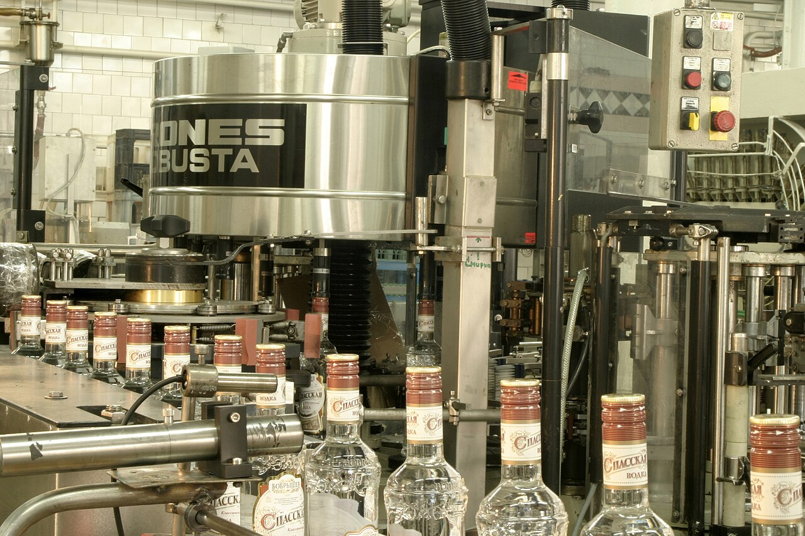
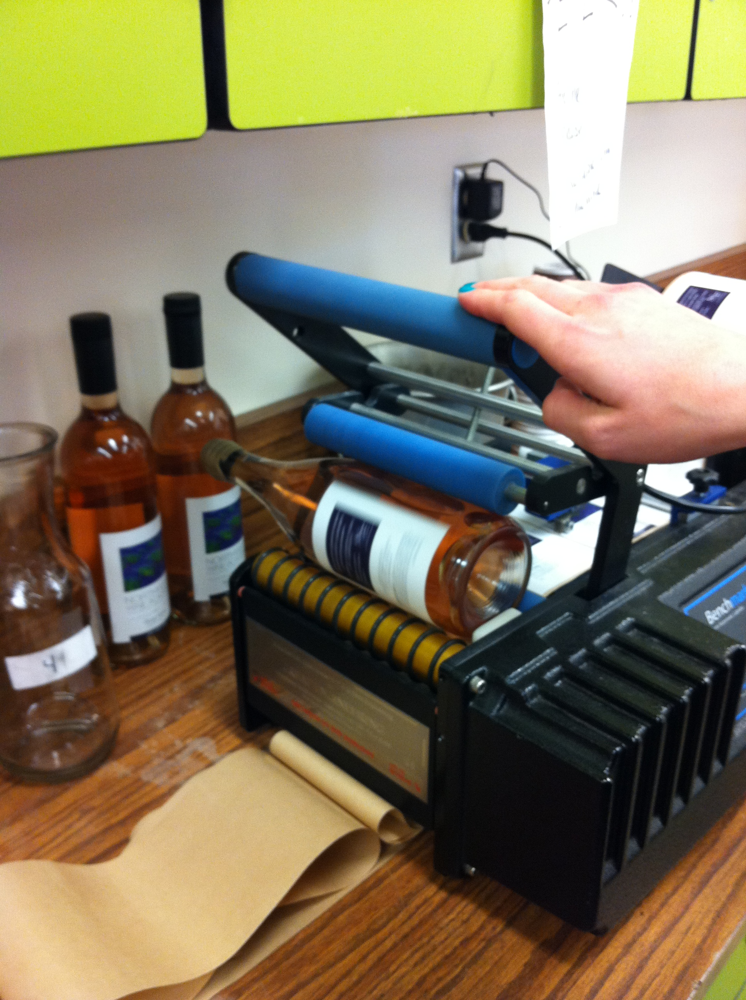
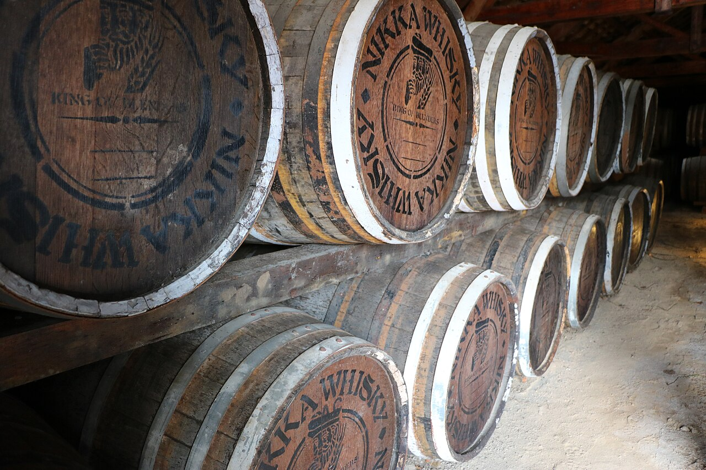
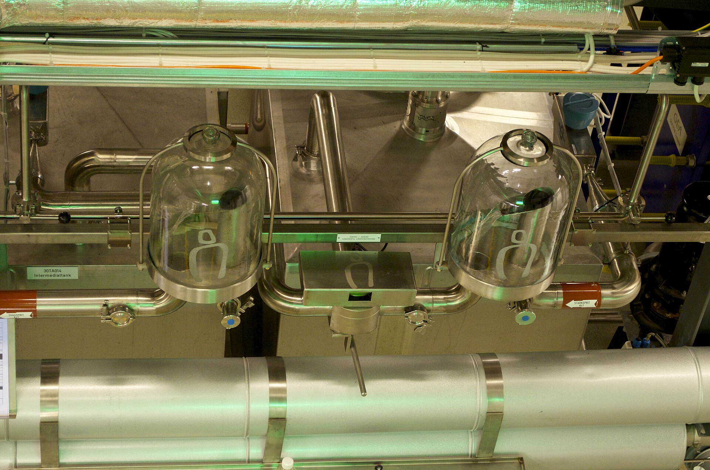

# Phase 6 Expanded: Distillery Operations, Safety, and Commercial Execution

Suggested duration: Week 22, then ongoing review

This document expands Phase 6 from the main roadmap into an operational field manual. Earlier phases taught what whisky is and why it varies. Phase 6 teaches how a distillery actually runs: physically, legally, financially, and safely.

A strong distillery does not depend on talent alone. It depends on systems.

The core Phase 6 principle:

- repeatability creates quality
- documentation creates traceability
- traceability protects safety and brand credibility

---

## 1. Operations Architecture: How to Think Like a Distillery Operator

Do not treat production, quality, safety, compliance, and sales as separate universes. They are one operating system.

If one fails, all are exposed.

Examples:

- A weak cleaning program becomes a flavor fault and then a commercial complaint.
- A labeling error becomes legal non-compliance and then a recall risk.
- Utility instability causes process drift and then product inconsistency.

Phase 6 asks you to map dependencies, not only tasks.

---

## 2. Plant Layout and Material Flow

### 2.1 Core Zones to Map

A practical distillery layout should include clear zone definitions:

- raw material receiving and storage
- milling and grist handling
- mashing/lauter/transfer
- fermentation rooms
- distillation house
- spirit handling and cask filling
- maturation warehouse(s)
- bottling and finished-goods staging
- laboratory/QA area
- utilities and engineering support
- hazardous-chemical and cleaning storage

### 2.2 One-Way Logic

Good layout minimizes cross-flow contamination and handling risk.

Design targets:

- raw and finished goods paths should not intersect without control points
- forklift and pedestrian routes should be physically separated where possible
- chemical routes should be isolated from food-contact materials
- rework areas should have explicit hold/release barriers

### 2.3 Utility Spine

Utilities are often the hidden bottleneck.

Monitor and map:

- steam availability and pressure stability
- glycol/chiller performance
- potable/process water quality and pressure
- compressed air quality
- wastewater load and treatment capacity

A distillery with poor utility reliability will struggle to hold flavor consistency even with strong operators.

---

## 3. SOP System Design

### 3.1 What an SOP Must Do

An SOP is not a checklist alone. It must define:

- scope
- equipment covered
- responsibility by role
- safety prerequisites
- step sequence with critical limits
- data capture requirements
- deviation response
- escalation path

### 3.2 Critical SOP Families

At minimum, maintain current SOPs for:

- [raw receiving and quarantine release](/sops/01_raw_receiving_quarantine_release.md)
- [milling, mashing, lautering](/sops/02_milling_mashing_lautering.md)
- [yeast handling and pitch protocol](/sops/03_yeast_handling_pitch_protocol.md)
- [fermentation monitoring and intervention](/sops/04_fermentation_monitoring_intervention.md)
- [distillation cuts and spirit handling](/sops/05_distillation_cuts_spirit_handling.md)
- [cask receiving, filling, movement, and leak response](/sops/06_cask_receiving_filling_movement_leak_response.md)
- [CIP and sanitation verification](/sops/07_cip_sanitation_verification.md)
- [sampling and lab release](/sops/08_sampling_lab_release.md)
- [bottling setup, in-line checks, reconciliation](/sops/09_bottling_setup_in_line_checks_reconciliation.md)
- [non-conformance management](/sops/10_non_conformance_management.md)
- [incident and near-miss reporting](/sops/11_incident_near_miss_reporting.md)
- [recall and traceability exercises](/sops/12_recall_traceability_exercises.md)

### 3.3 Document Control Discipline

Without version control, SOP systems degrade quickly.

Use a strict policy:

- unique SOP IDs
- revision history
- controlled distribution
- periodic revalidation
- role-based training signoff

---

## 4. Process Control: Parameters That Actually Matter

### 4.1 Raw Material Control

Track consistency at intake:

- moisture
- contamination indicators
- specification conformance
- supplier lot traceability

Do not assume upstream variability will be corrected later.

### 4.2 Mashing and Wort Quality

Monitor:

- strike and rest temperatures
- mash conversion behavior
- lauter run clarity and timing
- wort gravity and pH

Inconsistent wort quality propagates variability into fermentation and spirit yield.

### 4.3 Fermentation Control

Key variables:

- pitch rate
- oxygenation strategy
- temperature profile
- fermentation duration
- gravity trend
- sensory off-note indicators

Define escalation triggers in advance, not during crisis.

### 4.4 Distillation Run Discipline

Process control should include:

- run start criteria
- heads/hearts/tails decision framework
- ABV and temperature trend logging
- receiver changeover rules
- end-run criteria

Consistency requires documented run logic plus experienced sensory checks.

### 4.5 Warehouse Monitoring

Track cask environment and condition:

- location and stack plan
- humidity and temperature trend
- ullage checks and leakage trend
- fill and refill metadata

Warehouse data integrity is central to release planning and traceability.

---

## 5. Laboratory and Quality Program

### 5.1 QA vs QC

- QC checks product state against limits.
- QA ensures system quality so defects are prevented.

High-performing sites use both, with clear ownership.

### 5.2 Minimum Sampling Plan

- incoming grains and adjuncts
- mash and wort checkpoints
- fermentation progression checkpoints
- new make acceptance criteria
- maturation sampling windows
- pre-bottling blend validation
- packaging conformance checks

### 5.3 Data Review Cadence

Set routine review intervals:

- daily shift-level process review
- weekly deviation and CAPA review
- monthly trend review for process capability
- quarterly management review and risk update

A lab without review cadence becomes data storage, not process control.

---

## 6. Bottling and Packaging Control

### 6.1 Pre-Run Readiness

Before bottling release:

- blend and target ABV confirmed
- tank ID and batch identity locked
- filtration and chill policy confirmed
- line clearance complete
- packaging components verified against approved artwork

### 6.2 In-Line Quality Gates

Monitor continuously:

- fill volume
- closure integrity/torque
- label position and orientation
- batch/date coding readability
- case pack correctness

### 6.3 Reconciliation and Hold-Release

A strong packaging system reconciles:

- bottles in
- labels in
- closures in
- finished units out
- scrap/waste recorded

Any unexplained variance triggers investigation before release.

---

## 7. Label and Regulatory Execution

### 7.1 Legal Label Fundamentals

Most markets require combinations of:

- product class/category
- ABV statement
- net contents
- producer/importer identity
- country of origin where applicable
- lot coding and traceability identifiers
- warning statements by jurisdiction

### 7.2 Compliance Workflow

Use a pre-release sequence:

1. Draft artwork from approved specification sheet.
2. Legal review by target market.
3. QA validation against batch facts.
4. Final signoff before print.
5. First-article check at line startup.

Treat labels as controlled documents, not marketing collateral alone.

---

## 8. Safety Program: Operating in a Flammable Process Environment

### 8.1 Major Hazard Domains

Distillery safety priorities include:

- flammable vapor control
- ignition-source management
- confined-space entry
- hot surfaces and pressure systems
- cask movement and traffic hazards
- chemical exposure risks
- electrical zoning compliance

### 8.2 High-Reliability Safety Behaviors

- active near-miss reporting
- routine permit-to-work audits
- visible supervisor safety rounds
- pre-task risk briefings
- emergency drill realism

Safety culture is measured by everyday behavior, not just policies on paper.

### 8.3 Incident System Quality

An incident program should capture:

- event chronology
- immediate controls
- root cause analysis
- corrective action owner and deadline
- verification of closure effectiveness

Without closure verification, CAPA becomes paperwork theater.

---

## 9. Risk Register: Practical Failure Modes

*Risk-control anchor: spirit-safe access and measurement discipline reduce both compliance exposure and cut-management variability.*

| Risk | Typical Failure Mode | Leading Indicator | Core Control |
|---|---|---|---|
| Fire/explosion | Vapor ignition in stillhouse/filling area | repeated gas alarm near threshold | zoning integrity, ventilation, ignition control, drills |
| Contamination | microbial growth in tank/line | rising micro counts or recurring off-notes | validated CIP, sanitation verification, line clearance |
| Fermentation failure | stuck or stressed ferment | abnormal gravity trend and heat profile | yeast health protocol, temp control, escalation SOP |
| Distillation drift | inconsistent cut quality | run-to-run ABV/sensory variance | operator standardization, instrumentation calibration |
| Cask loss | leaks/stack instability | ullage decline cluster in zone | receipt checks, rack standards, inspection cadence |
| Traceability gap | missing lot linkage | unresolved reconciliation deltas | digital batch records, release gate discipline |
| Label non-compliance | wrong market text/ABV | artwork mismatch at startup | controlled label workflow and legal signoff |
| Worker injury | burns, slips, crush events | repeated near-miss class | PPE, traffic segregation, permit controls |
| Utility outage | process interruption | repetitive downtime by unit | preventive maintenance, critical spares, contingency plans |

---

## 10. Commercial Execution and Market Reality

### 10.1 Portfolio Architecture

A distillery should define role clarity for each release type:

- core range for reliability and volume
- seasonal/limited release for engagement
- single cask for enthusiast depth
- cask strength for technical authenticity segment
- travel retail or channel exclusives for partner strategy

### 10.2 Price Ladder Logic

Price should reflect coherent variables:

- production cost reality
- maturation and cask quality inputs
- brand position
- channel margin structure

If price architecture is incoherent, portfolio cannibalization follows.

### 10.3 Channel Strategy

Evaluate channel fit:

- direct-to-consumer margin and relationship value
- distributor scale and control tradeoff
- export complexity and compliance overhead
- on-premise influence versus off-premise throughput

### 10.4 Narrative Integrity

Commercial storytelling should stay tethered to verifiable production facts. Overstated claims create long-term trust damage, especially in digitally literate enthusiast communities.

---

## 11. Australia Operational Compliance Map (Expanded Use)

This section complements the legal references in the main README and reframes them as a working operational model.

### 11.1 Federal Excise Operating Controls

For Australian spirits operations, treat excise as daily process control, not yearly admin.

Operational controls to implement:

- license status verification and scope review
- underbond inventory tracking by location and lot
- ABV and LAL data integrity checks
- periodic internal audit of duty calculation assumptions
- remission eligibility review with documented evidence

### 11.2 Label and Food Standards Workflow

Before production release:

- verify current standard interpretation for target category
- align mandatory fields to approved artwork template
- confirm all market-specific warnings
- lock final print files under controlled revision

### 11.3 Liquor Licensing and RSA Integration

For cellar door or event operations:

- map license conditions to actual service model
- maintain RSA currency tracker by staff role
- include responsible service checks in opening and event SOPs

Phase 6 insight: you cannot separate distilling competence from hospitality compliance if your commercial model includes direct service.

---

## 12. Operational Maturity Scorecard

Use this to self-assess an operation.

| Domain | Level 1 (Reactive) | Level 2 (Controlled) | Level 3 (Integrated) |
|---|---|---|---|
| SOPs | inconsistent and outdated | current but siloed | current, trained, audited, and cross-linked |
| Process data | ad hoc logging | routine logging | trend analytics with early-warning triggers |
| QA/QC | end-point checks only | in-process checks + release criteria | risk-based QA system with CAPA effectiveness tracking |
| Safety | policy-driven only | active incident logging | predictive safety culture + robust drill performance |
| Traceability | manual reconstruction needed | lot-level trace available | rapid bottle-to-cask trace with recall simulation success |
| Commercial alignment | production-led only | production + sales coordination | integrated production, compliance, and portfolio governance |

Use gaps from this table to prioritize improvement projects.

---

## 13. Study Tasks (Expanded)

1. Build a one-page process map from grain receipt to shipped bottle including hold/release gates.
2. Draft one SOP each for fermentation monitoring, distillation cut logging, and bottling line clearance.
3. Create a mock deviation report for a mislabeled batch and close it with CAPA actions.
4. Run a tabletop recall simulation and measure time to full lot trace.
5. Design a 12-month operational KPI set for quality, safety, utility uptime, and packaging efficiency.

---

## 14. Review List: Key Facts to Lock In

- Distillery quality is a systems outcome, not a single-operator outcome.
- Layout and material flow decisions strongly influence contamination, safety, and efficiency.
- SOP quality depends on control limits, role clarity, and version discipline.
- Fermentation and distillation consistency require trend monitoring plus escalation thresholds.
- Warehouse data and cask traceability are central to credible maturation management.
- Bottling quality relies on pre-run controls, in-line gates, and hard reconciliation.
- Label compliance must be treated as controlled-release governance.
- Safety performance requires active behavior systems, not policy documents alone.
- Risk registers are useful only when linked to leading indicators and control ownership.
- Commercial execution must align portfolio structure, price architecture, and truthful narrative.
- In Australia, excise, labeling, licensing, and RSA systems must be integrated into routine operations.

---

## 15. Quiz: Phase 6 Multiple Choice

1. The best summary of Phase 6 is:
A) tasting note memorization only.
B) integrated control of operations, quality, safety, compliance, and market execution.
C) exclusive focus on still design.
D) historical timeline revision.

2. Why is plant material-flow design critical?
A) It determines label typography.
B) It reduces cross-contamination and handling risk.
C) It sets flavor by itself without process control.
D) It replaces sanitation programs.

3. Which SOP element is most essential for consistent execution?
A) optional role assignment.
B) social media guidance.
C) critical limits and deviation response.
D) cask artwork archive.

4. In fermentation control, which combination is most useful?
A) color only.
B) gravity trend, temperature profile, and intervention thresholds.
C) bottle weight and torque.
D) warehouse humidity only.

5. Distillation consistency improves most when:
A) cuts are decided by memory without records.
B) run logic is standardized and logged with sensory and ABV checks.
C) all runs are shortened regardless of quality.
D) heads are always minimized to zero.

6. The purpose of packaging reconciliation is to:
A) increase box artwork complexity.
B) detect unexplained losses/mispack risk before release.
C) accelerate duty payment only.
D) avoid batch coding.

7. Label compliance should be managed as:
A) last-minute marketing preference.
B) controlled document workflow with legal and QA gates.
C) optional for export markets.
D) unrelated to traceability.

8. A strong safety culture is best indicated by:
A) no reporting activity.
B) frequent near-miss capture and verified corrective-action closure.
C) annual memo circulation only.
D) reliance on PPE without engineering controls.

9. A risk register is most effective when it includes:
A) only historical incidents.
B) leading indicators and specific control ownership.
C) no mitigation details.
D) marketing priorities only.

10. In Australian operations, excise should be treated as:
A) an annual accounting event only.
B) a daily control system tied to inventory, ABV data, and licensing.
C) optional for spirits.
D) unrelated to production records.

11. Which statement best describes Phase 6 commercial alignment?
A) Production quality and portfolio strategy should be designed independently.
B) Portfolio, pricing, channels, and narrative should be coherent with operational reality.
C) Limited releases should replace all core products.
D) Sales should ignore compliance constraints.

12. A distillery at operational maturity Level 3 is characterized by:
A) siloed systems and manual reconstruction.
B) integrated, audited, data-driven controls across quality, safety, and traceability.
C) no SOPs but strong intuition.
D) packaging speed as the only KPI.

### Quiz Answer Key

| Question | Correct answer |
|---|---|
| 1 | B |
| 2 | B |
| 3 | C |
| 4 | B |
| 5 | B |
| 6 | B |
| 7 | B |
| 8 | B |
| 9 | B |
| 10 | B |
| 11 | B |
| 12 | B |

### Quiz More Information

| Question | More information |
|---|---|
| 1 | Phase 6 represents the transition from academic understanding of whisky—how it is made, where it comes from, what it means culturally—to operational knowledge of how a distillery functions as a managed production business. This includes facility design for material flow, standardized operating procedures, fermentation and distillation control, packaging reconciliation, compliance documentation, safety culture, and commercial planning. Understanding these operational realities matters for consumers and analysts because they explain the constraints and capabilities that determine what a distillery can and cannot do at scale, and why claims about artisanship, handmade quality, or flavor character are more or less plausible given a facility's actual operational context and throughput. |
| 2 | Distillery material flow design—the physical routing of grain intake, milling, mashing, fermentation, distillation, cask filling, warehousing, and dispatch—is a foundational safety and quality concern that is often invisible to consumers but directly affects production consistency. Poor flow design creates opportunities for cross-contamination between clean and used equipment, between distillate fractions that should not mix, or between new spirit and spent grain residues. It also introduces unnecessary manual handling risks, inefficiencies that compound over high-volume production runs, and hygiene vulnerabilities in what is legally a food-grade production environment. Well-designed flow is not primarily about maximizing character expression; it is about consistent, safe, hygienic, and auditable production at the intended scale. |
| 3 | A Standard Operating Procedure (SOP) is only as useful as its specificity under deviation conditions—when something goes wrong. An SOP that describes the normal operating sequence without defining critical control limits (the boundaries within which key process parameters must stay) and without specifying what operators must do when those limits are breached provides no actionable guidance precisely when guidance is most needed. In regulated food and spirits production, critical limit definition and documented deviation response are often legal requirements under licensing and food safety legislation as well as operational quality necessities. Without specific limits and response protocols, quality and safety decisions default to individual operator judgment at moments of stress, introducing inconsistency, regulatory liability, and auditable gaps that can be difficult to defend during compliance inspections. |
| 4 | Effective fermentation management in distillery production requires monitoring multiple interrelated variables rather than relying on any single indicator as a proxy for process health. Specific gravity measured by hydrometer or densitometer indicates how much sugar has been converted to alcohol—a consistently descending gravity curve shows healthy progression. Temperature monitoring is critical because yeast operates within a defined optimal range; too cold slows or stalls fermentation, too hot risks yeast stress, death, and off-flavor congener production. Intervention thresholds define at what point operators take corrective action, such as adding cooling water if temperature rises above a defined limit or flagging a stuck fermentation if gravity has not changed within a defined window. Monitoring color or observing surface activity alone provides insufficient information about actual fermentation health to support reliable management decisions. |
| 5 | Distillation consistency is achieved not through rigid mechanical operation alone but through disciplined process definition combined with real-time sensory and analytical monitoring by skilled operators. Cut points—the decisions about when to move from foreshots to heart, and from heart to feints—depend on run time, still behavior, ABV readings, and sensory assessment. When these decisions are based on undocumented experienced intuition rather than recorded parameters, they cannot be reliably replicated between operators or recovered from when key personnel change. A standardized run logic documents starting conditions, expected run profiles, cut-point criteria (both objective ABV thresholds and sensory descriptors), and deviation response procedures. Combined with comprehensive batch records, this system allows retrospective analysis of underperforming batches and gives quality teams verifiable evidence of what changed when quality variations occur. |
| 6 | Packaging reconciliation is the process of accounting for all material inputs and outputs during a bottling run to verify that physical quantities balance within expected tolerances. A complete reconciliation checks bulk spirit received versus bottles filled, empty bottles received versus used, broken or returned, closures and capsules received versus applied, labels printed versus applied, and finished cases packed versus dispatched. Discrepancies outside normal tolerance ranges indicate measurement error, equipment malfunction, or—in a worst-case scenario—unexplained inventory shrinkage. Catching reconciliation gaps before product is released prevents more costly problems including regulatory non-compliance around duty-paid volume, traceability failures for potential recall events, and customer disputes about short shipments. For an excise-regulated product like spirits, packaging reconciliation records form part of the documentation audit trail required to demonstrate correct duty calculation and payment. |
| 7 | Spirits label compliance is a multi-jurisdiction legal requirement affecting mandatory declarations (category name, geographic indication, ABV, volume, allergen information, health warnings), optional claims (age statements, cask types, production methods), and format rules (font size, placement, prescribed language wording) that vary significantly by destination market. A last-minute or informal label review process creates high risk of regulatory non-compliance, product recalls, and costly import rejections. A controlled document workflow treats label artwork as a versioned record that passes defined review gates—legal sign-off for regulatory text accuracy, quality assurance sign-off for the accuracy of all production claims made, and market-specific regulatory compliance check for each export destination—before final approval and printing. This approach matches how quality management systems such as ISO 9001 handle critical customer-facing documents and is standard practice in any regulated food or beverage business operating across multiple markets. |
| 8 | Safety culture maturity in a distillery or any industrial facility is measured not by the absence of reported incidents but by the quality of the reporting, investigation, and response system in place. In a genuinely strong safety culture, near-miss events—situations that could have caused harm but did not—are reported freely, documented, investigated for root cause, and generate verified corrective actions with named owners and defined completion timelines. High near-miss reporting rates signal psychological safety: employees believe that reporting leads to improvement rather than blame or disciplinary consequence. Low incident or near-miss reporting in a high-hazard environment (distilleries involve high-proof flammable spirits, pressurized steam systems, CO2 from fermentation in confined spaces, forklift traffic, and heavy manual handling) is a warning sign rather than positive evidence. Relying on PPE alone without engineering controls that reduce hazards at their source reflects a reactive rather than preventive approach. |
| 9 | A risk register functions as a living management tool—not a historical archive—and its operational value depends on the specificity and currency of its content. Effective registers document current known risks with probability and consequence assessments, the specific controls currently in place to manage each risk, named individual ownership of each control measure, and leading indicators that signal when a risk level is increasing before an incident occurs. Leading indicators proactively reveal risk trajectory: increasing equipment downtime predicts equipment failure risk; operator overtime accumulation predicts fatigue-related error risk; high near-miss report volume in one area predicts injury risk concentration. Mitigation details should specify concrete actions with timelines rather than generic management commitments. Assigning personal ownership ensures accountability and prevents risks from being collectively acknowledged at a senior level but individually ignored at the operational level where they actually occur. |
| 10 | Excise duty on spirits in Australia is administered by the Australian Border Force (ABF) and assessed based on the volume of absolute alcohol produced, not the number of bottles sold or value of sales—making accurate volume and ABV measurement at every production stage a direct financial obligation rather than an optional record-keeping convenience. For distilleries, excise liability accumulates from the point of distillation and must be tracked through maturation and bottling. Because the duty rate per liter of alcohol is significant and applies during production rather than at retail, inventory records, ABV measurements, and reconciliation between production records and excise declarations are continuous operational requirements. An annual accounting approach—treating excise as a year-end tax filing exercise—creates cumulative error risk, regulatory non-compliance exposure, and potential licensing sanctions that are much more difficult to identify and correct at year-end than when managed as an ongoing daily control. |
| 11 | Operational reality and commercial strategy should be mutually informing in a well-managed distillery: what the facility can produce consistently, at what quality level, and at what throughput should directly inform portfolio design, pricing architecture, channel selection, and narrative communication. A distillery that markets handmade, small-batch artisan production values while operating at processing volumes incompatible with genuine small-batch attention creates a credibility risk when the disconnection is made visible by trade media, regulatory scrutiny, or quality failures. Conversely, a distillery with strong operational controls and honest production disclosure that develops a premium narrative matched to genuine quality differentiation can command appropriate price positioning and sustain customer expectations over time. Coherence between what a distillery can operationally deliver and what it commercially promises is the foundation for a sustainable business identity in the spirits industry. |
| 12 | A maturity model for distillery operations provides a structured vocabulary for assessing how developed and reliable a facility's management systems are at a given point in time. Level 1 represents basic intuitive operation: procedures are undocumented, problems are identified reactively after they occur, and operational memory is concentrated in specific individuals rather than the organization. Level 2 represents partial formalization: some procedures are documented but application is inconsistent, and improvement cycles depend on individual initiative. Level 3 represents integrated systems across quality, safety, and traceability that are actively monitored, regularly audited, and data-driven—meaning decisions are based on systematically collected and analyzed performance information. At Level 3, deviations trigger documented investigation and corrective actions, audits close loops and verify improvement, and the overall system has verifiable organizational memory that survives personnel changes. For exporting producers facing regulatory scrutiny from destination-country agencies and quality standards from retail customers, Level 3 is the minimum viable operational state. |

---

## Image Notes

Images in this document come from the local project image archive. These files were originally downloaded from Wikimedia Commons, and the original source URLs are included below.

- Mash tun interior: data/images/phase-3-process/mash-tun.jpeg
	Source: https://upload.wikimedia.org/wikipedia/commons/f/f6/Dallas_Dhu_Distillery_Mash_tun_inside.jpeg
- Washbacks at distillery: data/images/phase-3-process/washbacks.jpg
	Source: https://upload.wikimedia.org/wikipedia/commons/f/f7/Washbacks%2C_Glenrothes_distillery.jpg
- Copper pot stills: data/images/phase-3-process/pot-stills.jpg
	Source: https://upload.wikimedia.org/wikipedia/commons/0/0e/Copper_Pot_Stills.jpg
- Spirit safe: data/images/phase-3-process/spirit-safe.jpg
	Source: https://upload.wikimedia.org/wikipedia/commons/6/6b/Spirit_Safe_in_Glenkinchie_Distillery_-_geograph.org.uk_-_4807840.jpg
- Bottling line: data/images/phase-3-process/bottling-line.jpg
	Source: https://upload.wikimedia.org/wikipedia/commons/a/a4/Nelsons_Greenbrier_bottling_line.jpg
- Cask warehouse: data/images/phase-3-process/cask-warehouse.jpg
	Source: https://upload.wikimedia.org/wikipedia/commons/a/a1/Old_casks_in_Bushmill%27s_old_warehouse.jpg
