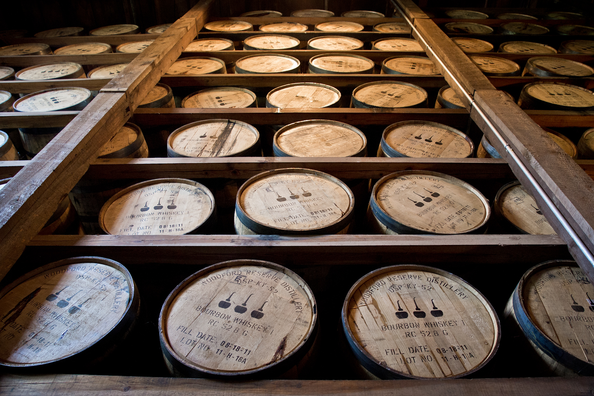
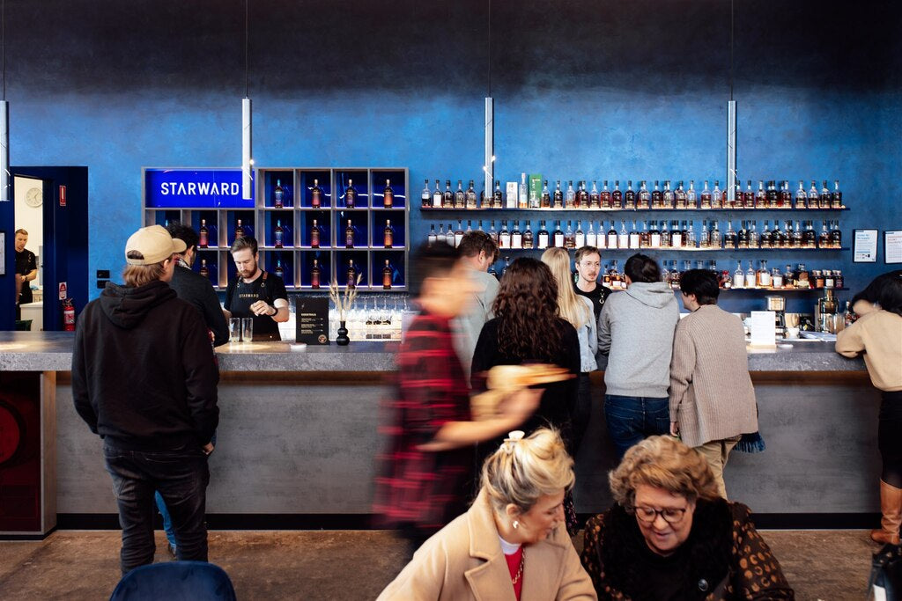
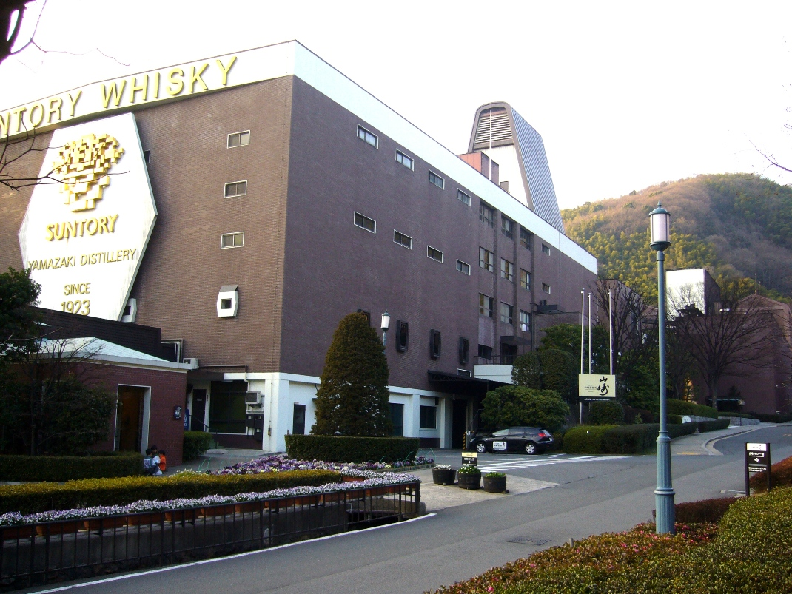

# Phase 7 Expanded: Advanced Brand and Region Analysis

Suggested duration: Weeks 23 to 24

This guide expands Phase 7 into an applied analysis framework. By now, you know categories, process mechanics, maturation variables, regional patterns, and social context. The final skill is synthesis: making high-confidence judgments about why a whisky tastes, behaves, and positions the way it does.

Phase 7 is where you move from enthusiast description to structured expertise.

---

## 1. What Advanced Analysis Means

Advanced analysis does not mean using complicated vocabulary. It means making claims that are:

- specific
- testable
- evidence-linked
- explicit about uncertainty

A weak analysis says: "This tastes premium and classic."

A stronger analysis says: "This profile likely reflects refill-heavy cask policy with restrained wood extraction, moderate fermentation-derived fruit retention, and blending choices that prioritize consistency over high-impact oak signatures."

The difference is causal structure.

---

## 2. The 12-Lens Brand Analysis Model

Use this model for each distillery or expression.

1. Legal category and jurisdictional constraints.
2. Grain bill or mash bill architecture.
3. Malting source and peat policy.
4. Fermentation duration and yeast strategy.
5. Still type, shape, and operating behavior.
6. Condenser style and expected reflux/contact effect.
7. Cut policy and new make target style.
8. Cask sourcing and refill/fresh wood balance.
9. Warehouse climate and maturation logistics.
10. Bottling decisions: ABV, chill filtration, color policy.
11. Brand narrative and declared identity claims.
12. Evidence audit: what is verified, inferred, or marketing-only.

Do not skip the twelfth lens. It protects you from narrative capture.

---

## 3. Evidence Ladder: Ranking Claim Strength

When evaluating statements, rank evidence quality.

### Tier 1: Strong Evidence

- official technical disclosures
- legally required label fields
- published specs with consistent batch behavior
- verified production interviews with clear process detail

### Tier 2: Moderate Evidence

- informed secondary reporting
- consistent tasting outcomes across multiple batches
- plausible process inference from known equipment and policy

### Tier 3: Weak Evidence

- promotional adjectives without technical detail
- single-review conclusions
- myth repetition from community lore

Your conclusions should track evidence tier. Strong claims require strong evidence.

---

## 4. Region Is Not a Shortcut: Build Region-Process Causality

Regional identity is useful, but it is often overused as a shortcut explanation.

Advanced practice:

- start with region expectations
- test against known process variables
- revise explanation if process data conflicts with stereotype

Example logic:

- Region expectation: coastal smoke and medicinal profile.
- Observed profile: softer smoke, citrus, clean cereal backbone.
- Possible causes: peat source style, cut strategy, cask policy, lower phenolic load, condenser behavior.

Region gives context. Process explains mechanism.

---

## 5. Comparative Analysis Frameworks

### 5.1 Same Region, Different House Style

Use pair analysis where region is held broadly constant and production choices differ.

Questions:

- How does cask program divergence alter profile center of gravity?
- Does one house prioritize distillate clarity while another prioritizes active wood impact?
- Are bottling strengths changing aromatic delivery enough to shape perceived quality differences?

### 5.2 Similar Category, Different Climate

Compare like-for-like category structures across climate environments.

Questions:

- Does accelerated extraction in hotter climate alter balance at younger ages?
- How do angel's share and concentration behavior change release strategy?
- Are age statements directly comparable in sensory maturity terms?

### 5.3 Similar Mash Bill, Different Process Discipline

For bourbon or rye comparisons, hold mash bill relatively constant and examine:

- fermentation management
- distillation proof regime
- barrel entry proof
- warehouse location policy
- char/toast approach

This reveals why mash bill alone is not enough.

---

## 6. Distillate-Driven vs Cask-Driven Brand Styles

A critical Phase 7 distinction is where the brand's identity primarily comes from.

### Distillate-Driven Signals

- clearer fermentation-derived fruit signatures
- spirit character visible under refill wood
- lower reliance on finishing for differentiation

### Cask-Driven Signals

- strong oak, spice, tannin, dried fruit, or wine-finish impact
- profile heavily shaped by cask selection strategy
- house style tied to wood management as much as spirit design

Most brands are mixed systems. The goal is to identify the dominant engine.

---

## 7. Narrative Audit: Story vs Technical Reality

Use this audit for each brand communication set.

### 7.1 Story Categories

Classify narrative emphasis:

- heritage-first
- craft-process-first
- place-first
- luxury-scarcity-first
- innovation-first

### 7.2 Verification Questions

- Which technical claims are measurable?
- Which historical claims are source-supported?
- Which phrases are suggestive but non-falsifiable?
- Is branding emphasis aligned with disclosed production behavior?

### 7.3 Red Flags

- heavy use of "ancient" and "authentic" with no verifiable timeline
- process claims that change frequently with product cycle
- region claims not reflected in production data
- scarcity language without transparent release logic

A narrative can be emotionally compelling and still analytically weak.

---

## 8. Price, Value, and Positioning Analysis

Advanced brand analysis must include economics.

### 8.1 Price Architecture Questions

- Is core range priced for long-term adoption or short-term margin extraction?
- Are limited editions structurally additive or cannibalizing?
- Does age/strength/specification justify deltas within peer set?

### 8.2 Value Assessment Without Hype

Evaluate value on combined basis:

- liquid complexity and balance
- technical transparency
- consistency across batches
- packaging honesty
- access fairness

This avoids both blind premium bias and simplistic anti-premium bias.

---

## 9. Blends vs Single Distillery Releases: False Hierarchies

Phase 7 should dissolve simplistic hierarchy assumptions.

- A blend can be technically sophisticated and stylistically coherent.
- A single distillery release can be inconsistent or overly cask-dominant.

Evaluation principle:

Judge intent execution, not category prestige.

Ask:

- What was this product trying to do?
- Did process and blending architecture achieve that objective?

---

## 10. Building High-Quality Tasting Inference

Tasting notes become advanced when linked to mechanism with uncertainty labels.

Template:

- Observation: what you sense.
- Mechanism hypothesis: likely process cause.
- Confidence level: high/moderate/low.
- Alternative explanations: at least one.

Example:

- Observation: concentrated dried-fruit sweetness with firm tannic grip.
- Hypothesis: active-seasoned cask influence with limited refill buffering.
- Confidence: moderate.
- Alternative: blend component proportion shift rather than cask policy change.

This prevents overconfident storytelling from limited data.

---

## 11. Case-Style Exercises

### Exercise A: Speyside Contrast

Compare two Speyside bottlings with different cask emphasis.

Deliverables:

- 500-word causal comparison
- evidence ladder rating for each major claim
- one-paragraph uncertainty section

### Exercise B: Islay Identity Split

Compare one medicinal/coastal style with one smoke-forward barbecue style.

Deliverables:

- process hypotheses for smoke character divergence
- cask-policy interaction discussion
- bottling strength and presentation impact notes

### Exercise C: Bourbon Variance Under Similar Age

Choose two bourbons with similar age statements.

Deliverables:

- variable map (mash, entry proof, warehouse, char, filtration)
- ranked explanation of likely sensory differences
- value-positioning commentary

### Exercise D: Japanese House Blend Strategy

Analyze one Japanese house blend and one single-distillery expression from the same company family if available.

Deliverables:

- style objective interpretation
- blending role explanation
- narrative audit of global marketing claims

---

## 12. Advanced Evaluation Worksheet

Use this worksheet format for each analyzed bottle.

| Field | Notes |
|---|---|
| Product + batch |  |
| Legal category |  |
| Region |  |
| Core technical disclosures |  |
| Most likely profile drivers |  |
| Distillate vs cask dominance |  |
| Narrative category |  |
| Evidence ladder rating |  |
| Confidence level of conclusions |  |
| Value assessment |  |
| Open questions |  |

Complete 20 of these and your analysis quality will rise sharply.

---

## 13. Capstone Mini-Project (Phase 7)

Build a final comparative report:

- 6 whiskies
- minimum 4 countries
- at least 2 categories (for example single malt + bourbon/rye)
- at least 1 blend included

Required sections:

1. Technical profile table.
2. Narrative audit table.
3. Region-process causality analysis.
4. Value and positioning commentary.
5. Final synthesis: top five variables that most shaped differences.

Recommended length: 3,000 to 4,500 words.

---

## 14. Review List: Key Facts to Lock In

- Advanced analysis means causal, evidence-ranked, uncertainty-aware judgment.
- Region provides context, but process variables provide mechanism.
- The 12-lens model prevents shallow category or story-based conclusions.
- Claims should match evidence tier strength.
- Distillate-driven and cask-driven systems require different evaluation priorities.
- Narrative audits help separate verifiable facts from branding suggestion.
- Price/value analysis should combine liquid quality, transparency, consistency, and access.
- Blends and single-distillery products should be judged on execution, not prestige assumptions.
- Strong tasting inference includes alternatives and confidence labels.
- Repeated structured worksheets build expertise faster than unstructured note-taking.

---

## 15. Quiz: Phase 7 Multiple Choice

1. The defining feature of advanced whisky analysis is:
A) more poetic adjectives.
B) causal, evidence-linked claims with explicit uncertainty.
C) preference for expensive bottles.
D) ignoring region.

2. In the 12-lens model, the final evidence audit lens is important because it:
A) replaces all tasting.
B) checks which claims are verified versus inferred or marketing-only.
C) eliminates need for legal categories.
D) focuses only on bottle design.

3. Which statement best reflects strong analytical practice?
A) Region alone explains flavor profile.
B) Brand story is sufficient evidence.
C) Region expectations should be tested against process variables.
D) Age statement always predicts quality.

4. A Tier 1 evidence source is most likely:
A) an anonymous forum post.
B) promotional copy without data.
C) official technical disclosure with consistent batch behavior.
D) one enthusiastic review.

5. Distillate-driven brand identity is most often associated with:
A) total masking by active finishing wood.
B) spirit character still visible under restrained cask influence.
C) mandatory luxury packaging.
D) no fermentation influence.

6. In bourbon comparisons, similar age statements can still yield major sensory differences because:
A) age is the only relevant variable.
B) mash, entry proof, warehouse placement, and char can differ.
C) legal category controls all flavor outcomes.
D) fermentation does not matter.

7. A narrative red flag is:
A) clear, measurable technical claims.
B) transparent process disclosure.
C) repeated authenticity language with no sourceable evidence.
D) explicit uncertainty statements.

8. The most rigorous value assessment combines:
A) auction premium only.
B) packaging weight only.
C) liquid quality, transparency, consistency, and access context.
D) country of origin alone.

9. Which statement about blends is most accurate?
A) Blends are inherently inferior.
B) Blends cannot show technical sophistication.
C) Blends and single-distillery releases should be judged by intent execution.
D) Blends are analytically irrelevant.

10. A strong tasting inference should include:
A) one definitive cause and no alternatives.
B) observation, mechanism hypothesis, confidence level, and alternatives.
C) only emotional descriptors.
D) no mention of uncertainty.

11. Why does the evidence ladder matter in Phase 7?
A) It eliminates disagreement entirely.
B) It calibrates how strongly you should state conclusions.
C) It ranks countries by prestige.
D) It replaces technical study.

12. The Phase 7 capstone is designed primarily to test:
A) memory of brand slogans.
B) your ability to synthesize technical, regional, narrative, and value analysis.
C) bottle photography skills.
D) speed of note-taking only.

### Quiz Answer Key

| Question | Correct answer |
|---|---|
| 1 | B |
| 2 | B |
| 3 | C |
| 4 | C |
| 5 | B |
| 6 | B |
| 7 | C |
| 8 | C |
| 9 | C |
| 10 | B |
| 11 | B |
| 12 | B |

---

## Image Notes

Images in this document come from the local project image archive. Where an image was originally downloaded from Wikimedia Commons, the original source URL is included below.

- Teeling distillery image: data/images/ireland-ireland-dublin-teeling/e881aa494ec16b46ad.jpg
	Source: local distillery crawl archive for Teeling (data/images/ireland-ireland-dublin-teeling/)
- Woodford Reserve Distillery: data/images/phase-2-history/woodford-reserve-distillery.jpg
	Source: https://upload.wikimedia.org/wikipedia/commons/0/02/Woodford_Reserve_Distillery-27527-4.jpg
- Starward distillery image: data/images/australia-victoria-victoria-starward/8dc9a2de537110bb18.jpg
	Source: local distillery crawl archive for Starward (data/images/australia-victoria-victoria-starward/)
- Suntory Yamazaki Distillery: data/images/phase-2-history/yamazaki-distillery.jpg
	Source: https://upload.wikimedia.org/wikipedia/commons/4/41/Suntory_Yamazaki_Distillery.JPG
