# Phase 9 Expanded: The Chemistry of Whisky

Suggested duration: Weeks 29 to 36

This guide extends the whisky curriculum into full process chemistry. Earlier phases taught you what distilleries do. This phase explains why those choices behave the way they do at a molecular level.

If you work through this carefully, you should be able to connect flavor language in the glass to specific biochemical and chemical pathways in fermentation, distillation, and maturation. You should also be able to reason more confidently about fault risk, poisoning risk, and process controls that reduce those risks.

This is intentionally the deepest technical phase in the course.

---

## 1. How to Think Chemically About Whisky

Many whisky discussions collapse into broad sensory words: fruity, smoky, harsh, smooth, spicy, woody. Those words are useful, but they are only the output layer.

A process chemist asks a different sequence:

1. What precursor molecules were present?
2. What transformations happened at each stage?
3. Which transformations were favored by process conditions?
4. Which products survived into the next stage?
5. How do these compounds interact in perception rather than in isolation?

A single flavor note can have multiple chemical origins.

Examples:

- "Green apple" can come from acetaldehyde, but low-threshold esters can also create apple-like perception.
- "Banana" is often linked to isoamyl acetate, but matrix context and ethanol level can shift this from pleasant to artificial.
- "Smoky" may involve phenol, cresols, guaiacol, syringol, and context-specific modulation by oak lactones and vanillin.

Two core principles for this phase:

- Concentration matters, but threshold and matrix effects matter just as much.
- Compounds are not good or bad in absolute terms. They are concentration- and context-dependent.

---

## 2. Fermentation Chemistry: The Foundation of New Make Character

Fermentation is the primary creator of whisky flavor potential.

Distillation does not create flavor from nothing. It selects and reshapes what fermentation produced, then maturation further transforms that selection. If fermentation chemistry is weak or unstable, every downstream stage has less to work with.

At fermentation stage, the major chemical flows are:

- Carbohydrate conversion to fermentable sugars (from mashing input).
- Sugar catabolism to ethanol and carbon dioxide.
- Generation of secondary metabolites: higher alcohols, esters, organic acids, sulfur compounds, carbonyl compounds.
- Production of precursor molecules that later react during distillation and maturation.

The wash is therefore both:

- an ethanol solution,
- and a chemical inventory of congeners and precursors.

---

## 3. Carbohydrate and Mash Chemistry Before Yeast Metabolism

Although this section is fermentation-adjacent, it matters because yeast can only metabolize what reaches the wash.

Starch hydrolysis is enzyme-driven and usually led by amylolytic enzymes:

- alpha-amylase: internal cleavage of alpha-1,4 linkages in starch.
- beta-amylase: release of maltose units from non-reducing ends.
- limit dextrinase: debranching support for alpha-1,6 points.

Main fermentable sugars relevant to whisky mashes/worts:

- glucose
- maltose
- maltotriose

Structure snapshots:

| Compound | Structure |
|---|---|
| glucose | 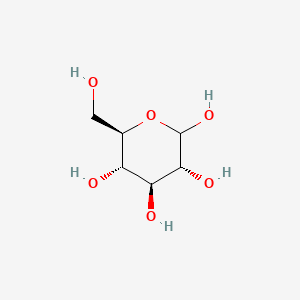 |
| maltose | 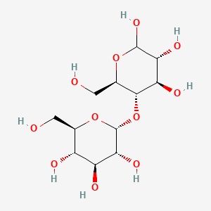 |
| maltotriose | 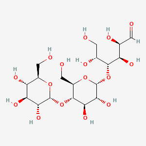 |

Relative proportions influence yeast kinetics, attenuation behavior, stress response, and secondary metabolite profile.

What can go wrong here:

- Poor starch conversion leaves high dextrin load and reduced fermentability.
- Improper mash pH reduces enzyme efficiency and alters nitrogen availability.
- Excessive thermal stress can denature enzymes and lower extract efficiency.
- Microbial contamination pre-fermentation can consume sugars and generate unwanted acids.

Flavor consequence:

- Incomplete conversion can indirectly increase off-flavors if stressed yeast ferment under nutrient imbalance.

---

## 4. Central Yeast Metabolism: Ethanol, CO2, and Redox Balance

The core fermentation pathway is glycolysis followed by alcoholic fermentation.

Simplified stoichiometric expression:

C6H12O6 -> 2 C2H5OH + 2 CO2 + energy

This simplification hides major biochemical detail, but it is a useful top-level map.

Key chemistry points:

- Glycolysis converts hexose sugars into pyruvate.
- Under oxygen-limited distillery conditions, pyruvate is decarboxylated to acetaldehyde.
- Acetaldehyde is reduced to ethanol.
- NADH/NAD+ redox cycling is central to maintaining metabolic flux.

Structure snapshots:

| Compound | Structure |
|---|---|
| ethanol | 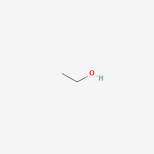 |
| acetaldehyde | 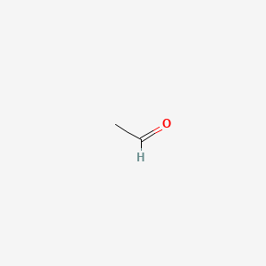 |

Why this matters for flavor:

- Acetaldehyde concentration is a major quality lever.
- Redox stress can change distribution of higher alcohols and acids.
- Yeast strain differences in enzyme expression alter congener outputs significantly.

What can go wrong:

- Stuck or sluggish fermentations can leave elevated acetaldehyde and residual sugars.
- Temperature overshoot can increase fusel alcohol formation and yeast stress byproducts.
- Oxygen mismanagement can alter sterol synthesis and membrane health, affecting ester expression.

---

## 5. Nitrogen Chemistry and Amino Acid Catabolism

Yeast-assimilable nitrogen (YAN) is one of the strongest hidden drivers of flavor chemistry.

Nitrogen sources in mash/wort influence:

- growth kinetics,
- biomass formation,
- higher alcohol production,
- sulfur metabolism,
- risk of problematic nitrogenous precursors.

A major flavor-relevant route is the Ehrlich pathway, where amino acids are converted to corresponding higher alcohols via:

- transamination,
- decarboxylation,
- reduction.

Examples:

- leucine -> isoamyl alcohol
- valine -> isobutanol
- phenylalanine -> 2-phenylethanol

Structure snapshots:

| Compound | Structure |
|---|---|
| isoamyl alcohol | 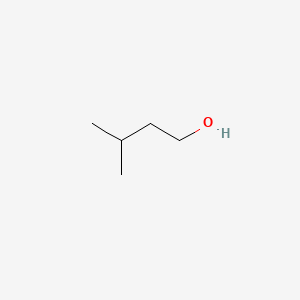 |
| isobutanol | 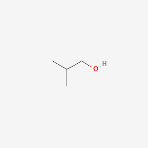 |
| 2-phenylethanol | 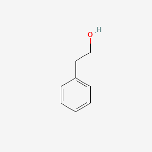 |

These higher alcohols can be:

- positive at balanced levels (structure, complexity),
- harsh at elevated levels (solvent-like, hot).

What can go wrong:

- Low YAN can stress yeast and increase reductive/sulfur faults.
- Excessive YAN in some contexts can increase unwanted byproducts and regulatory risk precursors.
- Poor control of amino acid profile can shift congener balance unpredictably.

---

## 6. Organic Acid Chemistry in Fermentation

Organic acids are not just "sourness." They are key precursors for ester formation and influence microbial ecology and pH.

Important acids in whisky fermentation context:

- acetic acid
- lactic acid
- succinic acid
- caproic (hexanoic) acid
- caprylic (octanoic) acid
- capric (decanoic) acid

Structure snapshots:

| Compound | Structure |
|---|---|
| acetic acid | 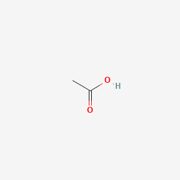 |
| lactic acid | 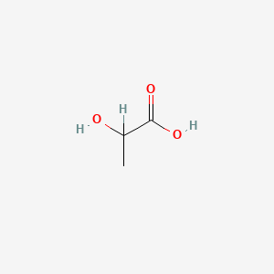 |
| succinic acid | 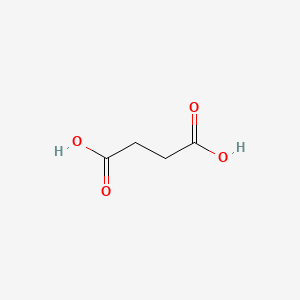 |
| hexanoic acid | 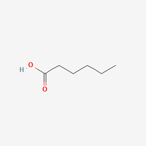 |
| octanoic acid | 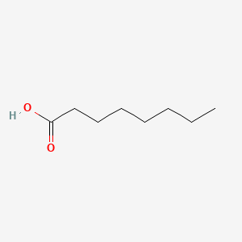 |
| decanoic acid | 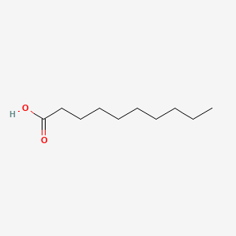 |

Roles:

- pH modulation and buffering effects.
- Ester precursor pool for later reactions.
- Potential signs of contamination or stressed metabolism when out of range.

Balanced acid profiles support esters and complexity.

Imbalanced profiles can produce:

- overt volatile acidity,
- sourness disconnected from style,
- soapy, rancid, or sweaty defects (especially with problematic fatty acid patterns).

---

## 7. Ester Chemistry in Fermentation: Fruit Engine and Risk Surface

Esters are major contributors to fruity/floral perception.

Typical esterification route in fermentation involves alcohol + acyl-CoA mediated enzymatic transfer, rather than only simple equilibrium esterification seen in textbook acid/alcohol systems.

Important fermentation esters:

- ethyl acetate: light fruity, solvent edge at high concentration.
- isoamyl acetate: banana/pear-drop profile.
- ethyl hexanoate: apple/anise nuance.
- ethyl octanoate: pineapple/fruity lift.
- phenethyl acetate: honey/floral facets.

Structure snapshots:

| Compound | Structure |
|---|---|
| ethyl acetate | 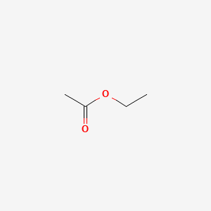 |
| isoamyl acetate | 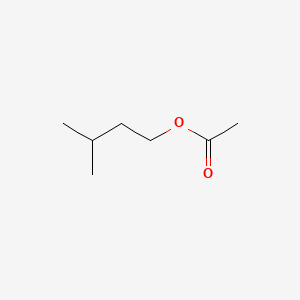 |
| ethyl hexanoate | 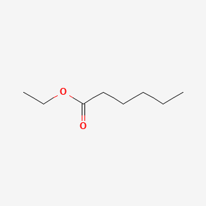 |
| ethyl octanoate | 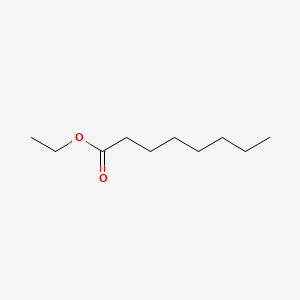 |
| phenethyl acetate | 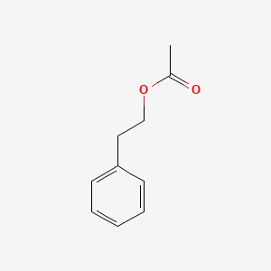 |

Why ester chemistry is difficult:

- Perception thresholds vary widely.
- Ethanol matrix and other volatiles modulate expression.
- Distillation cuts can disproportionately retain or discard relevant esters.

What can go wrong:

- Excess ethyl acetate can push from bright/fruity to nail-polish-like.
- Overly low ester systems can yield flat or cereal-dull spirit.
- Fermentation contamination can generate ester sets that read as artificial or unstable.

---

## 8. Higher Alcohol Chemistry: Structure vs Harshness

Higher alcohols (fusel alcohols) include compounds above ethanol in carbon count and often arise from amino acid catabolism and anabolic overflow.

Examples:

- propanol
- isobutanol
- isoamyl alcohol
- 2-phenylethanol

Structure snapshots:

| Compound | Structure |
|---|---|
| propanol | 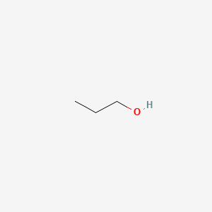 |
| isobutanol |  |
| isoamyl alcohol |  |
| 2-phenylethanol |  |

These compounds have dual roles:

- Positive: add body, aromatic weight, and complexity at moderate levels.
- Negative: hot, solvent-like, rough palate when elevated.

Interaction behavior:

- Moderate higher alcohols can carry ester expression and improve aromatic persistence.
- Excessive higher alcohol concentration suppresses perceived elegance and increases burn.

Process factors that shift higher alcohol formation:

- fermentation temperature,
- yeast strain,
- nitrogen balance,
- oxygenation strategy,
- osmotic stress.

---

## 9. Sulfur Chemistry in Fermentation: Essential Yet Dangerous

Sulfur chemistry is one of the most misunderstood flavor domains in whisky.

Key compounds and families:

- hydrogen sulfide (H2S)
- sulfur dioxide (SO2, less central in whisky than in wine systems but still relevant in some contexts)
- methanethiol and other mercaptans
- dimethyl sulfide (DMS)
- dimethyl disulfide (DMDS)
- dimethyl trisulfide (DMTS)

Structure snapshots:

| Compound | Structure |
|---|---|
| hydrogen sulfide |  |
| sulfur dioxide | 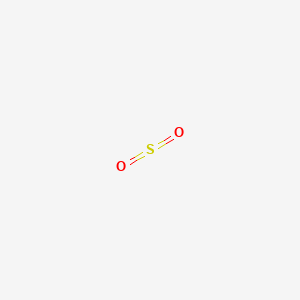 |
| methanethiol | 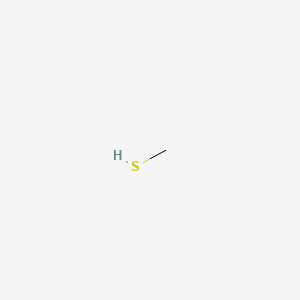 |
| dimethyl sulfide |  |
| dimethyl disulfide | 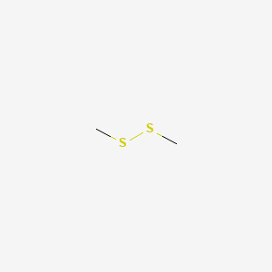 |
| dimethyl trisulfide | 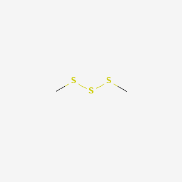 |

Small, controlled sulfur signatures can contribute depth in some styles.

Excess sulfur compounds can generate:

- rotten egg,
- cooked cabbage,
- rubber,
- struck match,
- onion/garlic,
- meaty decay notes.

What can go wrong:

- Nutrient-limited yeast increases reductive sulfur production.
- Poor copper management downstream fails sulfur cleanup.
- Contamination and autolysis can produce persistent sulfur defects difficult to remove.

---

## 10. Carbonyl Chemistry: Aldehydes and Ketones in New Make Potential

Aldehydes and ketones are high-impact compounds even at low concentrations.

Important compounds:

- acetaldehyde: green apple, bruised fruit, pungent at elevated levels.
- furfural and related furans (often maturation-linked too, but can have early-stage relevance).
- acetone and related ketones in fault scenarios.

Structure snapshots:

| Compound | Structure |
|---|---|
| acetaldehyde |  |
| furfural | 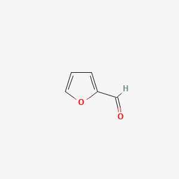 |
| acetone | 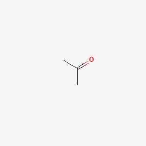 |

Acetaldehyde is particularly important because it is both:

- a central metabolic intermediate,
- and a sensory fault when excessive.

What can go wrong:

- Incomplete reduction of acetaldehyde under stress.
- Oxidative handling post-fermentation increasing aldehydic notes.
- Distillation cut errors carrying too much early-run volatile carbonyl material.

---

## 11. Microbial Ecology: Yeast Plus Bacteria and Controlled Complexity

Distillery fermentation is rarely a single-organism story.

Even in controlled systems, lactic acid bacteria and other microbes can contribute chemistry, especially in longer fermentations.

Potential positive contributions:

- Lactate generation and associated ester precursors.
- Complexity through modest mixed-culture metabolites.
- Texture and aromatic nuance in distillery house style.

Potential negative contributions:

- Acetic acid spikes,
- butyric/rancid notes,
- biogenic amine concerns in some contexts,
- inconsistent batch behavior.

This is a classic style-versus-control tradeoff:

- Highly sanitized short ferment: reliable, potentially less complexity.
- Longer fermentation with controlled microbial participation: potentially richer profile, higher risk envelope.

---

## 12. Fermentation Failure Modes and Their Chemical Signatures

Common failure modes and likely chemistry markers:

- Stuck fermentation:
  low attenuation, residual sugars, elevated acetaldehyde, weak ester expression.
- Overheated fermentation:
  high higher alcohols, potential yeast death, autolysis risk, harsh spirit.
- Contaminated fermentation:
  volatile acidity elevation, lactic/acetic imbalance, atypical sulfur or rancid notes.
- Nutrient imbalance:
  reductive sulfur and irregular congener pattern.
- Overlong dirty hold before distillation:
  oxidative drift, microbial spoilage chemistry, increased fault load.

Operational impact:

- Distillation cannot fully rescue severe fermentation faults.
- Some faults become concentrated by distillation rather than removed.

---

## 13. Fermentation Chemistry and Safety Risks

Flavor faults are not the only risk class. Safety risks can emerge from process chemistry failures.

Risk categories:

- Carbon dioxide accumulation in confined spaces.
- Chemical exposure from cleaners/sanitizers reacting with process residues.
- Biological contamination leading to unstable product and potential spoilage-linked hazards.
- Precursor formation that can feed later harmful compounds.

Critical principle:

- Good fermentation control is both a quality function and a safety function.

A flavor-first culture without process safety discipline is a serious operational mistake.

---

## 14. Distillation Chemistry: Separation by Volatility and Affinity

Distillation is not just boiling and collection.

It is a dynamic vapor-liquid equilibrium system where composition of vapor differs from composition of liquid based on:

- relative volatility,
- molecular interactions,
- reflux behavior,
- still geometry,
- heat input profile,
- time.

Ethanol-water behavior is central but not solitary.

Congeners each have their own:

- volatility,
- solubility,
- interaction with copper surfaces,
- partitioning tendencies.

Result:

- Distillation is selective concentration and selective rejection.

---

## 15. Pot Still Chemistry: Batch Selection and Copper Reactivity

Pot stills emphasize batch dynamics and operator-led cut decisions.

Chemical characteristics of pot still operation:

- Time-varying composition in vapor stream.
- Strong influence of reflux from still shape and condenser setup.
- High sensitivity to run speed and heat profile.
- Significant copper contact opportunities.

Copper chemistry is especially important.

Copper can react with sulfur compounds, reducing sulfur-heavy notes in spirit. This is one reason copper stills remain central in many whisky traditions.

However, copper is not a universal fix.

- Severe sulfur load can exceed cleanup capacity.
- Poor still hygiene can create other issues.
- Over-aggressive copper polishing of character can flatten desired complexity.

---

## 16. Column Distillation Chemistry: Continuous Fractionation and Precision

Column systems provide continuous separation with repeated vapor-liquid contact across plates or packing.

Chemical implications:

- Higher throughput and reproducibility.
- Potential for tighter control of congener carryover.
- Ability to produce lighter profiles when desired.
- In some designs, reduced heavy congener retention.

Quality myth correction:

- Continuous systems are not inherently low quality.
- They are engineering tools with different selectivity behavior.

Risk if mismanaged:

- Over-clean spirit that matures into one-dimensional profile.
- Under-controlled column operation causing instability in cut consistency.

---

## 17. Heads, Hearts, Tails: Chemical Reality of Cut Management

Cut management is one of the most consequential quality and safety decisions in whisky production.

Broad tendencies:

- Heads (foreshots): enriched in low-boiling volatiles including some aldehydes, light esters, and potentially undesirable compounds.
- Hearts: target fraction balancing ethanol with desired congeners.
- Tails (feints): enriched in heavier alcohols, fatty acids, sulfur species, and late-run compounds.

Important caution:

- The cut boundaries are not fixed temperatures or absolute moments.
- They are process- and system-specific transitions.

Poor cut execution can produce:

- harshness,
- solvent notes,
- oily/rancid tails dominance,
- sulfur carryover,
- elevated safety concerns if toxic fractions are not appropriately excluded.

---

## 18. Methanol Chemistry: Risk, Reality, and Misconceptions

Methanol discussion in distilling is often poorly explained in public discourse.

Key points:

- Methanol forms primarily from pectin breakdown in many fermentations.
- Grain-based whisky fermentations generally produce far less methanol than some fruit distillates.
- Methanol is toxic and must be controlled by legal and technical standards.

Toxicology summary:

- Methanol metabolism produces formaldehyde and formic acid.
- These metabolites drive toxicity, including optic nerve damage and severe systemic effects.

Structure snapshots:

| Compound | Structure |
|---|---|
| methanol | 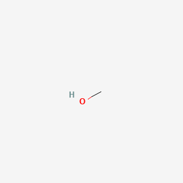 |
| formaldehyde | 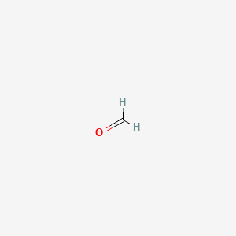 |
| formic acid | 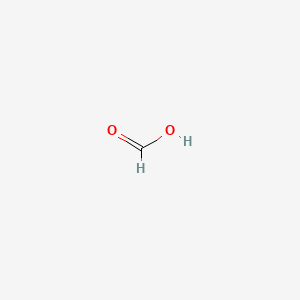 |

Process control implication:

- Compliance testing and legal limits are non-negotiable.
- Correct fraction management, validated production methods, and proper analytical verification are required.

What can go wrong:

- Poorly controlled illicit distillation can produce dangerous contamination profiles.
- Inadequate quality systems can fail to detect non-compliant methanol levels.

---

## 19. Other Distillation-Stage Hazards Beyond Methanol

Poisoning and injury risks extend beyond methanol.

Examples:

- Cleaning chemical residues (caustics, acids, sanitizers) if rinsing/verification fails.
- Heavy metal contamination risk from unsuitable or degraded equipment materials.
- Lubricant or process-aid contamination from poor maintenance.
- Cross-contamination with denaturants in non-food-grade handling systems.

Safety culture requirement:

- Food-contact materials, cleaning validation, and traceability must be treated as core quality chemistry controls.

---

## 20. Distillation Fault Modes and Downstream Flavor Damage

Common distillation chemistry failures:

- Run too fast:
  smearing of fractions, weak separation, harshness.
- Inconsistent reflux behavior:
  volatile profile drift batch to batch.
- Copper contact degradation:
  sulfur cleanup loss.
- Inadequate still cleaning:
  carryover of burnt, sulfury, or stale notes.
- Poor feints recycling policy:
  cumulative concentration of unwanted congeners.

Downstream impact in cask:

- New make faults can be masked temporarily by active oak,
- but re-emerge as spirit matures,
- often as unbalanced wood-plus-fault combinations.

---

## 21. Flavor Chemistry Framework: Families of Compounds in Whisky

A practical flavor chemistry map groups compounds into families:

- esters
- higher alcohols
- aldehydes and ketones
- organic acids
- phenols
- sulfur compounds
- lactones
- furans
- volatile and hydrolyzable phenolics from wood
- terpenes and norisoprenoids (especially in wine-finish contexts)
- tannin-related compounds
- Maillard-derived molecules (limited direct pathway in base spirit, stronger in wood toasting/charring contributions)

No single family defines quality.

Quality emerges from:

- relative balance,
- persistence,
- interaction network,
- matrix integration across nose, palate, and finish.

---

## 22. Esters in Mature Whisky: Fruit, Lift, and Fragility

Important esters in whisky context include:

- ethyl acetate
- isoamyl acetate
- ethyl butyrate
- ethyl hexanoate
- ethyl octanoate
- ethyl decanoate
- phenethyl acetate

Structure snapshots:

| Compound | Structure |
|---|---|
| ethyl acetate |  |
| isoamyl acetate |  |
| ethyl butyrate | 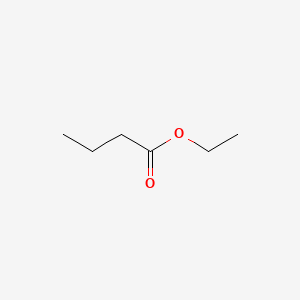 |
| ethyl hexanoate |  |
| ethyl octanoate |  |
| ethyl decanoate | 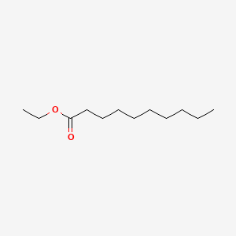 |
| phenethyl acetate |  |

Sensory roles:

- top-note fruit lift,
- floral edges,
- confectionary hints,
- aromatic freshness.

Good interaction examples:

- ethyl hexanoate + moderate vanillin can read as ripe orchard fruit with vanilla cream.
- ethyl octanoate + balanced oak spice can read as tropical-fruit complexity.

Bad interaction examples:

- high ethyl acetate + high acetaldehyde -> solvent and bruised-fruit harshness.
- high fruity esters + aggressive new char tannin extraction -> disjointed artificial-fruit impression.

---

## 23. Higher Alcohols in Mature Whisky: Backbone or Burn

Higher alcohols can act as structural carriers for aroma release.

At balanced levels they can:

- increase perceived body,
- lengthen finish,
- support ester persistence.

At excessive levels they can:

- increase hotness and palate bite,
- suppress subtle floral and wood-integrated notes,
- produce rough solvent-like finish.

Interaction examples:

- Moderate isoamyl alcohol with adequate ester counterweight can feel robust but expressive.
- High isobutanol plus low ester load often reads thin on aroma but harsh on palate.

---

## 24. Organic Acids and Their Double Role in Flavor

Organic acids influence flavor directly and as ester precursors.

Direct effects:

- volatile acidity (especially acetic acid) can add brightness in low levels,
- but becomes vinegary and disruptive at higher levels.

Indirect effects:

- acids react over time with alcohols to form esters,
- shifting flavor from sharp toward integrated fruit complexity.

Balanced maturation often includes a dynamic acid-ester relationship rather than static concentration.

Fault behavior:

- Excess volatile acidity with weak ester buffering reads sour/solvent.
- Low acid systems may feel broad but aromatically flat.

---

## 25. Aldehydes and Ketones: Precision Required

Aldehydes are potent and threshold-sensitive.

Acetaldehyde in particular can be:

- positive in very low amounts adding freshness,
- negative when elevated: green, pungent, raw.

Other carbonyl compounds can contribute:

- nutty,
- oxidized,
- caramelized,
- stale notes depending on chemistry and concentration.

Interaction behavior:

- Elevated aldehydes with high oak tannin can read astringent and under-integrated.
- Controlled aldehydes with mature ester system can add lift and definition.

---

## 26. Phenol Chemistry: Smoke, Medicinal Notes, and Complexity

Peat-derived and smoke-associated phenols include:

- phenol
- cresols (o-, m-, p-)
- guaiacol
- 4-methylguaiacol
- syringol derivatives

Structure snapshots:

| Compound | Structure |
|---|---|
| phenol | 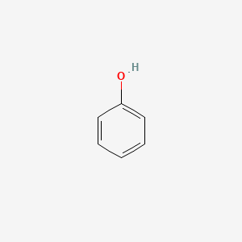 |
| p-cresol (representative cresol isomer) | 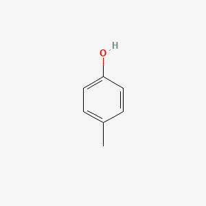 |
| guaiacol | 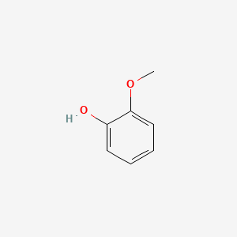 |
| 4-methylguaiacol | 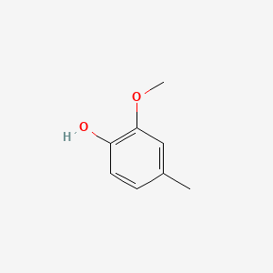 |
| syringol | 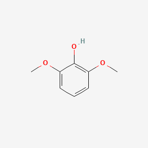 |

These compounds create smoky, medicinal, tarry, ashy, clove-like, and spice-smoke notes depending on ratios and matrix.

Good interaction examples:

- guaiacol with vanillin and lactones can create integrated smoke-sweet balance.
- moderate cresols with citrus esters can create coastal medicinal complexity rather than blunt ash.

Bad interaction examples:

- high phenol + high sulfur residues -> acrid rubber smoke.
- high phenol + aggressive raw oak tannin -> bitter smoky astringency.

---

## 27. Sulfur Compounds in Mature Spirit: Tiny Levels, Huge Effects

Sulfur compounds have some of the lowest sensory thresholds in whisky.

Relevant compounds include:

- hydrogen sulfide
- methanethiol
- ethanethiol
- dimethyl sulfide
- dimethyl disulfide
- dimethyl trisulfide

Structure snapshots:

| Compound | Structure |
|---|---|
| hydrogen sulfide |  |
| methanethiol |  |
| ethanethiol | 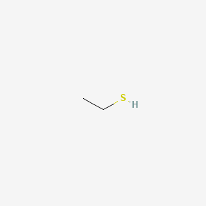 |
| dimethyl sulfide |  |
| dimethyl disulfide |  |
| dimethyl trisulfide |  |

Small quantities can add savory depth or "weight" in some styles.

Excess produces:

- struck match,
- cabbage,
- onion,
- rubber,
- sewer-like defects.

Interaction chemistry:

- Sulfur + oak sweetness can sometimes conceal defects briefly.
- Over time, sulfur notes may re-emerge as sweetness integrates, revealing imbalance.

Widely considered bad interactions:

- Sulfur compounds with high aldehydes and low ester buffer.
- Sulfur with burnt barrel notes and elevated bitterness.

---

## 28. Wood Chemistry I: Major Extractive and Transformational Families

Oak contributes both extractive compounds and reaction substrates.

Major contributors:

- lignin-derived compounds: vanillin, syringaldehyde, coniferaldehyde-related pathways.
- hemicellulose degradation products: furfural, 5-methylfurfural and related caramel/toast notes.
- oak lactones: cis- and trans-whisky lactones (coconut, woody, sweet).
- tannins and phenolic structures: astringency, structure, oxidation dynamics.
- eugenol and related spice compounds: clove/spice dimensions.

Structure snapshots:

| Compound | Structure |
|---|---|
| vanillin | 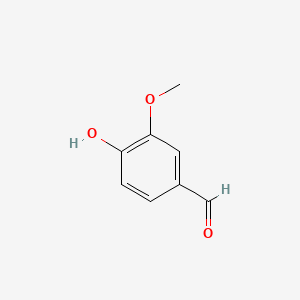 |
| syringaldehyde | 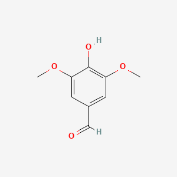 |
| coniferaldehyde | 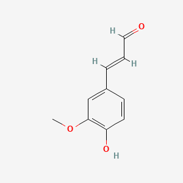 |
| furfural |  |
| 5-methylfurfural | 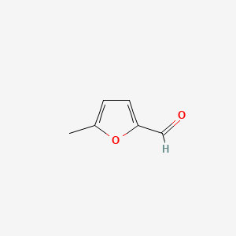 |
| beta-methyl-gamma-octalactone (whisky lactone representative) | 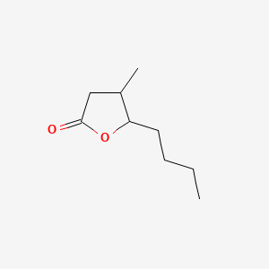 |
| eugenol | 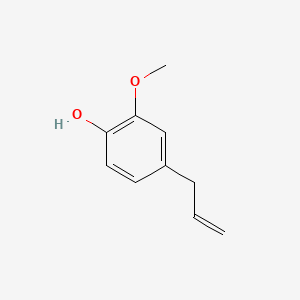 |

Toast and char level strongly influence which compounds become available and at what rate.

---

## 29. Wood Chemistry II: Oxygen, Time, and Secondary Reactions

Maturation is reaction chemistry over years.

Major processes:

- extraction from wood matrix,
- oxidation of spirit components,
- esterification and transesterification,
- acetal formation,
- polymerization and condensation reactions,
- evaporation-driven concentration changes.

Typical long-term effects:

- reduction of raw new-make edges,
- integration of aromatic families,
- increased complexity and persistence,
- potential over-oaking if extraction outpaces integration.

What can go wrong:

- Too active wood early can dominate distillate character.
- Poor cask quality can add musty, moldy, or contaminated notes.
- Oxygen ingress imbalance can produce stale or excessively oxidative profile.

---

## 30. Cask Type Chemistry: Ex-Bourbon, Sherry, Wine, and New Oak

Different cask histories provide different precursor inventories.

Ex-bourbon casks often emphasize:

- vanillin,
- lactones,
- caramelized sweetness,
- coconut/cream notes.

Sherry-seasoned or ex-sherry casks often emphasize:

- dried fruit signatures,
- nutty oxidative notes,
- spice and richer tannin framework.

Wine casks can introduce:

- berry, jammy, tannic, and acidic overlays,
- additional phenolics and fruit-derived compounds.

New oak can contribute intense:

- vanillin,
- spice,
- char-derived compounds,
- tannin extraction.

Risk:

- Finishing regimes that prioritize impact over integration can create patchwork flavor where cask note sits on top of spirit rather than harmonizing.

---

## 31. Flavor Interaction Matrix: Widely Considered Positive Pairings

The following interactions are widely valued when balanced:

- Fruity esters + moderate vanilla/lactone sweetness:
  perceived as ripe, rounded fruit complexity.
- Light phenolic smoke + citrus/high-note esters:
  perceived as bright coastal complexity.
- Moderate sulfur depth + strong fruit and oak integration:
  perceived as meaty complexity in some traditional styles.
- Structured tannin + oily congeners and esters:
  perceived as long finish with architectural balance.
- Spice phenolics + dried-fruit aldehydic richness:
  perceived as layered sherried complexity.

Key caveat:

- Positive interactions are window-dependent. Concentration drift can convert elegance into imbalance quickly.

---

## 32. Flavor Interaction Matrix: Widely Considered Negative Pairings

Commonly criticized interaction patterns:

- High volatile acidity + high ethyl acetate:
  solvent-vinegar profile.
- Elevated sulfur + low fruit ester support:
  blunt rubbery or onion-like profile.
- Heavy smoke + aggressive tannin + low sweetness:
  bitter ash dryness.
- High fusel alcohols + low oak integration:
  harsh, hot, immature palate.
- Intense wine-finish phenolics + delicate spirit base:
  cask dominance, loss of distillery identity.
- Excess aldehydes + rough wood extraction:
  green, astringent, unfinished profile.

These are not legal faults by definition, but they are often quality faults in sensory assessment.

---

## 33. Why "Good vs Bad" Is Not Universal But Still Useful

Preferences differ by market, culture, and style tradition.

However, there is still broad technical consensus on many quality ranges because:

- some compounds have universally harsh signatures at high levels,
- some balances repeatedly score higher in blinded panels,
- process instability correlates with sensory inconsistency,
- extreme defects are reproducibly identified by trained assessors.

So while taste is not fully objective, quality control is not purely subjective.

---

## 34. Oxidation Chemistry in Bottle and Post-Bottling Drift

Even after bottling, chemistry continues slowly.

Potential changes:

- gradual volatilization shifts after opening,
- oxidation of sensitive compounds,
- changing integration perception over headspace exposure cycles.

Practical implications:

- A bottle can show different aromatic emphasis at full fill vs low fill.
- Very delicate esters may decline faster with repeated oxygen exposure.

What can go wrong:

- Poor closure integrity can accelerate degradation.
- Heat/light abuse can push stale oxidative notes.

---

## 35. Water Addition Chemistry and Flavor Release

Dilution is a chemical intervention, not only ABV adjustment.

Adding water changes:

- volatility partitioning,
- micellar behavior of hydrophobic congeners,
- release dynamics of aromatic compounds.

This helps explain why some whiskies "open up" with small water additions while others collapse.

Potential negative outcomes:

- Excess dilution can flatten aromatic intensity.
- Some compounds may precipitate or create haze depending on temperature and matrix.

---

## 36. Chill Filtration Chemistry and Texture Tradeoffs

Chill filtration removes components that can cause haze at low temperatures, often including fatty acid esters and higher molecular weight congeners.

Potential benefits:

- visual stability,
- reduced consumer confusion around haze.

Potential tradeoffs:

- reduced mouthfeel,
- slight reduction in aromatic depth for some profiles.

Whether this is good or bad depends on product goals and market expectations.

---

## 37. Undesired Compounds and Fault Families: Practical Diagnostic View

Useful fault-family mapping:

- Solvent/nail polish:
  often ethyl acetate excess and/or high volatile acidity with harsh carbonyl support.
- Rotten egg/cabbage/rubber:
  sulfur compounds above threshold, often linked to fermentation stress and copper insufficiency.
- Rancid/goaty/sweaty:
  problematic fatty acid and microbial byproduct patterns.
- Green/raw:
  elevated acetaldehyde and under-integrated new make.
- Bitter/over-extracted wood:
  excessive tannin/char extraction with weak distillate support.
- Flat/bland:
  low congener diversity or over-refined distillation.

---

## 38. Ethyl Carbamate and Other Regulatory Chemical Concerns

Ethyl carbamate (urethane) is a known concern in some spirits contexts and can form from reaction pathways involving ethanol and carbamyl precursors such as cyanate or urea-related chemistry.

Risk factors can include:

- precursor presence in raw materials and fermentation,
- process conditions that favor formation,
- storage and heat influences.

Regulatory principle:

- Producers should monitor and minimize formation through validated controls and jurisdiction-specific compliance frameworks.

Other compliance-linked concerns can include:

- heavy metals,
- pesticide residues,
- process contaminants,
- packaging migration compounds.

---

## 39. Poisoning Risk Landscape in Whisky Production and Consumption

A realistic risk map includes:

- Methanol and non-compliant distillate contamination.
- Cleaning chemical contamination.
- Heavy metal contamination from unsuitable equipment.
- Intentional adulteration in illegal supply chains.
- Occupational exposure hazards in production environments.

Public health point:

- Legal, tested, compliant production systems drastically reduce these risks.
- Informal or illicit systems can elevate severe toxicology risk.

---

## 40. Case Pattern: Bad Fermentation Cascading Into Mature Flavor Problems

A common failure cascade:

1. Nutrient imbalance and temperature stress in fermentation.
2. Elevated sulfur and harsh higher alcohol profile in wash.
3. Distillation struggles to remove all problematic compounds.
4. New make enters cask with hidden imbalance.
5. Active wood initially masks flaws.
6. After time, sulfur-harsh profile reappears with woody bitterness.

Lesson:

- Cask cannot reliably fix poor upstream chemistry.

---

## 41. Case Pattern: Over-Corrected Distillation and Flavor Loss

Another common cascade:

1. Distiller chases ultra-clean spirit by aggressive cut strategy.
2. Many congeners removed, including positive texture and fruit-support compounds.
3. Spirit matures quickly in terms of oak pickup but lacks internal complexity.
4. Finished whisky feels polished but thin.

Lesson:

- Purity and quality are not synonymous in whisky chemistry.

---

## 42. Case Pattern: Cask Finish Overload and Interaction Failure

Typical pattern:

1. Base spirit has delicate, ester-driven profile.
2. Intense red-wine cask finish adds heavy tannin and polyphenolic load.
3. Resulting interaction suppresses primary fruit and exaggerates bitterness.
4. Sensory profile appears disjointed: cask note and spirit note do not integrate.

Lesson:

- Finishing is interaction chemistry, not flavor paint.

---

## 43. Analytical Chemistry Toolkit for Distillery Control

Common analytical approaches in modern distilling labs:

- GC-FID and GC-MS for volatile congener profiling.
- HPLC for specific non-volatile analyses.
- Spectrophotometric methods for selected quality indices.
- pH, titratable acidity, density, and ABV measurements.
- ICP methods for metals in advanced compliance contexts.

Sensory plus analytics is stronger than either alone.

- Analytics detects and quantifies compounds.
- Sensory detects integrated perception and emergent interaction effects.

---

## 44. Sensory-Chemical Correlation: Useful but Never Perfect

Students often ask for deterministic maps like:

- one compound = one flavor note.

Real systems are more complex:

- Synergy: two compounds together can exceed expected impact.
- Suppression: one family can mute another.
- Masking: strong notes can hide faults temporarily.
- Temporal effects: retronasal and finish phases reveal different chemistry.

Better model:

- flavor perception is a network property of the matrix.

---

## 45. Fermentation Chemistry: Advanced Deep-Dive on Process Levers

To build deeper control intuition, track these fermentation levers with chemistry framing.

### 45.1 Temperature profile as pathway selector

Temperature does not only change speed. It shifts metabolic routing.

- Higher temperatures often increase higher alcohol formation and can reduce delicate ester retention.
- Lower, controlled profiles can preserve nuanced esters but may risk incomplete attenuation if too low for strain behavior.

### 45.2 Oxygen management in early phase

Initial oxygen supports membrane sterol synthesis and yeast health, but excess oxygen later can raise oxidative stress and alter volatile profile.

### 45.3 Pitch rate and population dynamics

Under-pitching can increase stress metabolites.

Over-pitching can reduce growth phase expression that contributes to some desired complexity.

### 45.4 Fermentation duration

Very short fermentations may underdevelop complexity.

Very long fermentations can invite bacterial chemistry and oxidation risk if hygiene and timing are weak.

### 45.5 Nutrient architecture

Nitrogen source quality, micronutrient availability, and amino acid balance influence congener distribution more than many beginners expect.

---

## 46. Distillation Chemistry: Advanced Deep-Dive on Selectivity and Smearing

### 46.1 Reflux and internal redistillation

Reflux increases repeated equilibration, which can sharpen separation but also shape which aromatics survive.

### 46.2 Heat input profile

Aggressive heating can cause entrainment and smearing, carrying unwanted heavy compounds earlier.

### 46.3 Receiver management and transitions

Precise changeover timing matters because composition shifts continuously, not stepwise.

### 46.4 Recycling policies

Feints and recycle fractions can reclaim value but also accumulate unwanted compounds if policies are not chemically informed.

---

## 47. Flavor Chemistry Catalogue I: Fruity, Floral, and Sweet-Associated Elements

Commonly discussed compounds or classes and typical descriptors:

- Isoamyl acetate: banana, pear drop.
- Ethyl hexanoate: apple, anise-like fruit.
- Ethyl octanoate: tropical fruit, pineapple.
- Phenethyl acetate: floral, honey.
- 2-Phenylethanol: rose-like floral alcohol.
- Vanillin: vanilla sweetness.
- Oak lactones: coconut, sweet woody notes.
- Furfural derivatives: caramel, toasted sugar context.

Positive integration pattern:

- ester lift + controlled vanilla/lactone + moderate tannin frame.

Negative pattern:

- confected fruit esters + high solvent edge + weak structure.

---

## 48. Flavor Chemistry Catalogue II: Smoky, Spicy, and Savory Elements

Representative compounds/families:

- phenol and cresols (smoke, medicinal)
- guaiacol (smoke, clove, spicy smoke)
- syringol derivatives (sweet smoke)
- eugenol (clove spice)
- sulfur trace compounds (savory depth or faults)

Positive integration pattern:

- layered smoke with sweet oak and fruit counterweight.

Negative pattern:

- phenol-heavy spirit with sulfur load and bitter wood.

---

## 49. Flavor Chemistry Catalogue III: Bitter, Astringent, and Drying Elements

Main contributors include:

- tannin extraction,
- phenolic wood compounds,
- over-char associated bitter notes,
- aldehydic and oxidative contributions in imbalance.

Useful distinction:

- Structured dryness can be positive.
- Harsh astringency and bitter roughness are quality faults when dominant.

Integration cues:

- Adequate fruit/oil/esters can absorb tannic structure.
- Thin distillate with high tannin reads woody and hollow.

---

## 50. Interaction and Balance: Why Small Percentage Changes Matter

In whisky chemistry, tiny concentration shifts can create large sensory movement because many compounds are near threshold.

Practical implications:

- A minor cut adjustment can significantly change perceived fruit or harshness.
- A subtle fermentation temperature drift can alter higher alcohol-to-ester ratio.
- Small cask policy changes can move a whole release profile over time.

This is why disciplined logging and analytical correlation matter.

---

## 51. Process Control Framework by Chemistry Risk

A useful way to run a distillery is to map each stage to chemistry risk classes.

### Fermentation risk classes

- metabolic stress risk
- contamination risk
- sulfur precursor risk
- volatile acidity risk

### Distillation risk classes

- cut smearing risk
- sulfur carryover risk
- toxic fraction control risk
- repeatability risk

### Maturation risk classes

- over-extraction risk
- oxidation imbalance risk
- cask contamination risk
- integration failure risk

### Bottling risk classes

- filtration over-stripping risk
- dilution shock/haze behavior
- closure oxygen ingress risk

---

## 52. Fault Prevention: Upstream Controls Beat Downstream Rescue

Widely observed hierarchy:

- Prevent faults in fermentation.
- Select and refine in distillation.
- Integrate and elevate in maturation.

Reverse strategy fails often:

- trying to hide severe upstream faults with active wood, finishing, or blending.

Blending can improve balance, but it is not a universal defect eraser.

---

## 53. Consumer Safety and Ethical Chemistry

Technical competence carries ethical responsibility.

Core ethical commitments in whisky chemistry:

- never compromise analytical compliance,
- never bypass traceability,
- never treat contamination concerns as purely cosmetic,
- never ignore poisoning-risk controls for throughput reasons.

A whisky can be exciting stylistically only if it is first safe and compliant.

---

## 54. Study Method: Building Your Personal Chemistry Lexicon

For serious learners, build a structured notebook with three linked columns:

1. Sensory descriptor
2. Candidate compounds/families
3. Process origin hypotheses

Then verify over multiple tastings and known process examples.

This prevents one-note, oversimplified chemical storytelling.

---

## 55. Advanced Tasting with Chemistry Hypotheses

When tasting, test hypotheses explicitly:

- Is the fruit profile likely ester-led, aldehyde-led, or both?
- Is smoke clean phenolic or sulfur-compounded?
- Is dryness tannic structure or raw bitterness?
- Is hotness ethanol only, or fusel-supported roughness?

Use confidence labels:

- high confidence (supported by repeated evidence)
- medium confidence (plausible but not verified)
- low confidence (speculative)

---

## 56. Summary: Core Chemical Insights to Lock In

- Fermentation is the principal generator of whisky flavor potential.
- Distillation selects and reshapes; it does not replace fermentation quality.
- Maturation is long-term reaction chemistry, not passive storage.
- Flavor is interaction-driven, not single-compound deterministic.
- Good versus bad interactions are concentration- and context-dependent, but broad quality consensus exists.
- Sulfur, acids, esters, and phenols are all dual-role families: useful at the right levels, destructive at the wrong levels.
- Poisoning risks are real where compliance, equipment, or process discipline fail.
- Upstream control is the strongest defense against downstream faults.

---

## 57. Review Checklist for Phase 9

Use this checklist to verify your mastery.

- Can you explain the pathway from sugar metabolism to congener formation?
- Can you describe how cut management changes congener carryover?
- Can you name major flavor compound families and their interaction behavior?
- Can you identify at least five common fault signatures and likely chemical origins?
- Can you explain methanol risk accurately without exaggeration or misinformation?
- Can you discuss why cask finishing can improve or damage integration?
- Can you map process decisions to both quality and safety outcomes?

If you can do this with confidence, you have moved beyond beginner whisky chemistry.

---

## 58. Advanced Compound Atlas: Fermentation and Distillation Volatiles

This atlas section is intentionally expansive. Use it as a reference map rather than something to memorize in one pass.

| Compound or class | Typical phase origin | Common descriptor family | Why it matters chemically |
|---|---|---|---|
| Ethanol | Fermentation core product | spirit warmth, body | solvent matrix and volatility driver for all aromatic expression |
| Acetaldehyde | Fermentation intermediate, distillation carryover | green apple, pungent | redox marker and high-impact carbonyl at low thresholds |
| Ethyl acetate | Fermentation ester, maturation contribution | fruity lift to solvent edge | concentration-dependent marker of fruit-vs-solvent balance |
| Isoamyl acetate | Fermentation ester | banana, pear drop | strong fruity top note; quickly artificial when excessive |
| Ethyl butyrate | Fermentation and maturation ester chemistry | pineapple, bright fruit | supports tropical fruit style in moderate concentrations |
| Ethyl hexanoate | Fermentation-derived ester | apple, waxy fruit | key orchard-fruit contributor in many spirits |
| Ethyl octanoate | Fermentation-derived ester | tropical fruit, sweet fruit | low-threshold and often quality-positive in balanced matrix |
| Ethyl decanoate | Fermentation and maturation evolution | rich fruit, waxy depth | can support body and long finish when not over-dominant |
| 2-Phenylethanol | Amino acid metabolism | rose, floral honey | ties amino acid chemistry to floral perception |
| Phenethyl acetate | Esterification from aromatic alcohols | floral, honeyed | gives elegant floral lift in many mature whiskies |
| Propanol | Higher alcohol | alcoholic, solventy at high level | contributes structure; excess reads hot and rough |
| Isobutanol | Higher alcohol | harsh spirit, fusel | useful in trace structure, harsh when elevated |
| Isoamyl alcohol | Higher alcohol | oily, fusel, malty depth | major fusel component with strong balance implications |
| Hexanol traces | Fermentation/minor pathways | green, grassy | can enhance freshness or read raw if out of balance |
| Acetic acid | Fermentation and microbial activity | volatile acidity, vinegar edge | ester precursor and risk marker when elevated |
| Lactic acid | Fermentation bacterial participation | creamy sourness | can support complexity and ester precursors |
| Succinic acid | Yeast metabolism | savory, slightly bitter structure | contributes palate architecture and acid backbone |
| Hexanoic acid | Fatty acid metabolism | cheesy, fatty, sweat at high | critical ester precursor and fault risk in excess |
| Octanoic acid | Fatty acid metabolism | fatty, waxy | precursor for ethyl octanoate and texture effects |
| Decanoic acid | Fatty acid metabolism | soapy/waxy if high | contributes to heavier ester systems and mouthfeel |
| Acetoin traces | Fermentation side chemistry | buttery/creamy nuance | can support texture but excessive buttery notes can feel out of place |
| Diacetyl traces | Bacterial/fermentation side chemistry | butter, butterscotch | usually minimized in whisky ferments; style-sensitive impact |
| Dimethyl sulfide | Sulfur metabolism | sweetcorn to cooked vegetable | narrow acceptable window; highly style dependent |
| Hydrogen sulfide | Sulfur reduction stress | rotten egg | key reductive fault marker needing upstream control |
| Methanethiol | Sulfur pathway | cabbage, onion | potent low-threshold sulfur contributor |
| Dimethyl disulfide | Sulfur oxidation product | onion, garlic, rubber | can persist and become problematic in mature spirit |
| Dimethyl trisulfide | Sulfur oxidation product | cooked sulfur, meaty decay | very low threshold and usually fault-associated |
| Furfural | Toast/heat and wood chemistry | almond, toasted sugar | wood integration and toasting marker |
| 5-Methylfurfural | Toasted wood chemistry | caramelized sweetness | contributes to toasted sweet profile in matured spirit |
| Methanol | Fermentation minor alcohol | little direct sensory cue at low level | strict safety and legal compliance analyte |

Additional structure snapshots for atlas entries not shown earlier:

| Compound | Structure |
|---|---|
| acetoin | 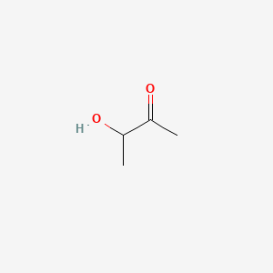 |
| diacetyl | 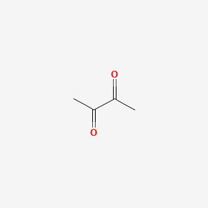 |

Use this atlas with a simple evaluation discipline:

- identify likely source stage,
- test whether concentration and interaction are plausible,
- avoid one-compound certainty when matrix evidence is mixed.

---

## 59. Advanced Compound Atlas: Wood and Maturation Chemistry

| Compound or class | Typical origin in cask chemistry | Descriptor family | Integration behavior |
|---|---|---|---|
| Vanillin | Lignin degradation and extraction | vanilla, sweet cream | often harmonizes esters and lactones when moderate |
| Syringaldehyde | Lignin-derived aromatic aldehyde | sweet spice, woody aroma | supports mature oak elegance in balance |
| Coniferaldehyde-related compounds | Lignin transformation network | resinous spice, woody depth | can add complexity or resin harshness when high |
| Eugenol | Oak spice phenolic | clove, baking spice | positive in layered spice systems; can dominate delicate spirit |
| Cis-oak lactone | Oak lipid-derived lactone | coconut, sweet oak | strongly aromatic and easy to over-accent |
| Trans-oak lactone | Oak lactone isomer | drier woody coconut | structure support with less overt sweetness |
| Ellagitannins | Oak tannin family | dryness, grip, structure | key for architecture; excess yields astringency |
| Gallic acid derivatives | Hydrolyzable tannin pathways | dry, tea-like | part of oxidation and structure evolution |
| Toast phenolics | Barrel heat treatment | char, toast, spice | set barrel personality and extraction trajectory |
| Char-layer compounds | Heavily charred oak | smoke-char, bitter edge | can support depth or drive bitterness |
| Lactone-vanillin cluster | Combined extraction profile | sweet oak, pastry | often consumer-friendly in younger expressions |
| Aldehyde-rich oak profile | Oxidative wood expression | dried fruit, nut, oxidative spice | valuable in sherry-driven systems when integrated |
| Furanic compounds | Thermal hemicellulose products | caramel, toffee, toasted sugar | fill mid-palate sweetness and roasted tone |
| Acetal-related products | Ethanol-aldehyde reaction products | rounded aromatic blending | can soften sharp aldehydic edges over time |
| Polyphenol reaction products | Oxidation and condensation in cask | complexity, dryness, persistence | long-term maturation signatures, can harden palate if overdone |

A practical note for students:

Two whiskies can have similar measured vanillin yet very different vanilla perception because matrix composition, ethanol level, and sulfur burden alter expression.

---

## 60. Reaction Pathway Map: Stage by Stage Chemistry Logic

This section links chemical mechanisms across stages.

### 60.1 Mash to fermentation

Primary transformation:

- starch -> fermentable sugars (enzyme-mediated).

Key dependencies:

- pH and temperature windows,
- enzyme preservation,
- fermentable sugar profile quality.

Failure result:

- poor fermentability and stress-prone yeast metabolism.

### 60.2 Fermentation core metabolism

Primary transformations:

- sugar -> pyruvate -> acetaldehyde -> ethanol.

Linked pathways:

- amino acid catabolism -> higher alcohols,
- acyl transfer and ester formation,
- sulfur assimilation and sulfur byproduct release,
- acid formation via yeast and mixed microbial activity.

Failure result:

- elevated sulfur, aldehydes, volatile acidity, and fusel harshness.

### 60.3 Distillation and copper-mediated selectivity

Primary transformation class:

- physical separation by volatility plus reactive modification at metal surfaces.

Linked pathways:

- sulfur reduction via copper interaction,
- fraction partitioning (heads/hearts/tails),
- congener concentration shifts by cut policy.

Failure result:

- smeared fractions, persistent sulfur, and unstable profile.

### 60.4 Maturation

Primary transformation classes:

- extraction, oxidation, esterification, acetalization, condensation/polymerization.

Linked pathways:

- oxygen-mediated profile evolution,
- wood-derived precursor uptake and integration,
- concentration effects from evaporation.

Failure result:

- over-oaking, imbalance, oxidative staleness, or unresolved new make faults.

### 60.5 Bottling and post-bottling drift

Primary transformation classes:

- volatility redistribution after dilution,
- slow oxidation and aromatic loss post-opening.

Failure result:

- reduced aromatic clarity and style drift in poor storage conditions.

---

## 61. Interaction Deep Dive I: Positive Synergy Scenarios

Positive flavor interactions are often built intentionally through process choices.

### 61.1 Orchard-fruit elegance model

Chemistry pattern:

- moderate ethyl hexanoate and ethyl octanoate,
- controlled acetaldehyde,
- restrained tannin extraction,
- moderate vanillin/lactone support.

Perception:

- apple and pear notes feel ripe rather than confected,
- finish remains clean and persistent.

Process drivers:

- controlled fermentation temperature,
- clean cuts,
- refill-forward maturation strategy.

### 61.2 Smoke-sweet balance model

Chemistry pattern:

- moderate guaiacol/cresol family,
- healthy ester support,
- low sulfur burden,
- sweet oak integration without aggressive tannin.

Perception:

- smoke reads layered and coastal rather than burnt,
- sweetness rounds edges without becoming cloying.

Process drivers:

- peat regime matched to spirit style,
- copper contact maintained,
- cask policy avoiding excessive fresh char dominance.

### 61.3 Sherried structure model

Chemistry pattern:

- dried-fruit aldehydic richness,
- spice phenolics,
- sufficient fruity esters and oily congeners,
- moderate acidity maintaining lift.

Perception:

- dense but coherent profile,
- long finish without bitterness spike.

Process drivers:

- robust distillate backbone,
- cask selection by integration trials,
- careful vatting to avoid tannin over-concentration.

---

## 62. Interaction Deep Dive II: Negative Synergy Scenarios

Many disliked profiles are not caused by one extreme compound alone, but by combinations.

### 62.1 Solvent-vinegar fault cluster

Chemistry pattern:

- elevated ethyl acetate,
- elevated acetic acid,
- sharp carbonyl edge.

Perception:

- nail-polish and volatile sourness,
- low elegance and short finish.

Likely causes:

- contamination or stressed fermentation,
- weak cut management,
- poor blending correction strategy.

### 62.2 Sulfur-char bitterness cluster

Chemistry pattern:

- residual sulfur compounds,
- aggressive char extraction,
- weak fruity counterbalance.

Perception:

- rubber, ash, and bitter dryness,
- smoky harshness without sweetness buffer.

Likely causes:

- high sulfur wash,
- insufficient copper effectiveness,
- cask choice overemphasizing raw char impact.

### 62.3 Thin-core over-oak cluster

Chemistry pattern:

- low congener depth in distillate,
- high oak extraction rate,
- aldehydic and tannic dominance.

Perception:

- polished nose but hollow palate,
- drying finish, limited complexity.

Likely causes:

- over-clean distillation,
- active cask used to compensate,
- insufficient maturation integration window.

---

## 63. Failure Diagnostics by Stage: Expanded Fault Table

| Stage | Chemistry failure | Typical sensory result | Common operational root causes |
|---|---|---|---|
| Mash conversion | Low fermentable sugar profile | thin spirit, stress-driven ferment notes | pH drift, enzyme denaturation, poor grist profile |
| Early fermentation | Yeast stress and redox imbalance | green, harsh, low fruit expression | low nutrient quality, poor oxygen setup, bad pitch health |
| Mid fermentation | Excess higher alcohol generation | hot palate, rough finish | temperature overshoot, nutrient imbalance, strain mismatch |
| Late fermentation | Contamination-driven volatile acidity | sour solvent edges | sanitation gaps, overlong hold times |
| Distillation heads cut | Overcarry of light volatiles/carbonyls | solvent and pungency | late heads cut, unstable run profile |
| Distillation hearts | Loss of desired congeners | bland, thin profile | over-conservative cut strategy |
| Distillation tails cut | Heavy oil/sulfur/fatty carryover | rancid, rubbery, dirty finish | late tails transition, recycle policy issues |
| New make storage | Oxidative drift before cask | stale rawness | poor handling and delayed filling |
| Early cask stage | Over-extraction | bitterness and hard tannin | too active oak for spirit weight |
| Mid-late cask | Integration failure | disjointed profile | weak base spirit, finish mismatch, insufficient balancing |
| Bottling dilution | Aroma collapse or haze shocks | muted nose, textural loss | rapid dilution without rest, unstable matrix |
| Post-bottling | Oxidative flattening | stale and reduced top notes | closure issues, heat/light abuse |

---

## 64. Poisoning and Contamination Risk Register for Chemistry Students

This section is intentionally safety-focused and non-procedural.

| Risk class | Chemical nature | Typical route | Consequence class | Prevention principle |
|---|---|---|---|---|
| Methanol non-compliance | toxic low molecular alcohol | flawed production or illegal adulteration | severe toxicity, visual and systemic injury | regulated production, validated testing, legal compliance |
| Cleaning agent carryover | caustics/acids/sanitizer residues | inadequate rinse/verification | chemical injury risk and product contamination | validated CIP and release checks |
| Heavy metal contamination | metallic contaminants | unsuitable equipment/contact surfaces | chronic and acute toxicology risk depending on metal | food-grade materials and monitoring |
| Solvent contamination | non-food solvent residues | maintenance or storage cross-contact | toxicity and severe taint | strict chemical segregation and QA release control |
| Packaging migration | unwanted compounds from packaging | poor packaging selection or storage | off-flavor and potential health concern | packaging compliance and stability testing |
| Illicit adulterants | unknown toxic additives | informal supply chains | unpredictable toxicology | transparent legal supply and traceability |

Quality culture message:

- Every poisoning risk is also a governance risk.
- Systems, documentation, and testing are not bureaucracy; they are consumer protection chemistry.

---

## 65. Fermentation Chemistry Micro-Atlas: Inputs, Outputs, and Balance Windows

| Lever | If too low | If balanced | If too high |
|---|---|---|---|
| Yeast-assimilable nitrogen | stress sulfur, weak attenuation | robust fermentation and cleaner congener architecture | potential byproduct shifts and instability |
| Pitch vitality | sluggish ferment, contamination risk | predictable kinetics and stable profile | over-dominance with reduced complexity expression |
| Fermentation temperature | incomplete or slow metabolism | healthy ester/fusel balance | excessive fusel and stress metabolites |
| Oxygen at start | membrane stress and poor growth | healthy growth phase and metabolic stability | oxidative complications if mistimed/excessive |
| Fermentation duration | underdeveloped complexity | style-appropriate congener development | contamination and oxidative drift risk |
| Hygiene discipline | variable and contaminated chemistry | repeatable microbial control | no practical downside other than resource cost |

---

## 66. Distillation Chemistry Micro-Atlas: Control Variables and Outcomes

| Distillation lever | Chemistry effect | Typical upside | Typical downside when mismanaged |
|---|---|---|---|
| Heat input ramp | affects entrainment and fraction sharpness | cleaner transition control | smearing and harshness if too aggressive |
| Reflux behavior | repeated vapor-liquid re-equilibration | refined profile shaping | over-cleaning or unstable runs if uncontrolled |
| Copper contact condition | sulfur reactivity and cleanup capacity | reduced sulfur burden | persistent sulfur faults if degraded |
| Heads cut point | low-boiling volatile removal | reduced solvent edge | late cuts carry harsh volatiles |
| Tails cut point | heavy congener management | preserve texture without heaviness | late cuts add rancid/oily/sulfur notes |
| Feints recycle ratio | recovery of useful congeners | efficiency and style continuity | accumulation of unwanted compounds |

---

## 67. Flavor Chemistry Catalog by Perceptual Theme

### 67.1 Orchard and fresh fruit themes

Frequently linked chemistry:

- ethyl hexanoate,
- ethyl butyrate,
- light acetaldehyde traces,
- moderate acetate esters.

When this theme fails:

- too much acetaldehyde shifts fresh to raw green,
- too much acetate ester with acidity shifts fruit to solvent candy.

### 67.2 Tropical and confectionary fruit themes

Frequently linked chemistry:

- isoamyl acetate,
- ethyl octanoate,
- ethyl decanoate,
- supportive oak sweetness.

When this theme fails:

- overt candy-artificial profile,
- low structural acidity and weak mid-palate.

### 67.3 Floral and honey themes

Frequently linked chemistry:

- 2-phenylethanol,
- phenethyl acetate,
- restrained wood spice,
- low sulfur background.

When this theme fails:

- sulfur traces can crush floral clarity,
- excessive tannin can convert floral elegance into dryness.

### 67.4 Smoky and medicinal themes

Frequently linked chemistry:

- phenol/cresol families,
- guaiacol and methylguaiacol sets,
- balanced oak sweetness,
- controlled sulfur.

When this theme fails:

- bitter ash profile,
- rubber-char overlap,
- medicinal harshness without supporting fruit.

### 67.5 Woody spice and mature dryness themes

Frequently linked chemistry:

- eugenol,
- vanillin,
- tannin architecture,
- aldehydic matured notes.

When this theme fails:

- over-astringency,
- bitter extraction,
- dominant oak masking spirit identity.

---

## 68. Maturation Decision Logic: Chemistry-Based Cask Strategy

A chemistry-informed cask strategy starts with distillate profile, not cask fashion.

### 68.1 Delicate, ester-forward distillate

Chemistry-compatible strategy:

- moderate extraction casks,
- avoid extreme tannin or aggressive wine residual profiles,
- longer integration windows.

### 68.2 Oily, heavier distillate with sulfur-adjacent depth

Chemistry-compatible strategy:

- cask plan that provides oxidation and sweetness support,
- avoid compounding sulfur with heavy char bitterness,
- monitor sulfur expression through maturation.

### 68.3 Very clean distillate with low congener diversity

Chemistry-compatible strategy:

- selective active oak for structure,
- blending support to prevent one-dimensional oak profile,
- avoid relying on finish impact alone.

The core discipline:

- match extraction power to distillate resilience.

---

## 69. Extended "What Can Go Wrong" Scenarios Across the Chain

### Scenario A: Fast production pressure

Pattern:

- shortened fermentation,
- high heat distillation,
- young aggressive oak to compensate.

Outcome:

- reduced fruit complexity,
- fusel harshness,
- oak-forward but under-integrated mature profile.

### Scenario B: Hygiene complacency in warm season

Pattern:

- contamination increase,
- volatile acidity drift,
- unstable batch aroma consistency.

Outcome:

- solvent-vinegar notes in some batches,
- blending complexity and brand inconsistency.

### Scenario C: Cask procurement compromise

Pattern:

- variable cask quality,
- occasional musty or contaminated wood influence,
- unpredictable tannin extraction.

Outcome:

- batch-level defects,
- elevated rejection or heavy blending correction needs.

### Scenario D: Inadequate analytical surveillance

Pattern:

- delayed detection of methanol/compliance deviations,
- poor tracking of sulfur or acidity drift,
- retrospective troubleshooting only.

Outcome:

- quality incidents,
- potential regulatory exposure,
- reputational damage.

---

## 70. Expanded Safety Notes: Occupational and Consumer Chemistry

### 70.1 Occupational chemistry hazards

- CO2 accumulation in fermenter rooms.
- Chemical cleaner handling risks.
- Solvent and vapor exposure from maintenance materials.
- Heat and pressure interactions around distillation equipment.

### 70.2 Consumer protection chemistry hazards

- Non-compliant methanol levels in illegal spirits.
- Adulteration with toxic industrial compounds.
- Contamination from poor packaging or storage environments.

### 70.3 Safety culture requirements

- Formal hazard analysis,
- release gating,
- traceability,
- incident review,
- corrective and preventive action systems.

Safety is a flavor topic indirectly: unstable or unsafe chemistry usually correlates with poor sensory quality and inconsistent output.

---

## 71. Practical Research Exercises for Advanced Students

These exercises keep chemistry study grounded in observable outcomes.

1. Build a congener hypothesis sheet for five whiskies with different styles and cask backgrounds.
2. Compare two peated whiskies and map whether smoke character seems phenolic-sweet or phenolic-bitter.
3. Compare two sherried whiskies and test whether dried-fruit perception aligns with balanced tannin or over-oak dryness.
4. Add controlled water increments to one whisky and log aromatic shift by probable compound family.
5. Revisit an opened bottle over several weeks and document top-note loss and oxidation drift.

Do not treat these as proof of exact concentrations.

Treat them as hypothesis training linked to chemistry language.

---

## 72. Master Summary: Chemistry Rules of Thumb for Whisky

- Fermentation quality sets the ceiling for downstream quality.
- Distillation decides what chemistry is carried forward and at what balance.
- Maturation transforms and integrates but cannot guarantee rescue of severe upstream faults.
- Flavor quality comes from interaction architecture, not single marker compounds.
- Sulfur, acids, esters, and wood compounds are all useful within windows and damaging outside them.
- A clean legal safety system is part of good chemistry, not separate from it.
- The best whisky chemistry practice is iterative: measure, taste, correlate, adjust, repeat.

---

## 73. Quiz: Phase 9 Multiple Choice

Choose the best answer for each question.

1. What is the most accurate statement about fermentation in whisky chemistry?
A) It only creates ethanol and no flavor-relevant compounds.
B) It is mainly a sanitation step before distillation.
C) It is the primary source of congener and precursor chemistry for later stages.
D) It has little impact if cask quality is high.

2. Which pathway is most associated with amino-acid-derived higher alcohol formation?
A) Maillard pathway
B) Ehrlich pathway
C) Calvin cycle
D) Krebs bypass only

3. Why can ethyl acetate be both positive and negative?
A) It is always a contamination marker.
B) It is odorless below all concentrations.
C) At low to moderate levels it can add lift, but high levels can read solvent-like.
D) It only forms during maturation.

4. Which statement best captures sulfur chemistry in whisky?
A) Any sulfur is automatically a fatal defect.
B) Sulfur compounds can add complexity at trace levels but become faults when elevated.
C) Sulfur exists only in peated whisky.
D) Sulfur can always be removed completely in cask.

5. What is a major chemical role of copper in pot still distillation?
A) Raising alcohol percentage by itself.
B) Reacting with sulfur compounds and reducing sulfur carryover.
C) Creating esters directly from starch.
D) Eliminating all aldehydes.

6. Which is the best description of cut management?
A) Fixed by one universal temperature point.
B) Irrelevant if wash ABV is stable.
C) Dynamic fraction selection that strongly influences quality and safety.
D) Only a legal paperwork step.

7. Methanol toxicity is primarily linked to:
A) Ethanol dehydration.
B) Metabolism to formaldehyde and formic acid.
C) Sulfur oxidation.
D) Tannin polymerization.

8. Which flavor interaction is widely considered risky?
A) Balanced esters with moderate vanilla and lactone support.
B) Light phenol with citrus ester lift.
C) High volatile acidity combined with high ethyl acetate.
D) Moderate tannin with oily congeners.

9. In maturation chemistry, which process is central?
A) Extraction only, with no reactions.
B) Polymerization only.
C) Extraction plus oxidation and ester-related transformations over time.
D) Complete removal of congeners.

10. Why can over-aggressive distillation cleanup be a quality problem?
A) It raises methanol.
B) It can strip desirable congeners, yielding a thin mature profile.
C) It always causes sulfur faults.
D) It makes cask maturation impossible.

11. Which statement about aldehydes is most accurate?
A) They are always positive markers of age.
B) They are irrelevant below 50% ABV.
C) They are potent and threshold-sensitive; elevated levels can read green or pungent.
D) They only appear in heavily peated spirit.

12. What is a common cascade from poor fermentation?
A) Faults disappear completely after first-fill cask maturation.
B) Distillation amplifies every fault equally regardless of cuts.
C) Sulfur and harsh congener imbalance can survive and later re-emerge in mature spirit.
D) Only color is affected.

13. Which statement best reflects column still chemistry?
A) Continuous distillation cannot make quality whisky.
B) Continuous systems can provide high reproducibility and selective control, depending on operation goals.
C) Column systems always create neutral spirit with no congeners.
D) Column systems remove the need for fermentation control.

14. Ethyl carbamate concerns in spirits are mainly tied to:
A) starch gelatinization only.
B) ethanol reacting with carbamyl-related precursors under relevant conditions.
C) oak lactone hydrolysis only.
D) carbon dioxide pressure.

15. Which pair is most often associated with smoky character?
A) Guaiacol and cresols.
B) Isoamyl alcohol and glycerol.
C) Acetaldehyde and acetone.
D) Maltose and glucose.

16. Why is flavor chemistry not one-compound-equals-one-note?
A) Because compounds do not have odors.
B) Because sensory perception is matrix-dependent with synergy, suppression, and masking.
C) Because only ethanol is detectable by humans.
D) Because maturation removes all interactions.

17. Which risk is directly relevant to fermentation spaces?
A) Carbon dioxide accumulation in confined areas.
B) Oak lactone overdose from casks.
C) Bottle closure oxygen ingress.
D) Chill haze in final product.

18. Which statement about quality consensus is best?
A) Quality is fully objective and culture-independent.
B) Quality is fully subjective so process control is unnecessary.
C) Preferences vary, but broad consensus exists on many imbalance and fault patterns.
D) Only panel scores matter, not chemistry.

19. What is a likely outcome of intense cask finish on a delicate spirit if poorly integrated?
A) Perfect complexity by default.
B) Cask dominance and disjointed profile.
C) Elimination of tannins.
D) Automatic reduction in volatile acidity.

20. The strongest preventive strategy against major whisky faults is:
A) heavy finishing casks only.
B) maximizing bottling speed.
C) upstream control of fermentation and distillation chemistry.
D) relying on post-release feedback.

### Quiz Answer Key

| Question | Correct answer |
|---|---|
| 1 | C |
| 2 | B |
| 3 | C |
| 4 | B |
| 5 | B |
| 6 | C |
| 7 | B |
| 8 | C |
| 9 | C |
| 10 | B |
| 11 | C |
| 12 | C |
| 13 | B |
| 14 | B |
| 15 | A |
| 16 | B |
| 17 | A |
| 18 | C |
| 19 | B |
| 20 | C |

### Quiz More Information

| Question | More information |
|---|---|
| 1 | Fermentation generates not only ethanol but many aroma-active congeners and precursor compounds that shape downstream flavor potential. |
| 2 | The Ehrlich pathway links amino acid catabolism to higher alcohol formation, which can support complexity or harshness depending on level. |
| 3 | Ethyl acetate is concentration-sensitive: bright and useful in balance, solvent-like when excessive, especially with volatile acidity. |
| 4 | Sulfur compounds are a dual-role family: tiny levels may add depth in some styles, while elevated levels quickly become defects. |
| 5 | Copper surfaces help reduce sulfur carryover through chemical interactions, one reason copper contact remains a key distillation variable. |
| 6 | Cut transitions are dynamic and system-specific; poor cuts can hurt both sensory quality and safety-related compliance outcomes. |
| 7 | Methanol itself and especially its metabolites formaldehyde and formic acid drive toxicity risk, reinforcing strict compliance requirements. |
| 8 | Volatile acidity and ethyl acetate can combine into a solvent-vinegar profile frequently viewed as a clear quality fault. |
| 9 | Maturation is extraction plus reaction chemistry over time, including oxidative and ester-related transformations that integrate spirit profile. |
| 10 | Over-cleaning during distillation can remove positive congeners, producing spirit that is technically clean but organoleptically thin. |
| 11 | Aldehydes such as acetaldehyde are potent at low concentrations and can quickly shift from freshness to green/pungent imbalance. |
| 12 | Severe upstream faults can survive into cask and reappear later, showing why maturation is not a universal correction mechanism. |
| 13 | Column distillation can be highly precise and quality-oriented when operated for desired congener retention and repeatability targets. |
| 14 | Ethyl carbamate mitigation depends on controlling precursor chemistry and process conditions under applicable regulatory frameworks. |
| 15 | Guaiacol and cresol families are commonly associated with peat smoke and medicinal/spice-smoke signatures in peated whisky profiles. |
| 16 | Flavor perception is emergent: interactions among compounds, thresholds, and matrix effects often matter more than isolated concentrations. |
| 17 | CO2 from fermentation is a major confined-space hazard and must be managed with proper ventilation and safety procedures. |
| 18 | While preference varies, trained panels and process analytics show repeatable consensus around many defect and imbalance signatures. |
| 19 | A strong finish can overpower delicate distillate chemistry, yielding a patchwork profile rather than integrated complexity. |
| 20 | Robust upstream chemistry control is more reliable than downstream masking for preventing serious quality and safety failures. |

---

## 74. Final Notes

This phase is intentionally dense. Revisit it after additional tasting practice and production study.

Most learners understand the logic better after comparing real examples side by side:

- balanced ester-forward unpeated spirit,
- sulfur-risk spirit with limited copper cleanup,
- heavily peated spirit with good fruit integration,
- over-oaked spirit with weak distillate backbone.

The goal is not to memorize every compound. The goal is to reason clearly from chemistry to flavor, quality, and safety.

---

## 75. Appendix A: Detailed Profiles of Ester and Alcohol Families

This appendix expands the compact atlas into longer form notes. The purpose is to help advanced students practice causal reasoning instead of memorizing flat descriptors.

### 75.1 Ethyl acetate

Ethyl acetate is often the first ester students learn because it sits right on the boundary between attractive and faulty expression. At low to moderate levels it contributes lift, brightness, and perceived aromatic motion. In bland spirits, a small amount can make the nose feel alive. At higher levels, especially with elevated acetic acid and aldehydes, it shifts toward adhesive, solvent, and nail-polish-like character. The key lesson is not that ethyl acetate is bad. The key lesson is that it is interaction-sensitive, and therefore interpretation without matrix context is unreliable.

### 75.2 Isoamyl acetate

Isoamyl acetate is strongly associated with banana and confectionary pear notes. In youthful spirit styles this can be attractive, but overexpression creates an artificial candy profile. Its sensory behavior is strongly shaped by surrounding compounds. In a spirit with moderate acids, supportive vanillin, and balanced higher alcohols, isoamyl acetate can feel integrated and natural. In an under-structured spirit, the same concentration can feel loud and detached from the base distillate character. Distillery process levers that influence this include yeast strain choice, fermentation temperature, nutrient status, and distillation cut decisions.

### 75.3 Ethyl butyrate

Ethyl butyrate contributes pineapple and bright tropical fruit cues and often supports perceived freshness in both new make and mature spirit. It can help recover aromatic brightness in cask programs that otherwise lean heavily toward spice and dry wood notes. However, heavy sweetness plus very high ethyl butyrate can turn the profile toward confectionary imbalance. In whisky systems, its contribution is usually strongest when reinforced by neighboring esters rather than as a single dominant note. Monitoring this family is useful in experiments comparing shorter versus longer fermentations and high- versus low-reflux distillation setups.

### 75.4 Ethyl hexanoate

Ethyl hexanoate is frequently connected with apple and orchard-fruit perception and appears in many spirits regarded as elegant rather than aggressive. It often performs best when acetaldehyde is controlled and sulfur burden is low, because raw carbonyl or sulfur edges can suppress perceived fruit cleanliness. In maturation, oak sweetness can round ethyl hexanoate expression into baked-fruit complexity. If wood extraction is too severe, the fruit note can become difficult to perceive, even when analytically present. This is a useful example of sensory masking and suppression in complex ethanol-water matrices.

### 75.5 Ethyl octanoate

Ethyl octanoate can create high-value tropical fruit cues at very low concentrations. In many whiskies, it acts less as a dominant flavor and more as an upper harmonic that increases aromatic complexity. Distillers often observe improved perception of this family in spirits where fermentation health is stable and tails carryover is not excessive. Heavy late-cut compounds can bury octanoate brightness. In practical sensory training, students should compare octanoate-rich samples with and without water dilution to observe volatility and release changes across ABV shifts.

### 75.6 Ethyl decanoate

Ethyl decanoate tends to be associated with richer fruit, waxy depth, and prolonged aromatic persistence rather than obvious top-note fruit. It can support mature profile texture when balanced by acidity and moderate tannin structure. Excess heavy congeners and high tails inclusion can produce waxy heaviness that some panels read as dull. In the right range, this family helps prevent thinness in spirits that might otherwise present as bright but short. It is therefore part of long-finish architecture, not just fruit expression.

### 75.7 2-Phenylethanol

2-Phenylethanol is linked to rose-like floral cues and aromatic elegance. It is usually subtle but can materially influence complexity when sulfur and harsh carbonyls are low. Its expression depends heavily on amino acid metabolism and yeast strain behavior. In cask-mature spirit, floral alcohol character can shift toward honeyed and perfumed notes if oak integration is gentle. Heavy char and bitterness can suppress this family. This profile is useful for understanding how delicate volatiles can be structurally fragile during aggressive maturation or overbearing finishing.

### 75.8 Phenethyl acetate

Phenethyl acetate often adds honeyed floral lift and is especially valuable in whiskies where fruit and spice need a connecting bridge. It can smooth transitions between ester-led top notes and oak-led mid-palate notes. In poorly integrated systems, it may feel perfumed rather than natural. Because this family often exists near low thresholds, temperature and glass conditions can change perception. For advanced study, compare the same whisky across serving temperatures and note when floral continuity appears or collapses.

### 75.9 Propanol

Propanol is often treated as generic fusel background, yet it contributes to overall alcohol structure and can influence perceived warmth trajectory across the palate. Moderate levels may support spirit weight and persistence. Elevated levels combined with high isobutanol and isoamyl alcohol can create roughness and burn that consumers describe as immature. Because propanol is less glamorous than fruity esters, it is often neglected in casual analysis, but in practical quality control it is a useful indicator of fermentation and distillation discipline.

### 75.10 Isobutanol

Isobutanol contributes fusel weight and can become harsh quickly when out of balance. It interacts strongly with ethanol burn perception, meaning that two whiskies at similar ABV can feel dramatically different in heat because of higher alcohol distribution. Controlled presence can contribute body, but high concentrations are often linked to coarse palate texture. Process conditions that push this upward include fermentation stress, high temperature, and nutrient imbalance. Distillation strategy can modulate carryover, but complete removal is neither realistic nor desirable.

### 75.11 Isoamyl alcohol

Isoamyl alcohol is one of the major higher alcohols in many fermentations and can provide oily depth and structural support. In combination with fruit esters, it can create positive complexity. Without adequate ester and oak balance, it may read as heavy and spirit-forward. During maturation, some roughness may soften through integration, but severe excess often remains as a long hot finish. Advanced students should observe how isoamyl-driven structure behaves differently in refill casks versus active first-fill wood.

### 75.12 1-Hexanol and related green alcohol traces

Green alcohol traces can contribute fresh grassy edges when low, especially in younger distillates. If elevated, they can make the spirit feel raw and underdeveloped. In whisky chemistry discussion, these compounds are often overshadowed by esters and phenols, but they can explain why certain young spirits feel "leafy" or "green" even when sulfur and volatile acidity are acceptable. Their expression is highly context dependent and can be masked by strong smoke, wine finish overlays, or dominant oak extractives.

### 75.13 Mixed higher alcohol cluster effects

In practice, higher alcohols are best interpreted as a cluster rather than isolated molecules. The combined profile influences body, heat, and aromatic persistence. A spirit can test similarly in total higher alcohol concentration yet present differently due to ratio differences among major components. This is why decision-making should combine analytics and sensory panel work. Relying on one scalar metric can miss meaningful structural differences relevant to style and quality.

### 75.14 Alcohol-ester balance ratio as a style lever

A useful practical concept is the alcohol-ester balance ratio. High ester with low supporting alcohols can feel bright but thin. High alcohol with low ester can feel hot and dull. Balanced systems tend to deliver both aromatic clarity and palate continuity. This ratio is influenced by fermentation biology and distillation selectivity, then refined in maturation. It is one reason style consistency requires cross-stage discipline rather than isolated optimization at one step.

### 75.15 Why advanced profiling matters

These compounds are not only flavor descriptors. They are process fingerprints. If a distillery tracks their behavior over batches and links shifts to upstream parameters, it can detect drift early and maintain house style with greater confidence. Advanced learners should view compound families as diagnostic signals embedded in flavor, not just chemical trivia.

---

## 76. Appendix B: Detailed Profiles of Acids, Carbonyls, and Sulfur Families

### 76.1 Acetic acid

Acetic acid is one of the most important double-role compounds in whisky systems. At low levels it contributes lift and serves as precursor chemistry for ester formation. At elevated levels it drives volatile acidity and can create vinegary sharpness, especially when paired with high ethyl acetate. Acetic acid spikes often indicate microbial imbalance, oxygen handling issues, or delayed processing after fermentation completion. In maturation, some edges may integrate, but high initial burden usually remains a quality challenge.

### 76.2 Lactic acid

Lactic acid often emerges from controlled or uncontrolled bacterial participation. In moderate ranges it can contribute creamy sour complexity and support ester evolution. In excess, it can flatten brightness and produce sour heaviness that obscures fruity precision. Lactic pathways are also linked to perceived texture, making this a subtle but important lever. Distilleries using longer fermentations often treat lactic development as part of style identity, but only within hygienically controlled boundaries.

### 76.3 Succinic acid

Succinic acid contributes savory and slightly bitter structural cues rather than obvious aroma. It is often under-discussed in enthusiast contexts, yet it can influence palate architecture and finish grip. High levels may increase bitter persistence in already tannic systems. Moderate levels can improve complexity and reduce the sense of emptiness in very clean spirits. Because it is less volatile than many top-note compounds, its contribution appears more in mid-palate and finish assessment.

### 76.4 Hexanoic, octanoic, and decanoic acids

These medium-chain fatty acids illustrate the precursor-fault duality clearly. They are critical precursors for desirable ethyl esters, but when too high or poorly integrated they can contribute rancid, sweaty, or soapy notes. The perceived outcome depends on ester conversion, distillation selection, and maturation integration. For students, this family teaches an important lesson: precursor abundance is useful only when the conversion and integration pathways are functioning properly.

### 76.5 Acetaldehyde

Acetaldehyde is a central metabolic intermediate and one of the most influential aldehydes in spirits. Low levels can provide freshness and definition. Elevated levels can produce green, sharp, and raw impressions often associated with immature or stressed spirit. Because it is chemically reactive, acetaldehyde also participates in downstream transformations including acetal-related chemistry. Quality control should therefore treat acetaldehyde both as immediate sensory variable and as a predictor of later integration behavior.

### 76.6 Other aldehydic contributors

Beyond acetaldehyde, oak and oxidation pathways can contribute aromatic aldehydes that support dried fruit, spice, and maturity notes. These can be highly positive in sherried and long-aged profiles when balanced by fruit esters and controlled tannin. In over-oxidized systems, aldehydic load can become stale, sharp, or woody-dry. This balance challenge is one reason warehouse environment and cask quality management are central to long maturation success.

### 76.7 Carbonyl cluster interactions

Carbonyl compounds rarely appear alone in perception. They interact with esters, sulfur compounds, and oak extractives. A moderate aldehydic note may seem elegant in one matrix and harsh in another. This is why panel training should include mixed-spike style references, not only single-compound aroma standards. Real whisky quality work requires interpreting cluster behavior rather than isolated peaks on chromatograms.

### 76.8 Hydrogen sulfide

Hydrogen sulfide is a potent low-threshold sulfur compound and a classic reductive fault marker in fermentation. It can arise from yeast stress, nutrient limitations, or sulfur amino acid metabolism imbalance. Distillation and copper contact can reduce carryover, but severe burdens often leave downstream sulfur complexity problems. In practical terms, prevention in fermentation is more reliable than downstream correction.

### 76.9 Methanethiol and ethanethiol

Thiols can create onion, garlic, and cabbage-type notes at very low concentrations. In trace amounts some sulfur complexity can contribute savory depth, but these compounds have narrow acceptable windows. They are especially problematic when fruit ester support is low, because there is little aromatic counterweight. Copper management and clean fermentation are crucial, yet not all thiol-derived issues are removable once established.

### 76.10 Dimethyl sulfide

Dimethyl sulfide can read as sweetcorn or cooked vegetable depending on concentration and matrix. In some styles, tiny amounts may add interesting depth. Elevated levels are usually viewed as defects. Its expression may change through maturation, sometimes becoming less obvious, sometimes persisting in distracting ways. Students should avoid categorical statements and instead assess DMS in context with fruit, smoke, and oak balance.

### 76.11 Dimethyl disulfide and dimethyl trisulfide

DMDS and DMTS are often fault-associated due to their intense sulfur character and low thresholds. They can emerge through oxidation and transformation of earlier sulfur species. Once prominent, they are difficult to hide without compromising overall profile through heavy cask influence or blending dilution. A recurring lesson in distillery chemistry is that sulfur prevention is easier than sulfur rescue.

### 76.12 Sulfur and smoke overlap

A common diagnostic error is misreading sulfur-rubber notes as smoky complexity. True phenolic smoke and sulfur defects can overlap perceptually in untrained analysis. The difference often appears in finish behavior: balanced phenolic smoke tends to evolve with sweetness and spice, while sulfur-heavy notes remain blunt, metallic, or rubbery. This distinction is essential for both production troubleshooting and serious sensory training.

### 76.13 Acid-sulfur interplay

High volatile acidity with sulfur burden can produce especially unpleasant profiles because sharpness amplifies sulfur harshness. Even moderate sulfur levels can become more objectionable when acidity is out of range. Distilleries facing this cluster should investigate fermentation health, contamination risk, and cut strategy simultaneously rather than treating each metric in isolation.

### 76.14 Carbonyl-sulfur interplay

Carbonyl compounds and sulfur compounds can create compounded impressions of rawness and instability. For example, elevated acetaldehyde alongside sulfur traces can produce a profile perceived as both green and dirty. This combination often signals upstream stress and insufficient downstream refinement. A fix focused only on oak impact usually fails because interaction root causes remain active.

### 76.15 Practical interpretation rule

When evaluating acids, carbonyls, and sulfur chemistry, always ask:

- Is the system balanced enough to support complexity?
- Or are these compounds signaling stress, contamination, or selection failure?

That question is more useful than treating any single number as automatic pass/fail.

---

## 77. Appendix C: Detailed Profiles of Wood-Derived Flavor Chemistry

### 77.1 Vanillin and allied aromatic aldehydes

Vanillin is often treated as shorthand for oak quality, but its role is broader. It can bridge spirit fruit notes and wood spice, making profiles feel cohesive. Excessive vanillin relative to structure can read sweet and simple. In elegant systems, vanillin is integrated into a wider network including lactones, spice phenolics, and mild tannin. Its contribution also changes with ABV and dilution, making serving context relevant to perception.

### 77.2 Oak lactones

Cis and trans whisky lactones contribute coconut and sweet woody notes with strong sensory impact. In moderate amounts, they provide warmth and approachability. In excess, they can dominate delicate distillate character and produce generic oak sweetness. Their extraction is influenced by oak species, seasoning, toast, and cask history. Understanding lactone behavior is essential for controlling modern consumer-facing flavor profiles.

### 77.3 Eugenol and spice phenolics

Eugenol provides clove-like spice and can increase aromatic complexity when paired with fruit and sweetness. In highly spiced systems without sufficient fruit support, it may feel sharp or drying. This family illustrates a common maturation principle: spice is most effective as a structural accent, not a dominant layer.

### 77.4 Tannin architecture

Tannins are central to palate structure, perceived dryness, and finish length. Moderate tannin contributes grip and seriousness. Excess tannin creates astringency, bitterness, and palate fatigue. Distillate weight strongly influences tannin tolerance. Heavier spirit can absorb more tannin before becoming harsh, while lighter spirit often requires gentler extraction trajectories.

### 77.5 Furanic compounds

Furfural and related compounds contribute toasted sugar, almond, and caramelized notes from thermal wood chemistry. They can fill mid-palate and support perceived maturity in younger whiskies. Overexpression with low fruit can produce monotone toasted sweetness. Their best use is as part of a layered system rather than as a dominant flavor driver.

### 77.6 Char-layer contributions

Char levels influence extraction and filtration-like behavior at the wood interface. Char can provide desirable depth and color, but aggressive char with weak distillate can lead to bitter and ashy profiles. Char strategy should therefore be linked to distillate style, intended maturation length, and blending plan rather than brand mythology.

### 77.7 Oxidative development in wood environments

Controlled oxygen ingress supports aldehydic and ester evolution and can soften raw edges over time. Insufficient oxygen can leave spirit closed and under-integrated. Excessive oxidative exposure can create stale, cardboard-like, or over-dry character depending on matrix. Warehouse climate and cask condition therefore function as chemistry variables, not just logistics variables.

### 77.8 Acetalization and rounding effects

Aldehydes reacting with alcohols can form acetal species that may contribute aromatic smoothing. While not the sole explanation for maturation softening, these pathways help explain why sharp young spirit edges can become rounded in well-managed casks. The degree of this effect depends on precursor levels, time, and broader matrix chemistry.

### 77.9 Polyphenol evolution

Polyphenolic compounds can polymerize or participate in condensation pathways during long aging. This can alter color, texture, and dryness behavior. In balanced maturation, these pathways add complexity and finish structure. In imbalanced systems, they can harden palate texture and suppress fruit expression.

### 77.10 Cask variability and chemistry uncertainty

Casks with similar labels can behave differently due to oak variability, prior fill history, seasoning quality, and storage conditions. This introduces unavoidable chemical variability that must be managed by sampling, blending strategy, and decision discipline. Advanced whisky chemistry therefore includes uncertainty management, not only reaction knowledge.

### 77.11 Fill strength influence

Fill ABV influences solvent properties and extraction selectivity. Different fill strengths can favor different compound families and extraction rates. This is one reason cask policy cannot be reduced to wood type alone. Solvent composition is part of the extraction equation.

### 77.12 Refill vs first-fill behavior

First-fill casks often deliver faster and stronger extraction. Refill casks generally provide slower integration and greater distillate transparency. Neither is universally better. The right choice depends on spirit robustness, intended maturation horizon, and desired style clarity.

### 77.13 Finishing chemistry cautions

Finishing can add complexity, but short intense finishes often prioritize impact over integration. If finish chemistry overwhelms base spirit architecture, the result can be dramatic but unstable in sensory coherence. Evaluation should focus on integration across nose, palate, and finish, not first-sip intensity.

### 77.14 Wood contamination and hygiene

Cask chemistry is not only flavor extraction. Poor cask hygiene or contamination can introduce musty, moldy, or tainted profiles that are difficult to correct. Strong cask intake standards and monitoring are therefore quality and safety controls.

### 77.15 Practical summary

Wood chemistry is powerful but should be treated as collaborative with distillate chemistry, not dominant over it. The best mature whiskies usually show distillate identity plus wood integration, not wood replacement of identity.

---

## 78. Appendix D: Extended Interaction Casebook

### Case 1: Ester-rich spirit in refill casks

Outcome trend: high fruit transparency, graceful oak development, long aromatic persistence. Risk: insufficient structure if tannin support remains too low.

### Case 2: Ester-rich spirit in aggressive first-fill char

Outcome trend: fast sweetness and color gain, possible fruit masking, risk of confectionary oak dominance. Requires blending discipline.

### Case 3: Sulfur-adjacent spirit with moderate oxidative cask plan

Outcome trend: possible savory complexity if sulfur remains low enough and fruit survives. Risk: sulfur re-emergence during long aging.

### Case 4: Sulfur-adjacent spirit with heavy char emphasis

Outcome trend: compounded rubber-char bitterness if sulfur cleanup was incomplete. Commonly criticized as dirty smoke.

### Case 5: Very clean light distillate with wine finish

Outcome trend: immediate aromatic drama, potential disjointed palate if base spirit lacks weight. Can be market-friendly but polarizing.

### Case 6: Robust oily distillate with sherry-forward maturation

Outcome trend: strong dried fruit and spice complexity when tannin is controlled. Risk: over-dry finish if oak extraction outruns integration.

### Case 7: High fusel new make with active oak rescue attempt

Outcome trend: initial masking by sweet wood, later emergence of hot harsh finish. Demonstrates limits of downstream correction.

### Case 8: Balanced new make with long refill maturation

Outcome trend: distillate identity preserved, subtle complexity growth. Risk: perceived under-impact for consumers expecting intense wood notes.

### Case 9: Phenolic smoke with high ester support

Outcome trend: layered and attractive smoke-fruit interplay. Often associated with high enthusiast scores when sulfur is controlled.

### Case 10: Phenolic smoke with low ester support and high tannin

Outcome trend: dry and bitter smoke profile with reduced complexity. Frequently described as austere or harsh.

### Case 11: Elevated volatile acidity with active cask maturation

Outcome trend: wood sweetness can partly mask acidity early, but solvent-vinegar edges may persist. Better prevention is upstream.

### Case 12: Delicate floral spirit with heavy sulfury feints recycle

Outcome trend: floral collapse and dirty finish. Shows that recycle policy can damage aromatic signatures over time.

### Case 13: Controlled lactic complexity with clean cuts

Outcome trend: creamy texture and nuanced fruit in mature spirit. Demonstrates beneficial mixed microbial contribution when controlled.

### Case 14: Contaminated long fermentation with rushed distillation

Outcome trend: unpredictable fault carryover, high batch variance, difficult blending correction. Governance issue as much as chemistry issue.

### Case 15: High vanillin/lactone extraction on thin distillate

Outcome trend: appealing nose, hollow palate. Useful teaching example for mismatch between top-note attractiveness and structural depth.

### Case 16: Refill plus selective first-fill vatting

Outcome trend: often strong integration when proportioning is disciplined. Combines transparency and richness without over-oak.

### Case 17: Over-oxidized warehouse condition

Outcome trend: stale notes and reduced fruit clarity. Highlights warehouse climate as a chemistry control point.

### Case 18: Under-oxidized slow warehouse with aggressive cask

Outcome trend: extraction without integration, producing woody yet under-developed profile. Time alone does not guarantee balance.

### Case 19: High proof bottling preserving volatile structure

Outcome trend: concentrated aromatic architecture, but can feel closed without water. Dilution behavior becomes part of user experience.

### Case 20: Low proof bottling with fragile ester system

Outcome trend: immediate accessibility but potential aromatic flattening. Demonstrates ABV as sensory chemistry tool.

---

## 79. Appendix E: Fault and Safety Casebook

### Case A: Confined fermentation area without adequate ventilation

Chemistry issue: carbon dioxide accumulation from active fermentation. Risk profile: severe occupational hazard including asphyxiation risk in confined spaces. Quality link: emergency-driven process interruptions often increase contamination and consistency failures. Lesson: life safety controls and quality stability are linked.

### Case B: Incomplete rinse after caustic cleaning cycle

Chemistry issue: residual cleaning chemistry contacting product pathways. Risk profile: chemical contamination and potential injury. Quality link: harsh taints and unacceptable product. Lesson: validated CIP and release checks are non-negotiable.

### Case C: Improper non-food-grade equipment retrofit

Chemistry issue: potential leaching or contamination from unsuitable materials. Risk profile: unknown toxicology and quality defects. Quality link: metallic or chemical taints with regulatory exposure. Lesson: food-contact compliance belongs at design stage, not after incidents.

### Case D: Poor sulfur management in fermentation

Chemistry issue: elevated reductive sulfur compounds. Risk profile: product quality failure and potential consumer rejection. Quality link: persistent rubber/onion character difficult to remove later. Lesson: upstream nutrient and health control outperforms downstream masking.

### Case E: Aggressive rush to market with immature spirit

Chemistry issue: unresolved aldehydic and fusel harshness. Risk profile: brand damage rather than toxicology in compliant systems. Quality link: consumer perception of harshness and low quality. Lesson: maturation time and integration chemistry cannot be bypassed entirely.

### Case F: Contaminated cask batch entering maturation inventory

Chemistry issue: microbial taint or off-compound introduction from wood. Risk profile: broad batch impact and costly remediation. Quality link: musty or moldy notes impossible to hide cleanly. Lesson: cask intake QA is part of chemistry governance.

### Case G: Inadequate methanol monitoring discipline

Chemistry issue: failure to detect non-compliance risk in edge scenarios. Risk profile: severe safety and legal exposure. Quality link: catastrophic trust and regulatory consequences. Lesson: testing systems are foundational, not optional overhead.

### Case H: Distillation cut drift after equipment maintenance

Chemistry issue: altered run behavior with unchanged SOP assumptions. Risk profile: heads/tails misallocation and inconsistent profile. Quality link: sudden harshness or dullness in release lots. Lesson: post-maintenance revalidation is essential.

### Case I: Excessive feints recycle over long horizon

Chemistry issue: accumulation of unwanted heavy and sulfur compounds. Risk profile: chronic style drift and fault build-up. Quality link: dirty finish and reduced fruit clarity. Lesson: recycle policy should be data-driven and reviewed regularly.

### Case J: Warehouse heat spikes and closure weakness

Chemistry issue: accelerated oxidation and volatile loss. Risk profile: product degradation and inconsistency. Quality link: flattened top notes and tired palate. Lesson: storage conditions are active chemistry controls.

### Case K: Adulterated informal market spirit

Chemistry issue: unknown additives and potentially toxic contaminants. Risk profile: acute toxicology hazards. Quality link: unpredictable sensory profile and severe safety outcomes. Lesson: legal traceable supply chains are critical public health infrastructure.

### Case L: Poor incident documentation culture

Chemistry issue: recurring root causes remain unresolved because data is incomplete. Risk profile: repeated quality and safety failures. Quality link: recurring off-flavors and escalating corrective cost. Lesson: documentation is a chemistry tool, not just compliance paperwork.

---

## 80. Appendix F: Ultra-Condensed Diagnostic Rules

- Fruit seems loud but artificial: check acetate ester load, volatile acidity, and distillate structure.
- Smoke feels dirty not layered: check sulfur profile and char-tannin balance.
- Palate feels hot but aroma is quiet: check higher alcohol distribution and cut strategy.
- Nose is sweet but finish is hollow: check distillate congener depth vs oak extraction intensity.
- Complexity appears then collapses: check integration mismatch, possible finish overload, and dilution effects.
- Batch-to-batch drift appears suddenly: audit fermentation health, equipment changes, and recycle policy.
- Chronic sulfur recurrence: prioritize fermentation prevention and copper system condition.
- Persistent bitterness in mature stock: investigate cask quality, extraction rate, and oxidation balance.

These rules are heuristics, not absolute laws, but they speed troubleshooting.

---

## 81. Appendix G: Style-Focused Interaction Matrices

The same compound can read differently across style families. This section maps common style contexts to interaction priorities.

### 81.1 Light unpeated malt style

Primary positive targets:

- clear ester articulation,
- low sulfur burden,
- moderate oak sweetness,
- gentle tannin structure.

Common imbalance patterns:

- low congener diversity causing blandness,
- over-oaking masking distillate identity,
- aldehydic green edges in under-mature stock.

Interpretation rule:

In light styles, suppression effects are strong. A small increase in sulfur or tannin can disproportionately reduce perceived fruit and elegance.

### 81.2 Rich sherried style

Primary positive targets:

- dried fruit and spice integration,
- sufficient distillate weight,
- tannin structure without over-dryness,
- supportive acidity maintaining lift.

Common imbalance patterns:

- tannin overload and palate fatigue,
- oxidative staleness,
- finish chemistry detached from base spirit.

Interpretation rule:

Rich styles tolerate more oak and aldehydic complexity but require stronger core congener architecture to avoid woody heaviness.

### 81.3 Peated coastal style

Primary positive targets:

- phenolic clarity,
- retained fruit counterpoint,
- controlled sulfur,
- sweetness-spice frame supporting smoke length.

Common imbalance patterns:

- sulfur-smoke confusion,
- bitter ash dryness,
- one-dimensional medicinal dominance.

Interpretation rule:

Phenolic impact should evolve across nose, palate, and finish. Static blunt smoke often indicates imbalance.

### 81.4 Grain-forward light column style

Primary positive targets:

- clean profile with subtle fruit,
- textural continuity,
- moderate oak detail without overstatement.

Common imbalance patterns:

- over-clean neutrality,
- excessive oak compensation,
- weak finish persistence.

Interpretation rule:

In lighter column-led spirits, structure is often the hardest variable to build. Blending and cask strategy must supply architecture without creating woody artifacts.

### 81.5 High-proof cask-strength presentation

Primary positive targets:

- concentrated aromatic range,
- robust structural balance,
- dilution-responsive complexity.

Common imbalance patterns:

- ethanol heat masking complexity,
- harsh higher alcohol expression,
- sulfur spikes revealed with water.

Interpretation rule:

A strong cask-strength whisky should improve with controlled dilution rather than collapse. Collapse suggests fragile interaction architecture.

### 81.6 Finished whisky styles

Primary positive targets:

- additive complexity from finish cask,
- maintained base spirit identity,
- coherent transition between core and finish notes.

Common imbalance patterns:

- cask overlay replacing rather than integrating base character,
- tannic or acidic spikes,
- short-term aromatic excitement with weak finish coherence.

Interpretation rule:

A successful finish feels like an extension of chemistry already present, not a disconnected aromatic layer.

### 81.7 Experimental grain or yeast styles

Primary positive targets:

- novel aroma families with internal balance,
- transparent process discipline despite innovation,
- controlled risk around sulfur and volatile acidity.

Common imbalance patterns:

- novelty without structure,
- unstable batch behavior,
- difficult scale-up from pilot conditions.

Interpretation rule:

Innovation quality is measured by repeatable balance, not by unusual notes alone.

### 81.8 Why style matrices improve learning

Without style context, students overgeneralize. With style matrices, compound interpretation becomes conditional and more accurate. This method reduces false diagnoses like calling all sulfur a fatal fault or all oak sweetness a sign of quality.

---

## 82. Appendix H: Troubleshooting Playbooks by Stage

This section is a structured troubleshooting approach for advanced learners. It is intentionally non-operational and focused on diagnostic logic.

### 82.1 Fermentation troubleshooting playbook

Step 1: characterize the symptom cluster.

- Is the issue primarily aromatic (sulfur, solvent, low fruit), structural (heat, roughness), or process (stuck/sluggish behavior)?

Step 2: check input quality.

- Fermentable sugar profile quality,
- nitrogen and micronutrient assumptions,
- yeast viability and vitality.

Step 3: examine process window drift.

- temperature trajectory,
- oxygen management timing,
- sanitation deviations,
- hold-time before distillation.

Step 4: link to chemistry hypotheses.

- sulfur increase likely from stress or nutrient mismatch,
- solvent-like profile likely from volatile acidity plus ester imbalance,
- dull profile likely from suppressed ester development or yeast stress.

Step 5: verify with data and panel.

- analytics to confirm direction,
- sensory panel to confirm impact and severity.

### 82.2 Distillation troubleshooting playbook

Step 1: define whether issue is consistency or absolute quality.

- batch drift vs persistent profile fault.

Step 2: inspect run profile conditions.

- heating behavior,
- reflux behavior,
- changeover timing,
- copper condition and cleanliness.

Step 3: assess cut and recycle decisions.

- heads/tails transition stability,
- recycle fraction accumulation behavior,
- evidence of fraction smearing.

Step 4: map likely chemical outcomes.

- late heads cut -> solvent/carbonyl carryover,
- late tails cut -> heavy/sulfur/fatty carryover,
- over-cleaning -> thin profile with weak maturation potential.

Step 5: monitor correction over multiple runs.

- single-run improvement does not guarantee stable correction.

### 82.3 Maturation troubleshooting playbook

Step 1: identify whether fault is extraction-driven, oxidation-driven, or upstream carryover.

Step 2: inspect cask population behavior.

- broad cask-set issue vs isolated cask defects,
- cask type, fill date, and warehouse location patterns.

Step 3: evaluate integration trajectory.

- Is spirit improving with time?
- Is wood extraction outrunning integration?

Step 4: assign chemistry hypothesis.

- harsh dryness -> tannin over-extraction,
- stale profile -> oxidative imbalance,
- persistent sulfur -> upstream carryover unresolved.

Step 5: decide action class.

- re-cask, blend adjustment, hold longer, or declassify lot depending on severity and brand standards.

### 82.4 Bottling and post-release troubleshooting

Step 1: check if issue appears only after dilution or storage.

Step 2: review water addition strategy and rest periods.

Step 3: test closure integrity and environmental exposure.

Step 4: correlate consumer feedback with retained samples.

Step 5: close loop into upstream preventive controls.

### 82.5 Governance playbook

When chemistry failures recur, technical fixes alone are insufficient.

Governance checks should include:

- data quality and access,
- incident documentation completeness,
- decision authority clarity,
- training consistency,
- change-control discipline.

Many repeated flavor faults are governance faults wearing chemistry clothing.

---

## 83. Appendix I: Quantitative Thinking for Whisky Chemistry

This appendix focuses on how to think numerically without overclaiming certainty.

### 83.1 Concentration vs threshold

A concentration value is not the same as sensory impact.

Sensory relevance depends on:

- detection threshold,
- matrix interactions,
- adaptation effects,
- retronasal behavior,
- serving conditions.

Therefore, interpretation should use threshold-relative thinking, not only absolute concentration ranking.

### 83.2 Ratio thinking

Ratios often explain perception better than single values.

Useful conceptual ratios include:

- ester to higher alcohol ratio,
- acidity to ester buffering ratio,
- sulfur burden to fruit counterweight ratio,
- tannin extraction to distillate weight ratio.

These are conceptual frameworks, not universal formulas, but they help explain why similar absolute values can taste very different.

### 83.3 Time-series thinking

Single lab snapshots can mislead.

Chemical systems should be assessed over time:

- fermentation progression,
- run-by-run distillation behavior,
- cask sample trajectories,
- bottle aging changes after opening.

Time-series logic detects drift earlier and improves root-cause clarity.

### 83.4 Variability and confidence

All process measurements include variability.

Strong analysis should include:

- expected range,
- drift thresholds,
- confidence labels for interpretation,
- explicit assumptions.

When uncertainty is high, claims should be narrowed, not inflated.

### 83.5 Correlation traps

Common mistakes include:

- assuming one compound explains whole profile,
- confusing co-occurrence with causation,
- ignoring confounding process variables,
- overfitting conclusions to one batch.

Countermeasure:

- triangulate with sensory, process logs, and multiple analytical indicators.

### 83.6 Practical scoring framework

A useful advanced framework scores each release on four axes:

- chemical balance,
- sensory integration,
- process consistency,
- safety/compliance confidence.

No release should pass high quality gate if safety/compliance confidence is weak, regardless of sensory appeal.

### 83.7 Why quantitative literacy matters

Quantitative literacy helps students avoid two extremes:

- purely romantic tasting language with no mechanism,
- purely numerical analysis with no sensory reality.

The strongest whisky chemistry practice combines both.

---

## 84. Appendix J: Extended Self-Test Prompts for Mastery

Use these prompts as written exercises.

1. Explain how the same ethyl acetate concentration can be judged positive in one whisky and negative in another.
2. Compare a sulfur-rich profile and a phenolic smoke profile without using the words smoky or dirty.
3. Describe a realistic pathway from nutrient imbalance in fermentation to mature bitterness after years in cask.
4. Explain why a technically cleaner distillation run can still produce a lower-quality mature whisky.
5. Build a reasoned argument for why refill casks may outperform first-fill casks for a specific distillate type.
6. Map three ways oxygen can improve whisky chemistry and three ways it can damage it.
7. Explain how methanol risk communication can be accurate without becoming alarmist or misleading.
8. Describe an interaction where sulfur is not automatically a fault and identify the narrow conditions where this might hold.
9. Build a hypothesis for why a whisky smells complex at first but finishes short and hollow.
10. Explain why cask finishing can create immediate excitement but long-term integration problems.
11. Propose a diagnostic order when a distillery sees simultaneous increases in volatile acidity and solvent notes.
12. Explain why quality incidents often persist when governance systems are weak, even after technical retraining.
13. Compare two hypothetical whiskies at equal ABV and explain how higher alcohol distribution can change burn perception.
14. Explain why panel training should include interaction references, not just single-compound standards.
15. Describe a style where high tannin may be acceptable and a style where it is usually damaging.
16. Explain how dilution can both reveal and suppress aroma.
17. Build a plausible reason why two casks of the same declared type diverge strongly in sensory outcomes.
18. Describe what evidence would increase your confidence that a sulfur issue is fermentation-driven rather than cask-driven.
19. Explain how a distillery can use trend data to prevent defects instead of reacting after release.
20. Summarize in one paragraph why whisky chemistry is best understood as an interaction system rather than a compound checklist.

If you can answer these clearly with stage-linked chemistry, you are operating at advanced Phase 9 level.

---

## 85. Appendix K: Interaction Encyclopedia for Final Review

### 85.1 Ester and aldehyde balance

Ester-rich systems often feel lively and attractive, but aldehydes determine whether that liveliness reads as fresh or raw. Low acetaldehyde can sharpen fruit definition in a positive way. Elevated aldehydes can make the same ester level feel green and unfinished. Maturation can moderate this, but if the base imbalance is severe, cask influence may only obscure the issue temporarily. This interaction is a classic example of why top-note fruit quality cannot be judged by ester concentration alone.

### 85.2 Ester and sulfur balance

Fruity esters are highly vulnerable to sulfur suppression. A spirit that analytically carries useful ester levels may still smell dull or dirty if sulfur compounds sit above narrow thresholds. In some traditional profiles, tiny sulfur traces can add depth and make fruit feel less confectionary. Once sulfur crosses the integration window, fruit clarity falls rapidly and the profile can turn rubbery or vegetal. Distillers should treat sulfur management as a prerequisite for reliable fruit expression rather than a separate style decision.

### 85.3 Higher alcohol and tannin balance

Higher alcohols and tannin both contribute structure, but they do so through different sensory pathways. Moderate higher alcohols can add warmth and persistence, while tannin provides dryness and frame. In balance, these can produce serious texture and long finish. In excess, they amplify each other into roughness and fatigue. This interaction is especially important in cask-strength releases where alcohol intensity is naturally elevated. If tannin is also high, dilution behavior can become unstable and less forgiving.

### 85.4 Phenols and sweetness balance

Phenolic smoke often needs sweetness support to feel layered rather than aggressive. Sweetness here is not sugar in whisky, but a combination of vanillin, lactones, caramelized wood compounds, and fruit esters that create roundness. Without that counterweight, smoke may read as harsh ash and medicinal bitterness. Too much sweet support, however, can blur phenolic definition and produce a muddy profile. The best smoky whiskies often sit in a narrow corridor where smoke remains clear while sweetness softens its edges.

### 85.5 Phenols and sulfur balance

Phenolic and sulfur notes can be confused in casual tasting because both may be described as heavy, industrial, or medicinal. Chemically and sensorially, they are distinct families with different integration behavior. Balanced phenolic profiles usually evolve across the palate into spice and sweetness. Sulfur-dominant profiles often remain blunt, metallic, or rubbery through the finish. Distillery troubleshooting should therefore separate phenolic design intent from sulfur fault risk. Misdiagnosis here can lead to wrong process changes and degraded house style.

### 85.6 Acidity and oak balance

Acidity can refresh oak-heavy profiles and prevent mature spirit from becoming flat or cloying. Too little acidity in wood-dominant whiskies can produce broad but dull sweetness with weak definition. Too much volatile acidity with strong oak can produce a sharp and disjointed profile. The most successful mature whiskies often show restrained acidity that keeps the profile mobile while allowing oak depth to persist. This interaction is one reason maturation success depends on both cask quality and upstream fermentation behavior.

### 85.7 Carbonyl and oak spice balance

Aldehydic compounds can add appealing dried-fruit and oxidative complexity when paired with controlled spice phenolics from oak. If carbonyl load rises too high, spice shifts from elegant to harsh and can create a stale-dry impression. This is especially visible in over-oxidized stock where aromatic energy fades while woody sharpness remains. Blending can partially rebalance, but prevention through cask management and warehouse control is more reliable. Carbonyl-spice harmony is therefore a key marker of mature integration quality.

### 85.8 Lactone and fruit balance

Oak lactones bring coconut and sweet wood notes that many consumers find attractive. In ester-forward spirits, moderate lactones can deepen fruit into creamier dessert-like profiles. In delicate floral spirits, excessive lactones can mask nuance and push the profile toward generic oak sweetness. This balance is highly market-sensitive, but chemistry still sets boundaries. If lactones dominate while fruit complexity is thin, the whisky may perform well initially but lose interest quickly on repeat tasting.

### 85.9 Sulfur and oxidation balance

Controlled oxidation during maturation can soften some reductive edges, but oxidation does not guarantee sulfur removal. In certain cases, sulfur chemistry can transform into equally problematic compounds that remain highly odor-active. Distillers should avoid assuming that time alone will solve sulfur issues. If sulfur is severe at fill, risk remains high. Balanced sulfur handling combines fermentation prevention, distillation control, and monitored maturation rather than hoping for passive correction.

### 85.10 Distillate identity and cask impact balance

A recurring quality challenge is preserving distillate identity while adding cask complexity. When cask chemistry dominates, the spirit can become technically flavored but stylistically anonymous. When cask impact is too weak, the spirit may remain raw or underdeveloped. The best balance depends on base distillate resilience. Robust distillates can absorb stronger wood programs, while delicate distillates often need slower extraction and more blending precision. This interaction defines many differences between acceptable whisky and memorable whisky.

### 85.11 Bottle strength and aroma balance

ABV at bottling changes aroma release, mouthfeel, and perceived integration. Higher proof can preserve aromatic complexity but may suppress perception until water is added. Lower proof can improve immediate accessibility but may reduce structural depth and finish persistence. These effects are chemistry-driven, not purely stylistic. Producers should evaluate bottling proof as part of interaction architecture and not as a marketing afterthought.

### 85.12 Why interaction literacy is the final skill

Compound literacy is useful, but interaction literacy is the real endpoint of advanced whisky chemistry. A mature evaluator can explain not only what compounds are present, but how they shape each other across stages and over time. That includes recognizing when a profile is balanced, when it is merely intense, and when it is unstable despite short-term appeal. If this section feels demanding, that is expected. Interaction reasoning is what separates descriptive tasting from true technical insight.

---

## 86. Appendix L: Rapid Comparison Framework for Advanced Tastings

Use this framework when comparing two whiskies and trying to connect sensory differences to chemistry.

### 86.1 Step 1: Define primary contrast in one line

Write a short contrast statement before diving into details.

Examples:

- Whisky A is fruit-led and high-definition; Whisky B is wood-led and dense.
- Whisky A is smoke-sweet balanced; Whisky B is smoke-bitter and sulfur-adjacent.
- Whisky A is elegant but short; Whisky B is powerful but rough.

This creates a hypothesis anchor and prevents note-taking drift.

### 86.2 Step 2: Map likely compound families

For each whisky, assign likely dominant families:

- esters,
- higher alcohols,
- aldehydes,
- sulfur,
- phenols,
- lactones,
- tannin-related compounds.

Do not force certainty. Use confidence levels.

### 86.3 Step 3: Identify key interactions, not isolated notes

Ask which interactions drive the contrast.

Examples:

- A has higher ester to tannin harmony.
- B has higher phenol plus sulfur overlap.
- A has cleaner aldehyde management.
- B shows stronger wood extraction than distillate support.

This is usually more useful than long adjective lists.

### 86.4 Step 4: Back-cast to process hypotheses

Infer likely process differences:

- fermentation health and duration,
- cut strategy,
- copper effectiveness,
- cask type and extraction intensity,
- bottling proof decisions.

Avoid declaring these as facts unless verified.

### 86.5 Step 5: Check robustness with water and time

Reassess after controlled dilution and glass rest.

Questions:

- Does fruit open or collapse?
- Does sulfur emerge more clearly?
- Does tannin become harder or integrate better?
- Does smoke broaden or sharpen?

Robust whiskies tend to reveal more detail, not less, under thoughtful evaluation.

### 86.6 Step 6: Final diagnostic summary

End with three lines:

1. Best-supported chemical explanation of difference.
2. Main uncertainty that remains.
3. Most likely process stage driving the outcome.

This structure strengthens analytical discipline and makes your notes useful for later review.

---

## 87. Appendix M: Final Calibration Notes

Before ending Phase 9, calibrate your own assumptions.

1. Do not over-trust one favorite descriptor family. A fruit-forward palate can under-detect sulfur. A smoke-focused palate can under-detect aldehydic rawness.
2. Do not over-trust one favorite data source. Lab data without sensory context can miss integration failures. Sensory without data can misdiagnose root causes.
3. Do not over-trust one bottle context. Serving temperature, glass shape, fill level, and oxygen exposure can materially change what you perceive.
4. Do not over-trust one benchmark style. Chemistry windows differ across styles, so quality criteria should be style-aware but still evidence-based.

A strong technical taster can hold two truths at once:

- chemistry has measurable structure,
- perception remains interaction-driven and context-dependent.

That tension is not a weakness. It is the core of expert whisky analysis.

One last practical reminder: if you cannot tie a tasting claim to a plausible stage mechanism, treat the claim as tentative. If you cannot tie a process claim to measurable outputs, treat the claim as unverified. This simple discipline prevents overconfident narratives and improves both technical decision-making and educational clarity.

For continuous improvement, repeat this loop: observe, hypothesize, test, compare, and document. Over time, your sensory judgments become more consistent, your process inferences become more accurate, and your understanding of whisky chemistry becomes both broader and more precise.

Keep refining these skills, and reassess assumptions at every stage.